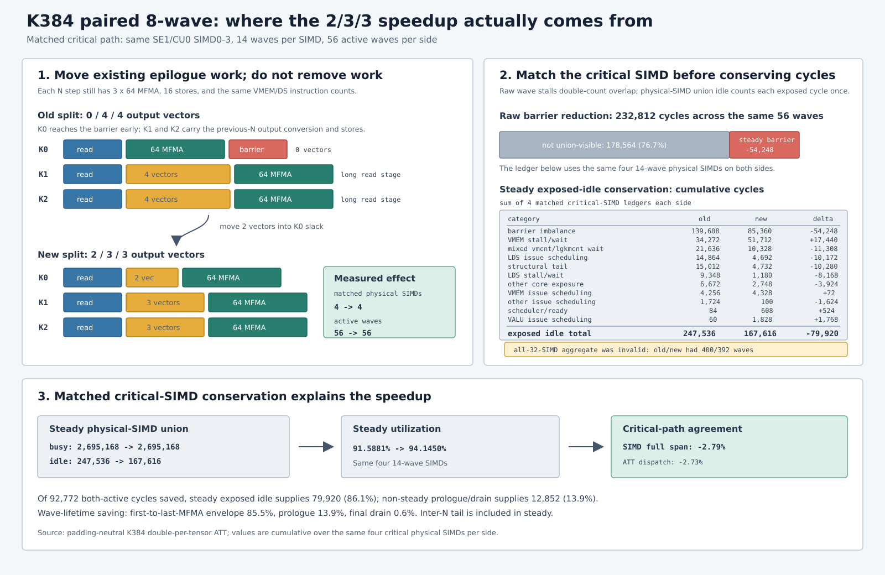

# FlyDSL MoE down 优化 TODO

> 打包最优方案晋级提交：`c82e2df`；历史 integrated-kernel checkpoint SHA256：
> `a8a017e81f52699cd33149266639fb14743412b419cf757a7c118c2d03946de7`。
>
> 当前六入口 pipeline 重构基线提交：`3591fd0112ef`；冲突解决并迁移 K384 优化后的源码 SHA256：
> `df8a07e98f1db5c95a26aecc4376dfe02854590a0061be9accf37dfe14af512c`。
>
> 历史 `a8a017...` 源码快照未保留在当前 Git/stash 中；该哈希仅作为 provenance，不能视为可重建 artifact。
>
> 固定 H3 目标：`1.895517 ms`；晋级结果：`1.913011 ms`；差距：`17.494 us`（`0.9145%`）。
>
> 候选方案未通过下列路径专属正确性门槛、资源/ISA 门槛和受控 ABBA 门槛时，不得晋级。

## 2026-08-19 全部 down 路径检查点

### 扩展 8-wave 支持与三路选择

- 配对 8-wave 现在支持所有要求的 FP8 down-prefill 组合，条件为 `BM=64`、`N % 512 == 0`、`K % 64 == 0` 且 `64 <= K <= 512`：PTPC 权重 + PTPC 激活，或 per-tensor 权重 + PTPC/per-tensor 激活。穷举 persistent 矩阵覆盖 N512/N1024、全部八个 K 点和全部三种量化组合（48/48），同时检查 M128 padding 与非活跃尾部。真实 dispatcher 也通过了强制 PTPC K256/K512。
- 使用 `local_tid` 为两个四-wave 组索引后，PTPC scale 的所有权问题已修复；两个组会暂存相同的 N256 scale block。K512 无法容纳额外 1KB scale LDS，因此改用从 global 直接加载到 C fragment。数值结果正确，但最终 ISA 使用 256 VGPR、有 19 个 spill 和 80B private memory，因此永不自动选择。
- 受控 10-buffer ABBA8 对比了 base、物理 N256 和 row-major 配对 8-wave，并包含 `sorted_sum`。通用 shape 仍在 base 与物理 N256 中选择实测最优者。后续的 streaming wave-private CShuffle 消除了 exact-H3 consumer 开销和全部 epilogue spill，因此 exact H3 per-tensor 现在自动选择配对 N512；`MOE_DOWN_PAIRED_N512=0/1` 仍作为禁用/强制 override。
- 自动胜者边界：K64-K320 选择物理 N256；K384 仅在 per-tensor 权重时选择物理 N256；PTPC K384 以及全部 K448/K512 选择 base。shape 专属 row padding 保留实测 combined 胜者：Hy3 K192 和 per-tensor H3 K384 使用 0B；Xiaomi PTPC K256 和通用 physical case 使用 128B，但 per-tensor N4096 K64/K128 除外。

- 打包 H3 的正式最优方案不变：重建后的最终 ISA 与晋级 artifact 逐字节一致。它仍包含 192 条 MFMA、39 条 128-bit load、16 条 store、10 个真实 barrier、254 VGPR、49,152B LDS，且 scratch 为零。
- 通用 dispatcher 不直接消费 packed layout。已晋级的 row-major epilogue 通过 wave-private LDS 流式处理每对已暂存的 BF16 vector，保留原有 K-stage overlap，并将 global 地址生成延后到 DS read 之后。Exact-H3 ABBA24 相对 physical4 的 down 从 `2.4743 -> 2.3552 ms`（24/24 胜）改善，完整 pipeline 从 `8.6356 -> 8.5859 ms`（22/24 胜）改善，reduced output 逐 bit 相等。
- timing contract 说明：历史 `1.913011 ms` 只包含 packed producer，而 streamed row-major down 包含标准 `sorted_sum` 所需的 layout conversion。同进程 exact-grid 正式 ABBA24 harness 测得 down + consumer：packed 为 `1.9350 + 3.6740 ms`，streamed row-major 为 `2.0943 + 0.7415 ms`。producer 成本增加 `+8.23%`，但 combined 从 `5.8432` 降至 `2.7887 ms`。在同一正式 harness 中相对物理 N256，streamed row-major 的 down ratio 为 `0.94760`，combined ratio 为 `0.96644`。packed ISA 仍逐字节一致。
- batch1 down 路径现在允许 VMEM read 跨越 compiler scheduling barrier。H3 维度 ABBA24 中，FP8 提升 `4.32%`（`0.956752`，24/24 胜），BF16 提升 `0.24%`（`0.997616`，21/24 胜）。BF16 和 FP8 dispatcher accuracy gate 均通过。
- 将同一 mask 应用于 splitk 已被否决：`0.872255 -> 1.626202 ms`，ratio `1.865054`，0/8 胜。Splitk 保持不变。
- 聚焦 selector suite 覆盖全部 24 个 K/quant 胜者单元及边界；完整 down suite 包含穷举的 48-case paired matrix、修复后的 physical4 two-block，以及 batch1 BF16/FP8 atomic 覆盖。
- 2026-08-20 streaming-paired 扩展门槛：72 个通用单元（`N=512/1024/4096`、K64-K512、三种 FP8 量化组合）加四个 production shape，对比了 base、物理 N256（0/128B）和配对 M128（0/128B）；所有 reduced output 均逐 bit 相等。没有任何通用 M128 单元能在相对当前胜者的可靠 direct ABBA24 中存活；H3 PTPC 仅在后文的 spill-removal 特化之后晋级。Xiaomi PTPC K256 padding 从 0B 改为 clean-window ABBA24 胜出的 128B（`combined ratio 0.99756`，18/24 胜）。由于外部 all-GPU workload 污染了后续微秒级计时，N512/N1024 base/physical 边界晋级仍待处理。
- best-paired/best-non-paired 的 combined ratio 汇总值：N512 为 `1.1831`，N1024 为 `1.1282`，通用 N4096 为 `1.0574`（72-cell median `1.1212`）。ABBA4 得到四个表面上的 paired 胜者；direct ABBA24 否决了全部四个（`1.00255`、`1.02040`、`1.01782`，以及只有 14/24 胜的 `0.99842`）。因此通用表没有新增自动 M128 晋级项。
- 随后，从 MFMA loop-carried state 中移除 current/next direct-scale fragment 后，H3 PTPC K384 晋级。新 ISA 从 18 个 VGPR spill / 76B private / 25+17 次 scratch load/store 降至零 spill/private/scratch。完整 paired correctness（48/48）和 production `diff=0.00019035` 均通过。ABBA24 combined ratio 相对旧的 spilling 8-wave 为 `0.60734`，相对 Base 为 `0.95473`，相对物理 N256 为 `0.79605`；全部 24/24 胜。非目标 exact-H3 和 Qwen-K512 的 old/new ratio 为 `0.99930` 和 `0.99772`，IQR 均跨 1；Hy3/Xiaomi 最终 ISA 逐字节一致。自动 M128 现在覆盖 exact H3 per-tensor 和 H3 PTPC。
- Hy3 K192 现在使用独立的 single-M N512 特化，而非 M128 pairing：M64 sorting 不变，八个 wave 跨越 N512，均衡的 512-thread A copy 消除了空闲 wave。K64 LDS swizzle 配合 `amdgpu-waves-per-eu=4,4` 达到 128 VGPR / 32KB LDS / 零 scratch，允许两个 512-thread workgroup 驻留；最终 ISA 有 96 条 MFMA，只有两个 barrier。物理 N256 与 single-M 的 output/tail 逐 bit 相等，production accuracy 为 `diff=0.00016577`，完整 down suite 为 62/62。干净的 10-buffer/1800MHz ABBA24 中，down 从 `1.673130 -> 1.513829 ms`（`0.906541`，IQR `0.903067--0.910706`）改善，combined 从 `2.511415 -> 2.347834 ms`（`0.935520`，IQR `0.931968--0.939437`）改善，均为 24/24 胜。
- 独立 tracked-harness 的干净 ABBA24 复现了 Hy3 结果：down `1.557529 -> 1.417749 ms`，ratio `0.909806`（IQR `0.908210--0.912926`，24/24）；combined `2.283913 -> 2.141253 ms`，ratio `0.937691`（IQR `0.934980--0.940317`，24/24）。consumer ratio `1.000015` 的 IQR 跨 1，确认提升来自 down。
- H3 PTPC 可以在两个反相四-wave 组之间安全共享 streaming CShuffle scratch。LDS 从 64KB 降至 56KB，occupancy、MFMA、store、barrier 和 output 均不变。相对旧 H3 PTPC 路径的两次 10-buffer ABBA24 得到 down ratio `0.99538` 和 `0.99393`，combined ratio `0.99607` 和 `0.99618`；两次均逐 bit 相等。收益很小，且 combined IQR 上界仍略高于 1，因此应将其视为低风险资源改善，而不是新的吞吐层级。
- 已为 H3 PTPC 和 Xiaomi PTPC 验证真正的 `(4 N waves) x (2 M waves)` M128xN256 tiled-MMA 原型。它采用 M64 sorting，支持两个 M64 half 使用不同 expert，通过 production-size 逐 bit 检查和 odd-tail 检查，并将 core 降至两个 barrier/八次 store，且零 spill。但它仍然失败：H3 相对已晋级 paired 路径的 combined ratio 为 `1.01448`；Xiaomi 相对物理 N256 的 down/combined ratio 为 `1.09436`/`1.06540`。Xiaomi slot-staggering 复现为 `1.09393`/`1.05675`。剩余差距不是 padding、spill 或 barrier 数量；单个 48KB/64KB 的 8-wave workgroup 无法达到两个驻留物理 N256 workgroup 的 latency hiding。不要原样重复此布局。
- 新的 padding-neutral 对比隔离了表面上的物理 N256 优势。`B8192/TOPK8/E128/N4096/K384`、双 per-tensor 恰好得到每个 expert 512 行：M64 与 M128 sorting ratio 都是 `1.0`，row padding 为 0B，两条路径都恰好启动 1024 个 M64 task。ABBA24 仍显示 paired 较慢（down `1.01346`，combined `1.01946`），但新的 ATT 显示其采样 core 更好：稳态 MFMA-union busy 为 `90.73%`，物理路径为 `86.29%`；lifecycle busy 为 `86.08%`，物理路径为 `82.63%`；wave lifetime median 为 `113457` 对 `115393` cycles。paired idle 主要是 barrier imbalance（占其更小 idle budget 的 `54.14%`）；physical idle 主要是 structural tail（`45.01%`）和 VMEM stall/wait（`27.24%`）。原始 trace 位于 `/tmp/padding-neutral-{physical,paired}-att`；统一报告位于 `/tmp/padding-neutral-n256-vs-paired-{slots,exposure}.{json,md}`。
- 剩余差异来自跨 CU 的 workgroup 粒度，而单 CU ATT 无法测量这一点。相同总工作量是 1024 个四-wave physical WG 对 512 个八-wave paired WG。分布到 80 个 CU 后，physical 为每 CU `12/13` 个 WG（`48/52` 个 wave），paired 为 `6/7` 个 WG（`48/56` 个 wave）；paired 的关键 CU 多承担 7.69% 的 wave。ATT target 恰好只采样到 48-wave paired CU，而 physical 样本同时包含 48-wave 和 52-wave CU。第二个零 padding shape 有 1280 个 M64 task（`B10240`），每 CU 恰好均衡为 16 个 physical WG 或 8 个 paired WG，均为 64 个 wave；此时 paired 在 ABBA24 中以 down `0.96455`、combined `0.97949` 胜出，均为 24/24。由此说明严格 8-wave 反相本身有效；表面反转主要来自 WG 调度量子翻倍导致的 dispatch-tail 负载不均衡。
- 在另一个 target CU 上进行的第二次 paired ATT capture 直接观察到了缺失的重尾：各 shader engine 捕获 `48/56/56/48` 个 wave，完整 span 为 `700780/804632/796092/706748` cycles；第一次 paired target 则统一为 48 个 wave，约 691K--699K cycles。physical target 为 `48/52/52/48` 个 wave，约 738K--795K cycles。对于 80 个 CU 上的 `T` 个逻辑 M64 task，physical 的关键 waves/SIMD 为 `ceil(T/80)`，paired 为 `2*ceil(T/160)`。当且仅当 `T mod 160` 落在 `1..80` 时，paired 多支付一个 wave batch；`T=1024` 为 13 对 14，而 `T=1280`、exact H3（`T=4632`）和 H3 PTPC（`T=2048`）的关键 wave 数相等。
- 全矩阵证伪说明 dispatch-tail 效应很常见，但不是通用 8-wave 回退的唯一原因。当前源码在全部 72 个 `N=512/1024/4096`、K64--K512 和量化组合单元上使用精确有效 grid、0B row padding，以及 direct `paired-pad0 / physical-pad0` ABBA8。由 `T=1024`（每 SIMD 13 个 physical 对 14 个 paired 关键 wave）改为均衡的 `T=1280`（16 对 16）后，down ratio median 改善 `5.20%`，从 `1.1280` 降至 `1.0600`。在 `T=1024` 较慢的 60 个单元中，仅 11 个翻转到 1 以下，49 个仍较慢。Combined ratio median 改善 `4.81%`，但 60 个回退中仅 8 个翻转，52 个仍存在。此 direct physical 对比不代表 dispatcher 应晋级；当前 Base 路径在多个 K448/K512 单元中仍是真正胜者。
- 该效应主要支配 long-N、接近盈亏平衡的单元。在 N4096，均衡将 down ratio median 从 `1.0487 -> 0.9982`，并翻转 9/20 个回退。在 N512 和 N1024，它分别从 `1.1912 -> 1.1475` 与 `1.1619 -> 1.0902`，但各只翻转 1/20 个回退。因此，更大的 WG 调度量子普遍贡献约五个百分点；而 short-N paired rendezvous、输出转换以及独立 WG latency-hiding 减少仍未充分摊销。当前 N512/K128 双 per-tensor paired ISA 使用 184 VGPR、32KB LDS、零 scratch，但均衡 ABBA24 仍以 down `1.14147`、combined `1.06581` 落败，排除了 spill 作为该类问题的解释。
- 资源专属回退构成另一类问题。均衡 PTPC/PTPC 在 18/24 个单元中仍较慢。当前通用 K512 PTPC paired ISA 使用 256 VGPR、64KB LDS、80B private memory、17 次 scratch load 和 17 次 scratch store；均衡 ABBA24 仍以 down `1.38757`、combined `1.34403` 落败。相反，N4096/K384 双 per-tensor 从 `T=1024` 时的 down `1.03263` 变为 `T=1280` 时的 `0.97846`（均衡 down 24/24 胜），这是纯粹由 dispatch-tail 支配的类别。N4096/K64 双 per-tensor 是边界：均衡 ABBA24 down 为 `0.97922` 且 IQR 跨 1，combined 为 `1.00596` 且同样跨 1。
- K384 paired barrier 分析发现的是确定性的 read-stage 不均衡，而不是随机 memory tail。K0 每个 wave 只有 23/24 条指令，比 compute peer 约早 452 cycles 到达；K1/K2 分别有 89/90 和 87/88 条指令，因为上一 N 的 epilogue 被分成 `0/4/4`，read group 在 85.4%/90.7% 的稳态内部迭代中较晚到达 barrier。仅调度的 probe 交错 K1/K2 VMEM 与 DS group，在不改变 compute/memory 指令数的情况下改动约 160 行 ISA，但结果中性：ABBA8 down `1.00064`（4/8），combined `1.00627`（3/8）。该方案已否决。
- 将上一 N 的相同八个输出向量重新分配到 K0/K1/K2 是有效的。对 `3/3/2`、`2/3/3`、`3/2/3` 和 `4/2/2` 的筛选选中 `2/3/3`；`4/2/2` 使 K0 过载并回退。集成后的 `2/3/3` 路径仅用于不共享 CShuffle scratch 的 K384 双 per-tensor paired kernel。它保持 192 条 MFMA、49 次 VMEM load、16 次 store、40 次 DS read、22 次 DS write、10 个 barrier、64KB LDS 和零 scratch，同时将 next-free VGPR 从 256 降至 242。Padding-neutral exact-grid ABBA24 的 down 改善 `3.01%`（`0.96991`，IQR `0.95610--0.97257`），combined 改善 `2.76%`（`0.97245`，IQR `0.96631--0.98151`），均为 24/24 胜。Production H3 per-tensor 的 down 改善 `4.64%`（`0.95362`），combined 改善 `3.47%`（`0.96534`），均为 24/24 胜。H3 PTPC 有意保留 `0/4/4`：其四-slot CShuffle 共享依赖旧的反相时序；应用 `2/3/3` 会破坏输出，恢复八个独立 slot 虽正确，却使 down/combined 回退 `1.72%`/`1.58%`。完整 down regression 为 62/62。
#### `2/3/3` 加速的关键 SIMD 守恒解释

新的 CU0/CU1 ATT 解释了“MFMA 数量不变但 dispatch 更快”的表面矛盾。首先，旧版与新版的 32-SIMD 全量样本不是等工作量的守恒对：

- old：24 个 12-wave SIMD + 8 个 14-wave SIMD，共 400 个活跃 wave。
- new：28 个 12-wave SIMD + 4 个 14-wave SIMD，共 392 个活跃 wave。

该构成来自合并两次各含 16 个物理 SIMD 的 ATT capture：old-cu1 的 16 个 SIMD 全部为 12-wave，old-cu0 则为 8 个 12-wave 加 8 个 14-wave；new-cu1 的 16 个 SIMD 全部为 12-wave，new-cu0 则为 12 个 12-wave 加 4 个 14-wave。也就是说，两侧虽然都包含 32 个物理 SIMD，但重载 SIMD 数量和活跃 wave 总数不同。

将两个负载层级混合后得到的全量利用率 `90.8028% -> 90.8013%` 具有误导性。它比较的是不同的 wave 构成，不能说明关键路径上的 exposed idle 没有变化。12-wave SIMD 较早完成，不决定 kernel 的结束时间；14-wave SIMD 才是 dispatch 尾部的关键路径。

匹配同一组关键路径的 4 个 14-wave SIMD 后，两侧都使用 `(SE1, CU0, SIMD0--3)`，每个 SIMD 14 个 wave，共 56 个 wave。此时守恒结果为：

| 累计指标 | old | new | 差值 |
| --- | ---: | ---: | ---: |
| 稳态 MFMA busy | `2,695,168` | `2,695,168` | `0` |
| 稳态 exposed idle | `247,536` | `167,616` | `-79,920` |
| 稳态利用率 | `91.5881%` | `94.1450%` | `+2.5569 pp` |
| 双 wave 同时活跃 span | `3,177,180` | `3,084,408` | `-92,772`（`-2.92%`） |
| 关键 SIMD 完整 span | `3,218,292` | `3,128,488` | `-89,804`（`-2.79%`） |
| ATT 派发耗时 | `0.444962 ms` | `0.432803 ms` | `-2.73%` |

详细累计 idle 账本严格闭合：barrier `139,608 -> 85,360`、VMEM stall/wait `34,272 -> 51,712`、mixed VMEM/LDS wait `21,636 -> 10,328`、structural tail `15,012 -> 4,732`、LDS issue `14,864 -> 4,692`、LDS stall/wait `9,348 -> 1,180`，其余类别 `12,796 -> 9,612` cycles。

在减少的 `92,772` 个双 wave 同时活跃 cycles 中，稳态 exposed idle 减少 `79,920`，贡献 `86.1%`；被稳态分母排除的 prologue/drain union idle 减少 `12,852`，只贡献 `13.9%`。精确累计 wave lifetime 从 `6,391,656 -> 6,205,180`：首个到末个 MFMA 的 envelope 贡献 `85.5%`，prologue 贡献 `13.9%`，final drain 仅贡献 `0.6%`。分析器中的 `structural tail` 是 N 间 tail，已经包含在稳态分母内。因此，加速主要来自关键 SIMD 稳态 exposed idle 的减少，而不是 final drain。

为排除 12/14-wave dispatch-tail 的影响，又构造了真实全 CU 均衡 case：`B=10240/TOPK=8/E=128/N=4096/K=384`、双 per-tensor、0B row padding。它有 `81,920` 个有效行、`1,280` 个逻辑 M64 task 和 `640` 个 paired 8-wave WG；`640 / 80 = 8 WG/CU`，因此每个 CU 累计 64 个 wave、每个 SIMD 累计 16 个 wave。这里没有通过 inactive task 扩大 grid：实际 launch 恰好为 `1,280` 个 M64 task。

在 GPU4、1800MHz deterministic、PTL `VECTOR,F8`、10 buffers、ABBA24 下，以当前源码仅关闭 `use_balanced_k384_epilogue` 作为 `0/4/4` control，并以集成源码作为 `2/3/3` candidate。两者 reduced output 逐 bit 相等，padding ratio 均为 `1.0`。有效计算量按真实有效行计算：`2 * 81,920 * 4,096 * 384 = 257,698,037,760 FLOP`，即 `0.257698 TFLOP`。结果如下：

| 阶段 | `0/4/4` median | `0/4/4` 有效 TFLOPS | `2/3/3` median | `2/3/3` 有效 TFLOPS | candidate/control 配对 ratio | ratio IQR | 胜率 |
| --- | ---: | ---: | ---: | ---: | ---: | ---: | ---: |
| down | `0.684864 ms` | `376.276` | `0.675625 ms` | `381.422` | `0.98106484` | `0.97337544--0.99331607` | 22/24 |
| combined | `0.936786 ms` | `275.088` | `0.914865 ms` | `281.679` | `0.97656773` | `0.96978053--0.98540326` | 23/24 |

`combined` 的有效 TFLOPS 使用相同的 down GEMM 有效 FLOPs 作分子，但分母包含 down + `sorted_sum` 时间，因此它表示端到端有效吞吐，而不是把 `sorted_sum` 另计为浮点工作量。按各版本独立时延中位数换算，down 吞吐提高 `1.37%`，combined 吞吐提高 `2.40%`。正式 ABBA 结论使用逐轮配对 ratio：其倒数对应的配对归一化吞吐提升分别为 `1.93%` 和 `2.40%`。down 的 `1.37%` 与 `1.93%` 不相等，是因为 `median(candidate/control) != median(candidate) / median(control)`；前者保留同轮配对信息，更能抵抗计时漂移。

因此，在完全消除跨 CU 负载尾差后，`2/3/3` 的配对时延仍改善 down `1.89%`、combined `2.34%`，且两个 IQR 上界都小于 1。这直接证明收益不依赖 12/14-wave dispatch-tail，WG 内 K-stage/epilogue 重新平衡本身即可产生稳定收益。相对先前 `T=1024` 的 down `3.01%` 和 combined `2.76%`，均衡 case 的收益分别少 `1.12` 和 `0.41` 个百分点；由于 B 和总工作量同时变化，不能把全部差额严格归因于 dispatch-tail。

复测日志 `/tmp/balanced-real-b10240-k384-044-vs-233-abba24.log` 的 SHA256 为 `6c1a7f187926b258dfa06679f8e419118ea2936c85f7e8cd94caa33c52d5842d`；结构化结果 `/tmp/balanced-real-b10240-k384-044-vs-233-abba24.json` 的 SHA256 为 `c856c13ce3d578d3261fc204562fa3723d0035d4472d497ba6f9e56b34f2bee4`。`0/4/4` control 源码 SHA256 为 `48df967b3179e457403a582b08f2be43648bfd4de3ac100969e1920809bc7249`，`2/3/3` candidate 源码 SHA256 为 `787a59e48fcc504f071fc1a6be32aab18284d0b1c7120774dc7952563485f394`。

#### 全 CU 均衡 case 的 fresh ATT 与剩余优化空间

随后在同一个 `B10240` 全 CU 均衡 case 上重新抓取 old `0/4/4` 与 new `2/3/3` 的 CU0/CU1 ATT。每份 capture 都覆盖 4 个 shader engine x 4 个 SIMD x 16 个 wave，即 256 个完整 wave；合并后两侧各有 32 个严格匹配的物理 SIMD、512 个完整 wave。所有 wave 都有 3,072 条动态 MFMA，old/new 的稳态 MFMA-busy cycles 完全相同，因此该比较不存在 12/14-wave 样本构成问题。

| 累计指标（CU0+CU1） | old `0/4/4` | new `2/3/3` | 变化 |
| --- | ---: | ---: | ---: |
| 物理 SIMD / active wave | `32 / 512` | `32 / 512` | 相同 |
| 稳态 MFMA busy cycles | `24,641,536` | `24,641,536` | `0` |
| 稳态 exposed idle cycles | `2,743,516` | `1,240,036` | `-1,503,480`（`-54.80%`） |
| 稳态 MFMA-union 利用率 | `89.9817%` | `95.2088%` | `+5.2271 pp` |
| lifecycle 利用率 | `85.1587%` | `89.6400%` | `+4.4813 pp` |
| wave lifetime mean | `116,092.5` | `110,316.7` cycles | `-4.98%` |
| wave lifetime median | `113,348` | `106,926` cycles | `-5.67%` |

两个 target CU 独立复现同一方向：CU0 稳态利用率 `90.5379% -> 94.9118%`，CU1 为 `89.4322% -> 95.5077%`。ATT dispatch 19 的有效吞吐分别为 old `489.248/480.311 TFLOPS` 和 new `494.429/495.875 TFLOPS`；ATT instrumentation 下的 wall time 不替代前述无 ATT ABBA24，只用于验证方向和 stall 归因。

##### 排除 kernel prologue/final drain 后的 TFLOPS

这里“排除 prologue/epilogue”严格采用 analyzer 的 steady N-loop 定义：去掉 kernel 首次进入 N-loop 前的 prologue 和末次离开 N-loop 后的 final drain；每个 N block 之间流水化执行的 epilogue 与 inter-N tail 仍保留，因为它们是 steady 工作的一部分。old 的 steady/lifecycle cycle ratio 为 `27,385,052 / 29,551,688 = 92.6683%`，new 为 `25,881,572 / 28,074,336 = 92.1894%`；被排除的首尾 cycles 分别占 `7.3317%` 和 `7.8106%`。

steady 区间并未保留完整 GEMM 工作量：每个 wave 的 3,072 条 MFMA 中，steady denominator 覆盖 3,008 条，即 `47/48`。因此不能用完整 `0.257698 TFLOP` 直接除以缩短后的 steady 时间，否则会得到人为偏高的 `523.090/537.102 TFLOPS`。严格守恒的 MFMA slot 模型使用独立 16-cycle MFMA roof：

$$
P_{steady}=P_{MFMA,roof}\times U_{steady},
\qquad P_{MFMA,roof}=582.944\ \text{TFLOPS}.
$$

| 版本 | steady MFMA-union 利用率 | 稳态 MFMA slot 模型吞吐 | 相对变化 |
| --- | ---: | ---: | ---: |
| old `0/4/4` | `89.9817%` | `524.543 TFLOPS` | - |
| new `2/3/3` | `95.2088%` | `555.014 TFLOPS` | `+5.81%` |

上述 `524.543/555.014 TFLOPS` 是在独立 `582.944T` MFMA roof 上按 steady union 利用率投影的模型值，不是 ABBA 实测吞吐。两者相差较大并非 prologue/final drain 导致：首尾阶段只占 lifecycle 的 `7.33%/7.81%`，不足以解释约 30%--45% 的差距。实际原因是实验条件不同：正式 ABBA24 使用随机 FP8 数据和 10 份轮转 buffer，而 ATT capture 使用全 1 数据和单 buffer 重复。

为量化该差异，在同一 GPU4、1800MHz deterministic、相同 kernel/grid 下执行了 `数据模式 x 路由模式 x buffer 数` 矩阵，每组连续 800 次 dispatch，并以 1ms 周期采样真实 GFX clock 与 socket power：

| 数据 / buffer | down median | 有效 TFLOPS | 稳态 sclk | 稳态 power |
| --- | ---: | ---: | ---: | ---: |
| 全 1 / 1 buffer（profile 路由） | `0.478393 ms` | `538.674` | `1774 MHz` | `615.5 W` |
| 全 1 / 10 buffers（ABBA 路由） | `0.601591 ms` | `428.361` | `1805 MHz` | `623.0 W` |
| 随机 / 1 buffer（ABBA 路由） | `0.611251 ms` | `421.591` | `1399 MHz` | `642.0 W` |
| 随机 / 10 buffers（ABBA 路由） | `0.693387 ms` | `371.651` | `1455 MHz` | `646.0 W` |

随机数据将单-buffer 稳态 sclk 从约 `1753 MHz` 压到 `1399 MHz`，吞吐降低 `20.15%`；这是数据位翻转增加功耗并触及 650W power cap 的直接证据。10-buffer 轮转还扩大 activation/weight/output 工作集，使随机 ABBA 路由时延再增加 `13.44%`，即缓存复用显著下降。路由模式本身在相同数据和 buffer 数下基本中性；因此 TFLOPS 差距主要由数据相关功耗降频和缓存工作集造成，而不是 ATT 工具本身，也不是 prologue/final drain。

若要得到与正式随机 10-buffer ABBA 相同条件下的“排除首尾”值，可将实际 down 吞吐按 steady work fraction `47/48` 和 `steady_cycles/lifecycle_cycles` 同时校正：old `376.276 -> 397.587 TFLOPS`，new `381.422 -> 405.118 TFLOPS`，折算后 new 相对 old 提升 `1.89%`。这是与“实际 TFLOPS”最可比的估计。

作为 ATT 自身的辅助 wall-equivalent 口径，old 的平均 ATT wall `0.531623 ms` 折算为 `512.192 TFLOPS`，new 的 `0.520443 ms` 折算为 `525.912 TFLOPS`，提升 `2.68%`；它仍继承 ATT 的全 1、单-buffer 条件。作为名义频率参考，使用 1800MHz 架构 roof `589.824 TFLOPS` 时，slot 模型对应 old/new `530.734/561.564 TFLOPS`，相对提升仍为 `5.81%`。

运行条件矩阵 `/tmp/balanced-runtime-condition-matrix.json` 的 SHA256 为 `0e84445f28a7fa91c3efe9e3a0c5aab1aebdba9c26174c558b8841fbcd5a09ca`，完整日志 `/tmp/balanced-runtime-condition-matrix.log` 的 SHA256 为 `9dd17b892553ee789157e950b6825a3206206e99a0898e725cf5c67cb67c7353`。

new `2/3/3` 剩余稳态 idle 为 `1,240,036` cycles，分类如下：barrier imbalance `593,020`（idle 的 `47.82%`，占稳态总 cycles 的 `2.291%`）、VMEM stall/wait `401,436`（`32.37%`，占总 cycles 的 `1.551%`）、mixed wait `91,936`（`7.41%`）和 structural tail `43,684`（`3.52%`）。barrier + VMEM 合计占剩余 idle 的 `80.20%`。最大的物理 blocker pair 是：

- `stall:barrier + stall:barrier`：`491,680` cycles，占剩余 idle 的 `39.65%`。
- `stall:VMEM-load + stall:barrier`：`291,796` cycles，占 `23.53%`。
- `stall:VMEM-store + stall:wait-vmcnt`：`108,052` cycles，占 `8.71%`。
- `stall:VMEM-store + stall:barrier`：`64,692` cycles，占 `5.22%`。

按同一 MFMA envelope 计算，消除全部剩余 idle 的吞吐理论上限仅为 `+5.03%`；单独消除全部 barrier bucket 的上限为 `+2.35%`，单独消除全部 VMEM stall/wait 的上限为 `+1.58%`。这些是不可同时兑现的归因上界，不是预期收益。真实 barrier arrival 重建还显示，每个 8-wave WG 中 slot1 在所有六个 K-stage barrier 都约晚 `1,028` cycles 到达；这主要是另一 slot 执行 64 条 MFMA 的正常反相时间，大部分已被 peer MFMA 隐藏。删除/替换真实 rendezvous 的历史 pairbarrier 路线虽正确，却曾使 down 回退约 `4.18%`，因此不能将 raw barrier stall 直接视为可删除周期。

本轮围绕 fresh ATT 热点做了七个当前源码单变量 probe，均通过逐 bit 正确性，但没有一个达到升级门槛：

| Probe | down ABBA8 ratio / 胜率 | combined ABBA8 ratio / 胜率 | 结论 |
| --- | ---: | ---: | --- |
| epilogue `2/4/2` | `1.00852349` / 2/8 | `1.01439958` / 1/8 | 将 K2 写回前移到 K1 反而回退 |
| output-store cache modifier `1` | `1.00395539` / 3/8 | `1.00979409` / 2/8 | 回退 |
| output-store cache modifier `3` | `0.99874084` / 4/8 | `0.99666949` / 6/8 | IQR 均跨 1，噪声级 |
| compute-stage mask `0x60` | `0.99995533` / 4/8 | `1.00274664` / 4/8 | 中性；最终 ISA 与当前版本逐字节相同 |
| rolling weight head | `1.05725992` / 0/8 | `1.03328857` / 0/8 | VGPR `242 -> 246`，明显回退 |
| Stage-A load-first | `1.06389056` / 0/8 | `1.05608862` / 0/8 | 零资源变化但明显回退 |
| scoped identity task map | `0.99835688` / 4/8 | `1.03531510` / 0/8 | down 中性，combined 明确回退 |

因此当前没有可晋级的新 kernel 改动。低风险局部调度空间已接近耗尽；继续优化只值得投入两类高成本方向：其一是重新设计跨 N 的双缓冲/epilogue pipeline，使一个 slot 的 K-boundary 与 peer tail 不再同时暴露，而不是继续移动单条 load/store；其二是在保持 10 个真实 barrier 和正确性契约的前提下设计新的两组 rendezvous 协议。前者需要新的 accumulator/output state，后者触及核心同步正确性，两者都应先建独立原型和理论周期账本，不应直接修改 production kernel。

fresh ATT 汇总 `/tmp/balanced-k384-044-vs-233-att-summary.json` 的 SHA256 为 `62d840b715aa26bb7a8cf581dc63aed06a18c055c9b1b11fdb92eea52b286db9`；四 trace 统一总账 `/tmp/balanced-k384-044-vs-233-cu01-slots.json` 的 SHA256 为 `6870dfc88766191a0ad46b7081ccccc05df084e6f9c1b5b7c33f3acee00dfe7d`。CU0 old/new capture log SHA256 为 `cf578550306b82a123d5b7ca809f7409d7944c23e3aa7ddb33d5a57bfa271335` / `2a17fa5ce76de64de63af4ca703af4a20e05ea6517bdce5ab325a56099aa6db9`；CU1 为 `e0a0885367154b5350148cc64ea3bc9318ea8c31a0ebef5963ac3657f9ad8ab7` / `088cb58fda8b81d9e7aec077639b463544d9c1471cf8e6e5b3a75a168086d787`。

同一 session 的 HEAD recapture 因外部污染而被否决：相同旧 ISA 的耗时在 `0.54` 到 `1.86 ms` 间波动，而干净历史值为 `0.44--0.48 ms`。有效的新 UI 是 `ui_output_agent_57892_dispatch_19` 和 `ui_output_agent_39749_dispatch_19`；统一报告 `/tmp/padding-neutral-paired-233-vs-old-slots.json` 的 SHA256 为 `86a04cdff71773b2dfb9e5c9c7fb35886a7d27b5ab48a92ad058488593ffa7e5`。

- 复现日志及 SHA256：`/tmp/unbalanced-matrix-all-k-exact-abba8.log`（`a8242e321784081cf4c24c179ffd4164fec42403a149ba5bcf745da4c61a896e`）、`/tmp/unbalanced-small-all-k-exact-abba8.log`（`c3c7f849ea545405188810d4c3e4d41c0bad30839129aba80d676209ba0708b5`）、`/tmp/balanced-matrix-all-k-abba8.log`（`99ab47365861dadf4e7dac528092baecedb6f6e8a41cdb7d1fe7cb3e1bf5e3d4`）、`/tmp/balanced-small-all-k-abba8.log`（`50dce038efa130694bdabbdc31b0f2df81326949f4ad04dffdaa401888bbb405`），以及代表性 ABBA24 `/tmp/tail-classification-representative-abba24.log`（`428cf2442bba08aa1ca2e147985b6fdb243584cded17ec6010572a0205ed947c`）。

## 路径矩阵

| Down 路径 | 当前实现 | 严格 paired 方法的适用性 | 必需门槛 |
| --- | --- | --- | --- |
| H3 fp8 per-tensor `prefill_1x4`，N4096/K384/TOPK9/E193 | packed paired 正式最优方案 + 自动选择的 streaming row-major adapter | Paired N512 通过 wave-private CShuffle 流式处理；packed 默认方案不变 | exact-grid physical/reduced/tail 逐 bit 门槛；256 VGPR、65,536B LDS、0 scratch；ABBA8/24 |
| H3 fp8 PTPC `prefill_1x4`，N6144/K384/TOPK4/E128 | paired N512 streaming row-major，并在 epilogue 阶段加载 scale | 延后 scale 后消除全部 18 个 spill，同时保留 64KB LDS | 48-case paired matrix、production accuracy、Base/old-paired ABBA24 |
| Hy3 fp8 per-tensor `prefill_1x4`，N4096/K192/TOPK9/E193 | single-M N512，使用 M64 sorting 和 row-major CShuffle | 八个 wave 跨越 N；没有 M128 metadata 复制或 paired rendezvous | physical/reduced/tail 逐 bit 门槛；128 VGPR、32KB LDS、0 scratch；干净 ABBA24 combined ratio `0.935520` |
| 通用 fp8 per-tensor `prefill_1x4` | 现有 base/physical4 胜者表 | Streaming row-major pairing 通过正确性，但没有非 H3 单元通过可靠 direct ABBA24 性能晋级门槛 | N512/N1024/N4096 K/quant matrix + 奇数 logical-block tail |
| fp8 PTPC `prefill_1x4` | 自动选择 base 或 physical4；paired8 仅显式启用 | Paired8 支持 K64-K512；staged scale 使用组内 thread 编号，K512 使用 direct scale load | 全部八个 K 点、multi-N 和 inactive tail |
| 非 physical `prefill_1x4`（bf16/fp8） | 原始 4-wave 路径 | 仅复用调度思路；physical pairing 会改变 output 和 LDS 契约 | 现有 prefill test + shape matrix |
| `splitk` down | one-wave compute，使用 scatter/atomic output | 不要直接应用 4+4 反相；仅独立测试 load 调度和映射 | atomic/non-atomic oracle、multi-expert routing |
| `batch1` down | one-wave compute，使用 BF16 atomic reduction；已启用 VMEM-read crossing | pairing 在结构上不适用；兼容的调度思路已晋级 | batch1 TOPK reduction oracle |

## P0：正确性与契约

- [x] 将 H3 paired output 与独立正确的 physical4/PyTorch 路径比较，而不只与同一 packed layout 的派生实现比较。随机 unique-top-k H3 的 reduced-output mismatch 为零；真实 dispatcher 报告 `diff=0.00017182`。
- [x] 确认 H3 packed store 是 row-major，还是需要配套 consumer/decode 步骤。结论为 block-major packed；修复后的 `packed_direct` decoder 正确，但对 production consumption 而言过慢。
- [ ] 增加 exact-H3 regression，独立于候选模块检查数学输出和 inactive tail。
- [x] 通用 shape 保持使用 physical4/base；仅在 streaming row-major 性能门槛通过后自动晋级 exact H3。

## P1：通用 per-tensor prefill pairing

- [x] 为 paired accumulator fragment 实现 row-major direct-store adapter 原型，且不增加真实 barrier。final-store 去重后，它保留 192 条 MFMA、39 次 load、16 次 store、10 个 barrier、254 VGPR、49,152B LDS 和零 scratch。
- [x] 在 direct store 证明代价过高后测试 transpose 替代方案。64KB CShuffle 版本达到 256 VGPR、27 个 spill/88B private memory；wave-local bpermute 版本达到 256 VGPR、4 个 spill/12B private memory。两者均已回退。
- [ ] 验证 N512、N1024、N4096、K192/K384、一个和两个逻辑 M64 block，以及非 128 倍数的有效 tail。
- [x] 计时前要求零 scratch 且 down suite 无回退。保留的 direct adapter 为零 scratch；persistent paired 和 physical4 test 覆盖两个 M64 block。

## P2：PTPC physical4 与 paired 路径

- [x] split weight-head prefetch 仅限原始 per-tensor K384 schedule；PTPC 使用通用 K-core 路径。
- [x] 使用 per-token activation scale 和 per-channel weight scale 测试 K64-K512，包括两个 N256 block 和 inactive tail。
- [x] 使用 10-buffer ABBA8 测量 base、physical4 和 paired8。原始 direct row-major adapter 未击败现有最优路径，因此仍只能显式启用；后续 zero-spill streaming adapter 仅对 exact H3 取代了该结果。

## P3：不增加内存的调度 probe

- [x] 仅允许 VMEM read 跨越 paired A-stage compiler scheduling barrier（`sched_barrier(0x20)`）；所有真实 barrier 保持不变。重建后的最终 ISA 与 control 逐字节一致，因此该全局放置没有可执行效果，已移除。
- [ ] 如果全局 `0x20` 污染某个 Stage B 区间，测试隔离的 K0->K1 与 K1->K2 mask。
  每个隔离 mask 的预期收益：`0.1%-0.35%`（`1.9-6.7 us`），与全局 probe 互斥。
- [ ] 要求三个 Stage B 区间都恰好保留 64 条 MFMA，且不含其他指令。

## P4：splitk 与 batch1

- [x] 改变调度前，捕获路径专属 baseline timing 和 ISA/resource 计数。
- [x] 对 `splitk` 仅测试 VMEM issue 顺序和 output scatter grouping；不要增加 workgroup barrier。VMEM-read crossing 回退 `86.5%`，已移除。
- [x] 对 `batch1` 测试 weight-load issue 顺序和 BF16 atomic grouping；不要引入 paired workgroup。VMEM-read crossing 通过 BF16/FP8 accuracy 和 ABBA24，现在仅用于 batch1。
- [x] 这些结果与 H3 固定目标分开记录，因为它们的 shape 和 output contract 不同。

## 已关闭路线

- [x] LDS weight sharing：1 atom ratio `1.286286`；3 atoms `1.099853`；4 atoms 达到 256 VGPR。
- [x] 纯 permute 重调度：ratio `1.020263`，0/8 胜。
- [x] Slot priority 1/2：ratio `1.029335`，0/8 胜。
- [x] Store26：ratio `1.019395`，0/8 胜。
- [x] Expert stripe2：ratio `1.005637`，1/8 胜。
- [x] Grid3d/grid2d：ratio `1.005300`/`1.000011`；无稳定收益。
- [x] Direct row-major paired store：相对 physical4 的 ratio 为 `1.232053`，相对 packed paired 为 `1.363678`，两项均为 0/8 胜。
- [x] Paired row-major CShuffle：N512/N1024 正确，但 65,536B LDS 导致 256 VGPR、27 个 spill 和 88B private memory。
- [x] Paired row-major bpermute：N512/N1024 正确，但 128 条 `ds_bpermute` 指令导致 256 VGPR、4 个 spill 和 12B private memory。
- [x] Splitk VMEM-read crossing：ratio `1.865054`，0/8 胜。
- [x] 初始 PTPC paired scale 原型崩溃，因为 wave 4-7 的索引超出共享 N256 scale block。使用 `local_tid` 修复后，K64-K384 staged-scale 和 K512 direct-scale 路径现已通过。