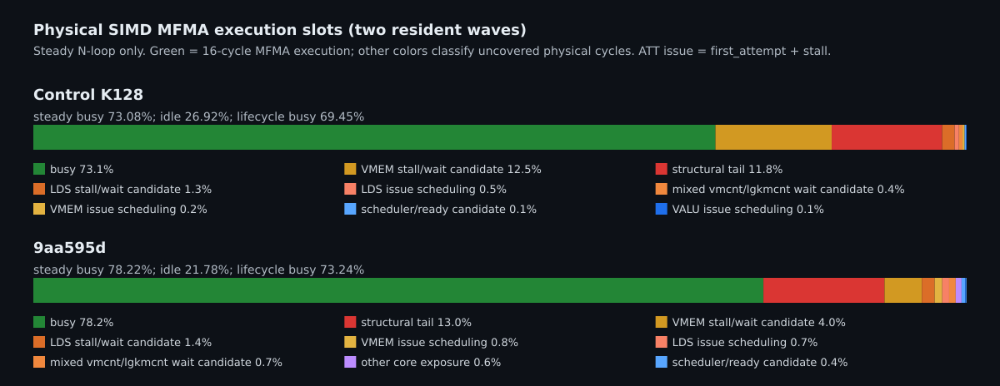
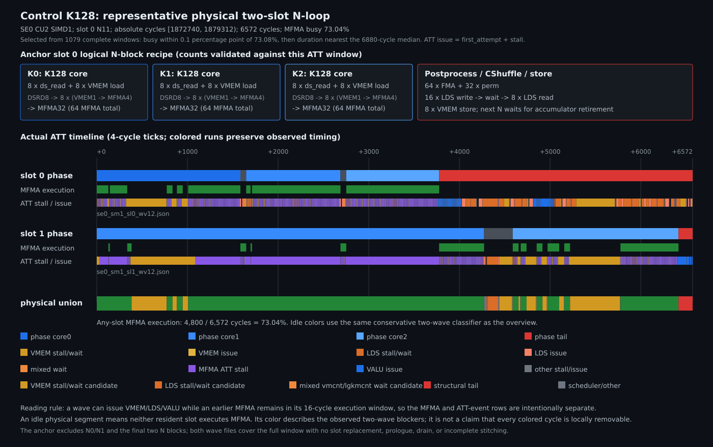

# Control K128两wave物理MFMA slot分析

日期：2026-08-15

## 结论

当前工作树的Control K128使用
`DSRD8 -> 8 x (VMEM1 -> MFMA4) -> MFMA32`，资源为
`64 VGPR + 128 AGPR`、28,672B LDS、0 scratch，实际驻留2 waves/SIMD。
将两个resident wave按物理`(SE, CU, SIMD)`合并后，steady N-loop的16-cycle
MFMA执行窗只有`73.08%`非空；其余`26.92%`为空。



空槽中最重要的两项是：

| 类别 | 占steady总时间 | 占MFMA空槽 | 每wave每N块 |
|---|---:|---:|---:|
| VMEM stall/wait | **12.46%** | **46.27%** | **448.36 cycles / 28.02 slots** |
| 结构性tail | **11.84%** | **43.97%** | **426.05 cycles / 26.63 slots** |
| LDS stall/wait | 1.34% | 4.96% | 48.08 cycles / 3.00 slots |
| LDS正常issue | 0.47% | 1.73% | 16.76 cycles / 1.05 slots |
| 混合`vmcnt/lgkmcnt` wait | 0.39% | 1.43% | 13.87 cycles / 0.87 slots |
| 其他 | 0.43% | 1.63% | 15.66 cycles / 0.98 slots |

这里“slot”是16-cycle等价执行窗，不是硬件发射队列项。最直接的程序反证是同代码量的
`9aa595d`：它保留slot priority调度，steady MFMA busy为`78.22%`，VMEM stall/wait只占
steady总时间`4.00%`；在稳定`VECTOR,F8`的24轮同进程ABBA中，`9aa595d`为
`2.194646ms / 422.72T`，Control K128为`2.217927ms / 418.28T`，Control配对时延
`+1.10%`、吞吐`-1.09%`。因此Control的K128 `sched_group`虽然缩短了单wave core切换，
却让两个resident wave的VMEM阶段更同相，净性能回退。

当前瓶颈不是HBM峰值带宽：Control的正式PMC为L2 hit `67.67%`，HBM读/写
`0.799/2.429GB`，按稳定2.217927ms折算仅`1.455TB/s`，即5.3TB/s峰值的`27.46%`；
读请求`0%`为32B、写请求`100%`为64B。实际HBM字节对应的峰值带宽时间只有
`0.609ms`。VMEM空槽主要是两slot请求相位和队列背压，而不是把HBM带宽跑满后的硬下限。

## 1. 基准、数据与验收

### 1.1 被测代码

- 工作树代码：冻结Control K128，SHA256
  `59f3a68c38427b3fe7d7ba9275f50c42a94969c03c25e0bb0166ea7b3d138cd0`；
- `HEAD`保持`1e637f62f11d008c5c9d47a26497b7515b4eb447`，代码回退只在工作树；
- shape：`B=32768, TOPK=9, N=4096, K=384, E=193, BM=64, BN=256`；
- FP8 activation/weight，均为per-tensor scale，physical N256，0B padding；
- 资源：`64V+128A`、112 SGPR、28,672B LDS、2 waves/SIMD、0 scratch。

Control和`9aa595d`的核心工作量相同：

| 版本 | MFMA | buffer load/store | DS read/write | barrier | setprio | 可执行指令 |
|---|---:|---:|---:|---:|---:|---:|
| Control K128 | 192 | 38 / 8 | 32 / 22 | 2 | 0 | 765 |
| `9aa595d` | 192 | 38 / 8 | 32 / 22 | 2 | 12 | 793 |

`9aa595d`额外的是slot priority和相关控制指令，矩阵、VMEM、LDS数据量不变，适合作为调度消融。

### 1.2 ATT

两条trace均使用GPU4、`VECTOR,F8`、单SE、4 SIMD、target CU2，第6次dispatch：

```text
Control: /tmp/moe-control-k128-slot-att/ui_output_agent_44314_dispatch_19
9aa:     /tmp/moe-9aa-k128-slot-att/ui_output_agent_14690_dispatch_19
```

每条trace均有4个物理SIMD、232条完整wave、每SIMD 58条wave、slot0/1各116条；所有wave均满足
`num_stitched == num_insts`，采集日志没有`Stitch Incomplete`、context save/restore或cutoff。
Control的`code.json`与fresh ISA除分支目标的符号/立即数显示外逐指令一致。

ATT会扰动墙钟，因此正式性能仍采用独立ABBA；ATT墙钟仅用于模型自闭合：

| Trace | ATT墙钟 | ATT有效TFLOPS | `582.944T * lifecycle busy` | 误差 |
|---|---:|---:|---:|---:|
| Control | 2.280010ms | 406.890T | 404.848T | -0.50% |
| `9aa595d` | 2.194649ms | 422.716T | 426.975T | +1.01% |

方向、量级和闭合误差均支持该物理slot模型，但跨trace的busy比例不能直接当成墙钟加速比。

## 2. 模型修正：ATT的`time`不是issue time

gfx9 decoder的raw instruction是：

```text
[first_attempt, category, stall, duration, pc_index]
```

ROCm SDK头文件明确定义：

```text
successful_issue = first_attempt + stall
issue_complete   = first_attempt + duration
duration         = stall + issue_time
```

旧的attention/MoE临时ledger把`first_attempt`直接当作issue time；旧MoE相位脚本还错误使用了
`code[pc_index - 1]`。README中此前`58.01%/58.27%`的MFMA双活结论因此作废，不能用于本轮判断。
新分析器始终使用`code[pc_index]`和`first_attempt + stall`。

对修正后MFMA successful issue间隔的验证：

| Trace | 最小 | 中位 | P95 | 恰为16 cycles |
|---|---:|---:|---:|---:|
| Control | 16 | 16 | 32 | 94.17% |
| `9aa595d` | 16 | 16 | 16 | 96.04% |

AMD Matrix Instruction Calculator对gfx942
`v_mfma_f32_16x16x32_fp8_fp8`给出16 execution cycles、4-cycle后允许VALU co-execute；
SQ PMC也给出
`SQ_VALU_MFMA_BUSY_CYCLES / SQ_INSTS_MFMA = 16.000`。因此物理MFMA执行窗定义为：

$$
I_i=[t_{issue,i}, t_{issue,i}+16)
$$

两个resident wave的所有$I_i$取并集。steady N-loop内：

$$
U_{MFMA}=\frac{|\bigcup I_i|}{|T_{steady}|},\qquad
T_{idle}=T_{steady}-\bigcup I_i
$$

分析按4-cycle tick离散化；空槽中的两个wave blocker分别由
`[first_attempt, successful_issue)`的stall和
`[successful_issue, issue_complete)`的正常issue区分。两wave同时阻塞时，归因权重各占一半，
但物理总周期始终只计一次。

### 2.1 为什么“所有非MFMA都占掉MFMA slot”是错误的

用户提出的两个scheduler约束需要分开判断：

1. **“每个wave每个cycle至多successful issue一条指令”成立。** 排除`duration-stall=0`的
   `wait/internal`记录后，232条wave没有任何同wave同timestamp双issue。旧raw JSON里看到的
   69,533个重复timestamp全部来自zero-cost记录，不能当成两条pipeline指令。
2. **“每个SIMD每cycle总共只能issue一条指令”不成立。** ROCm scheduler模型允许被选中的
   SIMD在同cycle从不同wave向VALU/VMEM/SALU/LDS/branch各发一条；上限是每类别一条，而非整个
   SIMD一条。Control ATT实际positive-cost同周期共发：MFMA+VMEM 6,892次、MFMA+LDS 22,319次、
   MFMA+SALU/SMEM 14,863次。

MFMA通过VALU issue类别发射。因此**在同一个successful-issue cycle**，普通VALU和MFMA竞争同一
类别；Control ATT的MFMA+普通VALU同timestamp次数确实为0。但MFMA successful issue后在独立矩阵
单元执行16 cycles，4 cycles后普通VALU可以进入其execution shadow。此时VALU没有“替换”正在执行
的MFMA，也不会让该16-cycle执行窗变空。Control每wave每N块已有218.08 cycles VALU issue落在
MFMA busy窗内，说明这种隐藏实际大量发生。

反过来，若某个16-cycle边界没有新的MFMA successful issue，边界上出现VALU只能说明该cycle的
VALU类别被VALU使用；它不能证明MFMA本来已经ready、只因VALU而没发。对Control所有缺失的名义
16-cycle MFMA边界统计positive-cost pipeline issue：

| 边界状态 | 占缺失边界 |
|---|---:|
| 无任何positive-cost pipeline issue | **70.05%** |
| 仅VALU | **15.15%** |
| 仅LDS | 5.81% |
| 仅SALU | 3.71% |
| 仅VMEM | 2.01% |
| 多pipeline组合 | 3.27% |

只有“仅VALU”的15.15%具备VALU/MFMA同类别竞争的必要条件，仍需移动MFMA的实际消融才能证明
因果；其余非MFMA类别原则上可与MFMA同周期issue，70.05%甚至没有任何pipeline issue，主因应在
两个wave都没有ready MFMA、operand/memory wait或scheduler相位。故正确问题不是“哪条非MFMA占了
这个16-cycle slot”，而是：**为什么两个resident wave在这个时刻都没有可successful issue的
MFMA，以及当前发出的非MFMA能否改变后续ready时间。**

## 3. 正常节奏与stall定义

### 3.1 本报告各类别到底表示什么

| 名称 | ATT/时间轴定义 | 硬件含义 | 可修复边界 |
|---|---|---|---|
| **structural tail** | 两个resident wave都已执行完当前N块的最后一条MFMA，且都尚未进入下一N块首条MFMA的物理空窗 | 当前N块必须完成scale/routing FMA、BF16 pack、CShuffle LDS write/read、wait和global store；此时两个wave都没有当前N块MFMA可移动 | **不可由局部重排修复**。只能跨N块退休accumulator、双缓冲CShuffle或改变输出布局；必须重新验证VGPR/LDS/正确性 |
| **VMEM instruction stall** | `buffer_load/store`的`[first_attempt, successful_issue)` | VMEM请求尚不能进入pipeline；可能是请求FIFO/credit/端口背压、两slot同相竞争或地址/ready约束 | 可能通过错开发射、改变priority、增加消费距离修复；**不等于完整HBM访问延迟，也不自动表示带宽饱和** |
| **VMEM wait stall** | `s_waitcnt vmcnt(*)`的整个duration | wave在等待既有VMEM请求达到计数条件 | 可通过更早预取或在wait前插入独立工作修复；若已经没有独立工作则属于数据流下界 |
| **LDS instruction stall** | `ds_read/write`的`[first_attempt, successful_issue)` | LDS端口、请求队列、bank/address conflict或跨SIMD pair竞争使DS暂时不能issue | 需用地址消融、独立bank微基准或错相实验区分；raw bank counter本身不足以判定 |
| **LDS normal issue** | `ds_*`的`[successful_issue, issue_complete)` | 指令固有服务成本；例如gfx942 wave64 `ds_write_b128`正常约20 cycles | 不是stall。只能减少指令数、缩小宽度或与另一wave MFMA重叠，不能把20 cycles直接记成“冲突” |
| **LDS wait stall** | `s_waitcnt lgkmcnt(*)`的整个duration | 等待LDS/SMEM完成 | 读后立即消费可通过前移DS read改善；write→read真实依赖且无独立工作时为结构下界 |
| **mixed wait** | 同一`s_waitcnt`同时含`vmcnt`和`lgkmcnt` | 无法只凭该指令把周期唯一分给VMEM或LDS | 单独列出，不能重复计入两类 |
| **MFMA issue unavailable** | MFMA的`[first_attempt, successful_issue)`扣除本wave已有MFMA execution、memory优先归因和tail后的single-wave气泡 | ATT本身不编码根因；Control经操作数RAW、waitcnt和physical successful-issue序列验证后，归因为peer wave占用16-cycle MFMA硬件时隙 | priority可改变跨wave仲裁；只有physical union空槽或同工作量墙钟随消融下降时才是调度缺陷，不能直接加总single-wave比例 |
| **other** | scheduler/ready、SALU/branch、VALU/TRANS dependency、trace量化残差等未进入上述类别的周期 | 不是一个硬件pipeline，也不是同一因果 | 必须先下钻opcode/源码或做消融；报告中不把它默认视为可修复 |

“stall”在本报告中严格指decoder的`stall`字段，即wave从首次尝试到successful issue的等待；
“latency”指请求发出到结果可消费的时间；“throughput/service cost”指连续请求的稳态间隔。
三者不能互换。比如`buffer_load_dwordx4`生产trace的正常issue中位为4 cycles、stall中位为0，
但独立HBM miss latency可为数百cycles；这些延迟通常由后续MFMA覆盖，只有暴露到`vmcnt`或请求
队列反压时才形成物理MFMA空槽。

structural tail也不是“硬件绝对不可优化”的同义词。它只表示：**在当前单N块accumulator生命周期
和单槽CShuffle布局下，没有现成MFMA能局部前移来填充。** 改变生命周期/存储结构后可以缩短，
但不应与VMEM发射错相这类局部scheduler修复混为一谈。

Control生产trace的典型动态值：

| 指令 | 正常issue中位/P95 | stall中位/P95 | 判断 |
|---|---:|---:|---|
| FP8 MFMA | 4 / 4 | 12 / 12 | MFMA/VALU issue暂不可用；Control已由操作数和waitcnt证明排除背靠背RAW及未覆盖A/B依赖 |
| `buffer_load_dwordx4` | 4 / 8 | 0 / **208** | issue正常，长尾为VMEM队列/ready stall |
| `buffer_store_dwordx4` | 4 / 4 | 0 / **360** | issue正常，长尾为store背压 |
| `ds_read_b128` | 4 / 4 | 0 / 32 | LDS read暴露较小 |
| `ds_write_b128` | 20 / 56 | 0 / 32 | 20-cycle服务是gfx942 wave64 16B/lane store的正常硬件节奏 |
| `v_fmaak_f32` | 4 / 4 | 0 / 4 | 可放入MFMA的12-cycle VALU shadow |
| `v_perm_b32` | 4 / 4 | 0 / 4 | 可放入MFMA shadow |
| `s_waitcnt` | 0 / 0 | 4 / 64 | 全部duration都是wait |

MFMA执行期间已经共发的非MFMA issue，每wave每N块为：VALU `218.08` cycles、DS write
`182.16`、VMEM load `90.89`、SALU `77.90`、DS read `69.55`、VMEM store `14.15`。
因此“所有非MFMA都占掉MFMA slot”的模型是错误的；普通scalar VALU大部分已被MFMA shadow覆盖，
Control真正暴露的VALU issue只占steady总时间`0.07%`。

## 4. 核心流水

机器级简化流程：

```text
prologue:
    gather activation -> 24KB A LDS
    barrier
    prefetch N0/K0 weight

for N block in 0..15:
    acc = 0
    for K core in K0, K1, K2:                 # each K128
        issue 8 x ds_read_b128(A)
        issue 8 x buffer_load_dwordx4(next weight core)
        execute 64 x FP8 MFMA
        scheduler target:
            DSRD8 -> 8 x (VMEM1 -> MFMA4) -> MFMA32

    # K2 has already prefetched next N block K0
    64 x scalar FMA(scale/routing + BF16 bias)
    32 x v_perm_b32(pack BF16)
    16 x ds_write_b128(CShuffle)
    wait/read CShuffle
    8 x buffer_store_dwordx4
```

### 4.1 真实双slot代表窗口

下图不是平均值或手工排布，而是Control fresh ATT中的一个完整物理SIMD窗口：



样本选择规则在分析器中固定，避免凭视觉挑图：从slot 0的N2到N13枚举窗口，要求另一个slot由
同一条完整wave覆盖，排除slot replacement、prologue、drain和不完整stitch；1079个合格窗口中，
先保留MFMA busy与全局`73.08%`相差不超过0.1个百分点者，再取窗口长度最接近总体中位
`6880 cycles`者。最终样本为`(SE0, CU2, SIMD1)`、slot 0的N11，绝对cycle
`[1872740, 1879312)`，共`6572 cycles`，物理MFMA busy为`4800 / 6572 = 73.04%`。

anchor wave `se0_sm1_sl0_wv12.json`在这个窗口内恰好执行一个完整N块：

| 动态指令 | 数目 |
|---|---:|
| FP8 MFMA | 192，即3个K128 core各64条 |
| `buffer_load_dwordx4` | 24，即每core 8条 |
| `ds_read_b128` | 32，即3个core共24条，加tail CShuffle 8条 |
| `v_fmaak_f32` / `v_perm_b32` | 64 / 32 |
| `ds_write_b128` / `buffer_store_dwordx4` | 16 / 8 |

图中phase轨表示数据流阶段；MFMA轨表示successful issue后的16-cycle执行窗；ATT event轨分别显示
`[first_attempt, successful_issue)`的stall和`[successful_issue, issue_complete)`的正常issue。
三条轨必须分开读：VMEM、LDS或VALU可以进入已有MFMA的execution shadow，event颜色与绿色MFMA重叠
不是冲突。最底部physical union只有在两个slot都没有MFMA执行时才出现空槽颜色；该代表窗口的
1772个空cycle中，VMEM stall/wait候选为1420 cycles、structural tail为156、LDS stall/wait为124，
其余72 cycles为正常issue、mixed wait或scheduler/ready。该单窗口复现了全局结论的方向，但正式
比例仍使用全部4个物理SIMD、232条wave的聚合值。

下一N块K0的最后一条weight load successful issue到消费的中位距离为Control `4140 cycles`、
`9aa595d` `4032 cycles`，远大于内存延迟隐藏需要；问题不是“预取太晚”。相反，Control这8条
load的stall均值/P95为`33.14/192 cycles`，`9aa595d`仅`17.54/56 cycles`。Control把load
铺在当前core MFMA中，但两个resident wave同时灌入VMEM队列，形成请求背压。

## 5. 物理SIMD结果

### 5.1 Steady MFMA slot

| 指标 | Control K128 | `9aa595d` | Control变化 |
|---|---:|---:|---:|
| steady MFMA busy | **73.08%** | **78.22%** | -5.14个百分点 |
| steady MFMA idle | 26.92% | 21.78% | +5.14个百分点 |
| lifecycle MFMA busy | 69.45% | 73.24% | -3.80个百分点 |
| steady idle cycles/wave/N | 968.90 | 715.39 | +253.51 |
| steady idle 16-cycle slots/wave/N | 60.56 | 44.71 | +15.84 |

### 5.2 Control新增空槽来自VMEM

Control减`9aa595d`，按每wave每N块：

| 类别 | 增量cycles | 解释 |
|---|---:|---|
| **VMEM stall/wait** | **+316.95** | 主回退；两slot请求同相和队列背压 |
| LDS stall/wait | +3.00 | 小幅回退 |
| 结构性tail | -0.17 | 基本逐字相同，不是版本回退原因 |
| VMEM正常issue | -18.76 | 指令数相同，Control更多issue已藏入MFMA shadow |
| 其他 | -47.51 | 不足以抵消VMEM stall增长 |
| **净steady idle** | **+253.51** | 与Control更慢方向一致 |

最热物理blocker pair进一步说明是两slot同相，而非单条load本身：

| Control blocker pair | 占Control MFMA空槽 |
|---|---:|
| VMEM load stall + VMEM load stall | 15.53% |
| VMEM load stall + VMEM store stall | 14.85% |
| VMEM store stall + VMEM store stall | 4.90% |
| VALU issue + `lgkmcnt` wait | 5.96% |
| DS write issue + `lgkmcnt` wait | 5.21% |

`9aa595d`对应前三项仅为`2.39% / 7.88% / 2.75%`。slot priority并未减少内存工作量，
只是避免两个resident wave同时挤压VMEM队列。

### 5.3 单wave局部优化与物理结果相反

单wave successful-MFMA之间的暴露间隔：

| 间隔 | Control中位 | `9aa595d`中位 |
|---|---:|---:|
| core0 -> core1 | **92 cycles** | 160 cycles |
| core1 -> core2 | **96 cycles** | 192 cycles |
| core2 -> next N | 2636 cycles | 2674 cycles |

Control确实把单wave core边界压短了，但物理SIMD busy反而下降。这证明局部
`sched_group`改善被长期resident-wave同相抵消；后续优化必须以物理SIMD ledger为验收门槛，
不能只看单wave stall或静态ISA。

## 6. HBM、L2和硬件下限

Control正式dispatch 19的单pass PMC：

| 指标 | 结果 |
|---|---:|
| MFMA busy cycles/inst | **16.000** |
| L2 hit | 67.67% |
| HBM read | 0.799GB |
| HBM write | 2.429GB |
| 32B read fraction | 0% |
| 64B write fraction | 100% |
| 稳定实测带宽 | 1.455TB/s |
| 占5.3TB/s峰值 | 27.46% |

按实际HBM字节计算的算术强度为`287.41 FLOP/B`，峰值HBM roof约`1523T`，高于MFMA
architecture roof；所以无法把当前差距归因于峰值HBM带宽。仍可能存在单请求L2/HBM延迟，
但同流量`9aa595d`可将VMEM stall/wait从steady总时间`12.46%`降到`4.00%`，证明至少
`8.46`个百分点是软件调度可修复的，而非外部HBM波动。`9aa595d`剩余的`4.00%`只是当前
同流量对照下的硬件/调度混合上界，不能武断称为不可消除下限。

### 6.1 独立Control资源形态微基准

[`probe_control_k128_hardware.py`](probe_control_k128_hardware.py)不调用MoE kernel，独立发射
FP8 MFMA、VMEM load/store、`ds_read/write_b128`和相应wait。正式配置为：

- gfx942 MI308X GPU4，80 CU，`VECTOR,F8`、1800MHz performance determinism；
- 160个workgroup，即2 WG/CU；每WG 256 threads、4 waves、28,672B LDS；
- 编译资源实测`64 VGPR + 128 AGPR`、0 scratch，与Control完全一致；
- 读取`XCC/SE/CU/SIMD`和wave生命周期验收：320个物理SIMD全部恰有2条来自不同WG的wave，
   最小/P50/P95生命周期重叠为`99.9837% / 99.9864% / 100%`；
- 每wave连续采64轮，每个metric共`640 * 64 = 40,960`条原始样本。每轮使用未触碰VMEM地址；
   timer只减固定P50基线4 cycles，不做会引入伪负值的逐样本噪声相减。

正式运行前GPU busy/VRAM均为0%，脚本自动执行
`F16,BF16/auto -> VECTOR,F8/perf_determinism -> F16,BF16/auto`；运行后busy/VRAM仍为0%，
`kernel.numa_balancing`始终为1。紧凑统计位于
[`CONTROL_K128_HARDWARE_DISTRIBUTIONS.json`](CONTROL_K128_HARDWARE_DISTRIBUTIONS.json)；
24.15MB full raw JSON保存在
`/tmp/control-k128-two-wave-hardware-distributions-20260815.json`，SHA256为
`04d85607f57c92adedb50b36a15e23674962b8f3b0338d47cf52b0eb1911a22e`。资源日志SHA256为
`03c463c0d37653351c7d902dff840e8eed912e3db90f97856117c15e633c7c2c`。

以下都是完整窗口周期，格式为`P50 / P95 / P99 / max`，不是ATT的instruction stall：

| 独立窗口 | cycles |
|---|---:|
| 64 MFMA，单依赖链（除以64后） | `17.812 / 45.562 / 58.062 / 100.562` per MFMA |
| 64 MFMA，四依赖链（除以64后） | **`15.812 / 44.875 / 57.625 / 99.750` per MFMA** |
| VMEM cold single load + `vmcnt(0)` | `1780 / 3356 / 4170 / 6744` |
| 同地址第二次load + `vmcnt(0)` | `1328 / 3128 / 3934 / 6872` |
| 8 load总窗 / 紧随8 load的wait-only窗 | `2228 / 3832 / 4660 / 7768` / `1928 / 3476 / 4256 / 7472` |
| VMEM single store + `vmcnt(0)` | `944 / 2912 / 3806 / 6800` |
| 8 store总窗 / 紧随8 store的wait-only窗 | `1992 / 3664 / 4500 / 7004` / `1388 / 3120 / 3908 / 7044` |
| LDS single read + `lgkmcnt(0)` | `64 / 880 / 1728 / 4260` |
| 8 LDS read总窗 / wait-only窗 | `180 / 1332 / 2144 / 4724` / `136 / 964 / 1766 / 3852` |
| LDS single write + `lgkmcnt(0)` | `76 / 684 / 1516 / 5532` |
| 8 LDS write总窗 / wait-only窗 | `256 / 1528 / 2366 / 5684` / `48 / 912 / 1624 / 3688` |

四链MFMA的P50为15.812 cycles/inst，配合SQ PMC的精确16.000 busy cycles/inst，排除矩阵单元
吞吐异常。但四链MFMA自身P95已达44.875 cycles/inst，说明满80 CU、2 waves/SIMD时，完整
`s_memtime`窗口包含scheduler等待和跨wave竞争，不能把P95解释成MFMA执行单元变慢。同理，
VMEM/LDS窗口的长尾是真实硬件/调度抖动，但不能逐项再加到已经包含这些空槽的ATT墙钟上。

### 6.2 两resident wave的抖动

对每个物理SIMD的两条wave按相同循环序号配对。`pair-min`表示该序号至少一条wave完成得较快，
`pair-max`表示两条wave都完成；序号不是hardware issue timestamp：

| 窗口 | pair-min P50/P95/P99 | pair-max P50/P95/P99 | skew P50/P95/P99 | Pearson |
|---|---:|---:|---:|---:|
| 64 MFMA四链 | `1012 / 1896 / 2449` | `1652 / 3200 / 4013` | `612 / 2180 / 3037` | -0.0116 |
| VMEM cold single load | `1372 / 2448 / 2989` | `2224 / 3716 / 4468` | `760 / 2328 / 3217` | +0.0120 |
| 8 VMEM load | `1872 / 2912 / 3421` | `2696 / 4180 / 5032` | `748 / 2376 / 3317` | +0.0183 |
| 8 VMEM store | `1468 / 2732 / 3276` | `2492 / 4044 / 4877` | `956 / 2764 / 3664` | +0.0152 |
| LDS single read | `60 / 76 / 444` | `68 / 1252 / 2088` | `16 / 1152 / 1952` | +0.0115 |
| LDS single write | `72 / 80 / 172` | `76 / 1104 / 1812` | `4 / 996 / 1689` | +0.0137 |

独立探针的同序号pair相关性接近0；两wave同时落入各自top quartile约6.3%--6.5%，接近独立概率
6.25%。因此该探针**没有**自行制造Control的resident-wave同相，它只证明相同资源形态下存在很宽的
硬件/调度长尾。Control同相归因仍来自生产ATT中的`load+load/load+store`物理空槽，以及同工作量
`9aa595d`消融；不能反过来用微基准相关性声称生产wave天然独立。

差分service interval `(burst8 - single) / 7`的P50为VMEM load/store
`68.57/129.14 cycles`、LDS read/write `16.57/26.29 cycles`。但四项负样本比例分别为
`33.08%/25.83%/11.44%/7.39%`，因为single与burst虽同wave同轮，仍落在不同scheduler相位。
所以这里只把P50当方向性service-cost参考，P95/P99不用于roof或墙钟闭合。

## 7. 性能差距与上限

### 7.1 为什么当前是约410T

shape的有效FLOPs固定为：

$$
F_{useful}=2\times32768\times9\times4096\times384
=927{,}712{,}935{,}936.
$$

稳定`VECTOR,F8`时Control为：

$$
t_{stable}=2.217927\text{ ms},\qquad
P_{stable}=F_{useful}/t_{stable}=418.279\text{ T}.
$$

独立16-cycle MFMA roof在均衡路由padding后为`582.944T`。ATT中完整两slot生命周期MFMA busy为
`69.4489%`，所以不使用墙钟答案反推校正的slot模型为：

$$
P_{slot,ATT}=582.944\times0.694489=404.848\text{ T}.
$$

ATT实际墙钟`2.280010ms`，即`406.890T`，slot模型误差为`-0.50%`。独立微基准四链MFMA
P50为15.812 cycles/inst、SQ PMC为16.000 busy cycles/inst，支持以架构16-cycle roof作为busy窗
换算基础；P95长尾已经通过ATT的idle窗计入，不能再重复扣费。

ATT采集使Control比稳定ABBA慢：

$$
r_{trace\to stable}=2.280010/2.217927=1.027991.
$$

只用这个**独立的计时域比值**把slot预测换回稳定域：

$$
P_{slot,stable}=404.848\times1.027991=416.181\text{ T}.
$$

它与稳定实测`418.279T`仍保持同一个`-0.50%`残差，没有用实测吞吐构造额外拟合因子。
`9aa595d`交叉检查为`582.944 * 73.2447% = 426.975T`，ATT实测`422.716T`，误差`+1.01%`。
两个版本方向与量级都在1.5%内闭合。因此“为什么约410T”的直接答案是：**当前两resident wave的
生命周期中只有约69.45%物理cycle有任一MFMA执行；16-cycle矩阵吞吐本身正常，约30.55%的空窗由
VMEM/LDS/wait、结构tail和边界共同形成。**

Control生命周期账本精确闭合为：

| 物理类别 | 生命周期占比 | 对`582.944T`的等价份额 |
|---|---:|---:|
| MFMA execution | **69.4489%** | **404.848T** |
| VMEM stall/wait candidate | 12.7845% | 74.526T |
| structural tail | 10.2139% | 59.541T |
| edge/prologue/drain | 4.7049% | 27.427T |
| LDS stall/wait candidate | 1.3101% | 7.637T |
| mixed VMEM/LDS wait | 0.5592% | 3.260T |
| 正常VMEM/LDS issue、scheduler、VALU及残差 | 0.9785% | 5.705T |

这些份额是互斥物理cycle分类，不是可以全部相加回收的性能预算。尤其structural tail和edge不能靠
局部错开VMEM修复，正常issue也不是stall。

### 7.2 当前代码可达上限分层

steady账本中Control的`VMEM + LDS + mixed wait`暴露为`14.1761%`；`9aa595d`同口径为
`6.0782%`，Control特有部分为`8.0979%`。以下场景都从稳定`2.217927ms / 418.279T`出发，
只缩短指定的steady物理空窗，其他周期保持不变：

| 层级 | 时延 | TFLOPS | 提升 | 证据边界 |
|---|---:|---:|---:|---|
| 当前Control | 2.217927ms | 418.279T | - | 24轮`VECTOR,F8`同进程ABBA实测 |
| **已实测可达** | **2.194646ms** | **422.716T** | **+1.06%** | `9aa595d`同工作量调度消融；唯一可称为已达点 |
| 保守规划区间上沿 | 2.139323ms | 433.648T | +3.67% | 条件敏感性：回收Control全部内存暴露的25%；尚无kernel证明 |
| 局部乐观上限 | 2.038322ms | 455.136T | +8.81% | 删除Control相对9aa多出的8.0979%，仍保留9aa的6.0782%残余 |
| 纯代数极限 | 1.903511ms | 487.369T | +16.52% | 删除全部14.1761%内存暴露；不代表硬件或当前代码可实现 |

### 7.3 实测波动与模型不确定性

24轮同进程ABBA每轮各有两次Control和两次`9aa595d`，每轮先取两次均值再计算
`Control / 9aa`时延比。原始统计为：

| 指标 | P25 | P50 | P75 | 其他 |
|---|---:|---:|---:|---:|
| Control绝对时延 | 2.214697ms | 2.217927ms | 2.220977ms | min/max 2.207527/2.233727ms |
| `9aa595d`绝对时延 | 2.191616ms | 2.194646ms | 2.197687ms | 首个冷态离群值2.513368ms |
| 配对`Control / 9aa`时延比 | 1.009490 | **1.011036** | 1.011935 | min/max 0.941838/1.015620 |

固定seed `20260815`、20万次bootstrap得到配对中位数95%区间
`[1.010316, 1.011715]`。因此同轮配对口径下，`9aa595d`相对Control的吞吐增益中位为
`+1.1036%`，95%区间约`+1.0316%..+1.1715%`；等价时延降低为`1.0916%`。上表
`422.716T / 418.279T = +1.0608%`则是两路全部绝对时延各自取中位后再换算，二者不是同一统计量。
首轮冷态使配对min异常，但中位数、IQR和bootstrap区间均保持稳定；不使用普通均值/CV掩盖该离群值。

slot模型自身在Control/9aa ATT上的误差分别为`-0.50%/+1.01%`，这是模型跨版本的经验误差范围；
Control换回稳定计时域后仍为`-0.50%`，没有拟合掉。`433.648T`以上场景的主要不确定性不是这约1%的
统计误差，而是“能回收多少物理空槽”的结构假设，因此不为条件敏感性和代数上限伪造置信区间。

因此当前代码的严谨表述是：

- **已证明可达：422.72T。** 这是同工作量、同资源、相同输入的实际kernel结果；
- **保守目标带：423--434T。** 下沿已实测，上沿是25%空槽回收敏感性，必须由新scheduler ABBA验证；
- **局部调度乐观上限：约455T。** 假设可消除Control相对9aa的全部额外内存暴露，却不动结构tail；
- **487T只是代数极限。** 独立探针的VMEM/LDS长尾和9aa残余表明“全部清零”不可信，不能称为可达；
- **582.944T是MFMA架构roof，不是当前kernel上限。** 它忽略tail、edge、数据搬运和发射抖动。

结构tail占steady总时间`11.8356%`，且Control/9aa每wave每N块分别为`426.05/426.21 cycles`，
与K128 scheduler无关。它包含后处理、CShuffle写读wait和global store。要缩短它必须跨N块退休
accumulator并双缓冲epilogue；此前双槽CShuffle使LDS升到32KB、VGPR升到228且N6144错误，
分散CShuffle又提高live range并退化。因此`455T`局部乐观上限刻意保留了tail；只有结构重写并重新
验证资源/正确性后，才有资格讨论高于该值的实际候选。

可复算模型位于
[`build_control_k128_upper_bound.py`](build_control_k128_upper_bound.py)，冻结输出为
[`CONTROL_K128_UPPER_BOUND_MODEL.json`](CONTROL_K128_UPPER_BOUND_MODEL.json)。脚本同时检查ATT
ledger闭合、Control/9aa资源一致、硬件summary的40,960样本/metric、320个物理SIMD两wave映射、
64V+128A/28,672B/0 scratch和测试前后状态恢复；任一不符会直接失败。

## 8. 改进顺序

1. **先恢复物理VMEM反相，而不是继续压单wave core边界。**
   - 最低风险方案是K128路径恢复`9aa595d`的slot priority；配对吞吐已实测+1.10%。
   - 若坚持0 setprio，新的scheduler必须让两个slot的8条VMEM请求错相；相同静态
     `sched_group`对所有wave生效，天然无法产生slot相关相位，需要新的硬件slot条件策略。
   - 验收标准：steady MFMA busy高于73.08%，`load+load`和`load+store`物理空槽下降，且
     10-buffer `VECTOR,F8` ABBA胜出。

2. **保持下一N权重load的长消费距离，但延后/错开发射。**
   - 当前最后load到消费仍有4140 cycles，不需要更早预取；应把请求从双slot同相窗口移走。
   - 不要机械改为更多`VMEM1 -> MFMA4`；Control已经证明单wave更紧不代表物理更快。

3. **LDS是第二优先级。**
   - LDS stall/wait仅占steady总时间1.34%，正常DS issue另占0.47%；即使全消除也远小于VMEM相位。
   - `ds_write_b128`约20-cycle正常服务不能标为bank-conflict stall。

4. **tail需要结构重写。**
   - 目标是`postprocess/CShuffle(N)`与`MFMA(N+1)`重叠；必须证明资源仍<=2-wave门槛、全shape正确。
   - 先做accumulator retirement + 单slice probe，禁止直接扩大LDS双槽。

5. **不再优先移动普通VALU。**
   - scalar FMA/PERM正常issue约4 cycles，绝大多数已co-issue；暴露VALU只有steady总时间0.07%。

## 9. 单wave/physical统一暴露模型

[`analyze_down_stall_exposure.py`](analyze_down_stall_exposure.py)将同一条fresh ATT重新投影为用户提出的
五类，并让单wave与physical union都使用N2--N13相同窗口。分类优先级是显式memory blocker优先，
其后才是structural tail，因此五类互斥，不会把tail里的VMEM/DS wait重复计算。完整冻结账本见
[`CONTROL_K128_STALL_EXPOSURE.md`](CONTROL_K128_STALL_EXPOSURE.md)和
[`CONTROL_K128_STALL_EXPOSURE.json`](CONTROL_K128_STALL_EXPOSURE.json)。

### 9.1 单wave视角

Control聚合2个slot、232条wave、共2784个完整N窗口；平均`7938.53 cycles/N`。每个N固定执行
192条MFMA，即3072个MFMA execution cycles。互斥账本为：

| 单wave原因 | cycles/N | 占单wave总时间 | 占单wave MFMA-idle |
|---|---:|---:|---:|
| MFMA execution | 3072.00 | **38.697%** | - |
| VMEM issue stall | 1143.83 | **14.409%** | 23.504% |
| VMEM wait stall | 98.23 | 1.237% | 2.019% |
| DS issue stall | 237.45 | 2.991% | 4.879% |
| DS wait stall | 904.95 | **11.400%** | 18.595% |
| structural tail remainder | 1242.36 | **15.650%** | 25.529% |
| mixed wait + MFMA issue unavailable + other dependency/normal issue/scheduler residual | 1239.71 | 15.616% | 25.476% |

slot0/slot1的MFMA busy分别为`39.298%/38.115%`，五类方向一致；因此聚合平均可作为典型单wave，
但不能用单个wave的局部结果替代physical验收。单wave最大的五项是tail、VMEM issue、DS wait，
另有`13.54%`总时间由ATT记在MFMA指令的`[first_attempt, successful_issue)`，现命名为
`mfma_issue_unavailable`，不再预判为accumulator RAW或operand-ready依赖。程序对N2--N13做了三层排除：

- 检查`534,528`个动态相邻MFMA对，前一条destination与后一条accumulator source相交为`0`；
   Control的accumulator复用距离固定为16条MFMA，最短成功issue距离为256 cycles；
- A/source0的`534,528 / 534,528`条VMEM producer边都被counter-order有效的`vmcnt`覆盖，
   B/source1的`534,528 / 534,528`条DS producer边都被`lgkmcnt`覆盖；
- 全部`2,991,620`个`mfma_issue_unavailable` wave-cycles都落在另一resident wave的16-cycle
   MFMA execution window中，且`0` cycles进入physical idle账本；其中`24.55%`与peer成功issue同tick。

因此本case可以排除背靠背accumulator RAW和未被wait覆盖的A/B读取依赖。剩余标签表示MFMA所属
VALU/MFMA issue类对该wave暂不可用，是priority/跨wave仲裁的调度候选。按physical SIMD合并两wave后，
Control的成功MFMA issue最小间隔为16 cycles，低于16 cycles的间隔为0；独立四链微基准为
15.812 cycles/inst，PMC为16.000 busy cycles/inst。ATT记录中的4-cycle `issue_cost`只是trace记录成本，
不是硬件MFMA initiation interval。因此peer 16-cycle execution-window覆盖在本case确实对应peer占用了当前
MFMA硬件时隙。更重要的是，这13.54%全部被peer计算遮盖，不能作为可加速预算；只有优先级/相位调整让
后续physical union空槽和墙钟下降时，才能判定原调度不佳。`9aa595d`的同工作量消融正提供了这层证据。

### 9.2 Physical union视角

每个`(XCC,SE,CU,SIMD)`合并两条resident wave；同一tick只要任一wave有MFMA execution就记busy。
对physical idle tick，owner账本把4 cycles均分给两wave的互斥原因，所以各行可相加并精确闭合：

| physical owner原因 | 占SIMD总时间 | 占physical MFMA-idle | 两wave同因/总时间 |
|---|---:|---:|---:|
| MFMA union execution | **71.776%** | - | - |
| VMEM issue stall | **13.036%** | 46.185% | **9.893%** |
| VMEM wait stall | 0.686% | 2.431% | **0.0019%** |
| DS issue stall | 1.994% | 7.065% | 0.568% |
| DS wait stall | 5.084% | 18.012% | 1.391% |
| structural tail remainder | 6.550% | 23.206% | 1.922% |
| mixed/normal issue/scheduler residual | 0.875% | 3.100% | 近0 |
| MFMA issue unavailable | **0.000%** | **0.000%** | 0 |

`owner`列是唯一可加的归因账本；“两wave同因”只是更严格的witness，不能与owner再相加。联合状态
显示最大物理空槽为`VMEM issue * 2 = 9.893%`，其次是`DS wait + tail = 4.132%`、
`tail + VMEM issue = 2.791%`、`tail * 2 = 1.922%`。这解释了为什么同一个physical gap通常没有
唯一原因，也解释了8-wave时不能把每wave百分比直接相加。

### 9.3 对“差距一 + 差距二”模型的判断

这套模型作为**暴露账本和优化验收指标是合理的**，但原始的线性理论值公式不成立：

1. **issue stall、wait和tail是当前schedule的状态标签，不是彼此独立的可回收预算。** 移动一次VMEM
   可能同时消除当前issue stall、改变未来`vmcnt`、延长另一段tail或暴露新的DS wait。
2. **“某个wave带可优化标签”不等于该tick已有ready MFMA可填。** 若乐观地假设五类中任一目标出现
   就能立即生成MFMA，Control会把physical busy从71.776%推到99.97%，约583T；该反事实凭空创造
   MFMA工作，不能作为理论上限。
3. **MFMA工作量守恒，优化改变的是完成时间。** 每wave每N固定192条MFMA。正确关系是：

   $$
   P_{useful}=\frac{F_{useful}}{T},\qquad
   U_{MFMA}=\frac{|\bigcup_w I_w|}{T},
   $$

   其中$I_w$是wave $w$的真实16-cycle MFMA执行窗。只能通过缩短$T$或减少不同wave执行窗重叠来
   提高$U_{MFMA}$，不能直接把标签周期加到分子。
4. **VMEM wait不是固定不可消除硬下限。** Control到同工作量`9aa595d`时，physical VMEM wait
   owner-share从`0.686%`降到`0.366%`；两wave同时VMEM wait仅`0.0019%`。其根因可能是延迟，但
   暴露量取决于预取距离、请求相位和其他可执行工作，不能预先全部列为“差距二”。`0.0019%`也只是
   当前schedule下的双wave同因witness，不是架构不可消除证明。
5. **真正不可消除项必须经过反事实/消融证明。** 当前只能把“优化后仍在physical union暴露的残余”
   视为差距，不能从原trace标签直接宣布不可消除。

最直接的当前代码验证是Control与`9aa595d`：

| physical变化（9aa-Control） | 百分点 |
|---|---:|
| MFMA union busy | **+4.819** |
| VMEM issue stall | **-7.526** |
| VMEM wait stall | -0.320 |
| DS issue stall | +0.070 |
| DS wait stall | +0.563 |
| structural tail | +1.170 |
| residual | +1.225 |

VMEM issue减少7.526个百分点并没有一比一变成MFMA busy；约2.7个百分点转移为其他暴露。这是对
线性加法模型的实测否证。稳定性能也只从418.279T升到422.716T，而不是五类直接删除所预测的
约575T。

### 9.4 修正版“真实可达理论值”

建议将理论值分成三层，而不是`roof - gap1 - gap2`：

1. **工作量下界。** 固定有效FLOPs、MFMA条数、必要VMEM/LDS字节和依赖DAG；这是算法约束。
2. **资源/流水下界。** 在目标频率、资源和occupancy下，用独立MFMA/VMEM/LDS基准与端口吞吐约束
   DAG；这是硬件约束，但必须允许跨wave overlap。
3. **可达调度上界。** 在满足前两层约束的真实候选schedule上重建physical union；无法被任何合法
   重排遮盖的residual才是理论差距。当前最可信的局部上限仍是前文约455T，而非575T/583T；它由
   Control/9aa实际相位差和physical账本约束。422.72T是已实测可达点。

因此优化目标可以保留用户提出的顺序，但验收必须改为：先让单wave的VMEM issue、DS issue/wait、
tail下降；若单wave不降，只要physical union不暴露也同样成功；最终只按physical union busy和墙钟
判定。任何“移除”都必须检查其周期是否转移到VMEM wait、tail或residual，不能只看目标行下降。

### 9.5 推广到8-wave kernel

该模型可以普适推广，但**统计单位仍是physical SIMD，不是整个8-wave workgroup**。gfx942一个
8-wave WG通常把wave分散到4个SIMD；应按`(XCC,SE,CU,SIMD)`分组，每组只合并实际resident waves：

$$
U_s=\frac{|\bigcup_{w\in W_s} I_w|}{|T_s|},\qquad
U_{device}=\frac{\sum_s |T_s|U_s}{\sum_s |T_s|}.
$$

对每个physical idle tick记录$|W_s|$维joint reason向量；owner账本按`4/|W_s|`分配，只用于闭合
归因；`all-waves same reason`是严格witness；`any-wave reason`是非加性的优化机会。8-wave推广还需：

- 动态读取实际slot/occupancy，不能硬编码每SIMD两wave；不同资源可能是1、2或更多resident waves；
- 以实际instruction的MFMA execution cycles建窗，不能把所有MMA固定为16 cycles；
- 按phase/DAG定义structural tail，不能把“无MFMA”自动都叫tail；
- 将barrier imbalance、producer/consumer角色、不同wave职责纳入joint state；8-wave协作kernel里某些wave
  本来不执行MFMA，不能用单一典型wave平均；
- 以candidate消融或约束调度求解器验证residual，不能从baseline标签直接算真实理论值。

满足这些条件后，这套框架能统一比较2-wave与8-wave kernel；但它给出的是可验证的暴露/关键路径
模型，而不是仅凭一次trace就能得到的绝对硬件roof。

## 10. 复现

分析器：[`analyze_down_mfma_slots.py`](analyze_down_mfma_slots.py)

```bash
python3 tests/contrib/moe/analyze_down_mfma_slots.py \
   --trace 'Control K128=/tmp/moe-control-k128-slot-att/ui_output_agent_44314_dispatch_19' \
   --trace '9aa595d=/tmp/moe-9aa-k128-slot-att/ui_output_agent_14690_dispatch_19' \
  --workers 4 \
  --json /tmp/moe-k128-mfma-slots.json \
  --markdown /tmp/moe-k128-mfma-slots.md \
   --svg /tmp/moe-k128-mfma-slots.svg \
   --detail-svg /tmp/moe-k128-loop-timeline.svg
```

单进程与4进程JSON逐字一致；热缓存公平重测约`21s -> 15s`。输出账本同时检查：

```text
steady_busy + steady_idle == steady_cycles
sum(steady_fixability) == steady_idle
```

单wave/physical同维度细分账本：

```bash
cd tests/contrib/moe
python3 analyze_down_stall_exposure.py \
   --trace 'Control K128=/tmp/moe-control-k128-slot-att/ui_output_agent_44314_dispatch_19' \
   --trace '9aa595d=/tmp/moe-9aa-k128-slot-att/ui_output_agent_14690_dispatch_19' \
   --first-n 2 --last-n-exclusive 14 \
   --json CONTROL_K128_STALL_EXPOSURE.json \
   --markdown CONTROL_K128_STALL_EXPOSURE.md
```

该脚本同时检查single-wave互斥账本、physical owner账本、joint状态和oracle recovered/residual闭合；
oracle只用于证明标签直接加法过于乐观，不作为真实性能预测。

正式硬件分布要求GPU初始为`F16,BF16 / auto / 650W / NUMA=1`，busy<=5%、VRAM<=20%；
系统AMDSMI 26.2.1不支持`VECTOR,F8`，`--amdsmi-root`必须指向26.2.2安装根：

```bash
HIP_VISIBLE_DEVICES=4 python3 tests/contrib/moe/probe_control_k128_hardware.py \
   --samples 64 --data-mib 768 \
   --amdsmi-root /tmp/amd-smi-lib-26.2.2-rocm-7.2.3/opt/rocm-7.2.3 \
   --json /tmp/control-k128-two-wave-hardware-distributions-20260815.json \
   --summary-json /tmp/control-k128-two-wave-hardware-summary-20260815.json
```

脚本在set前拒绝busy/未知初态，进入`VECTOR,F8 + 1800MHz determinism`后再读回验证，并在
`finally`恢复；`--smoke`只采1轮且将`formal_result`标为false，`--allow-busy`也永远不会产生
formal result。

最后将fresh slot JSON和硬件summary输入闭合脚本：

```bash
python3 tests/contrib/moe/build_control_k128_upper_bound.py \
   --slots /tmp/moe-k128-mfma-slots.json \
   --hardware tests/contrib/moe/CONTROL_K128_HARDWARE_DISTRIBUTIONS.json \
   --expected-hardware-raw-sha256 \
      04d85607f57c92adedb50b36a15e23674962b8f3b0338d47cf52b0eb1911a22e \
   --json /tmp/control-k128-upper-bound-model.json
```

关键产物SHA256：

```text
slot analyzer      397db474eb5c5a59ff8e7d62d1042a8dc3b1a11f1fadfabb58a28c3b6021714a
slot JSON          997653bfb53c3aeec805db14f38770040f2d4fcbd07dda43e33dc3b2b9812405
overview SVG       1ba9f75c0e7ed0a318b7b76cf42fb91b417af74f3a52b5b57cc5c508e85f9a40
detail SVG         485223b999e66ae9b4f4f86fb7fe9858f81c24126d93eae372ff42c4d82a3052
hardware probe     dad4829db7462e1b684573dbdc6727219356cccc2437ca2db83c34015f480f34
hardware summary   aec7819efaae500e63efece57bc47f55e69a3727ce0db289732d3ccf810a921d
hardware full raw  04d85607f57c92adedb50b36a15e23674962b8f3b0338d47cf52b0eb1911a22e
resource log       03c463c0d37653351c7d902dff840e8eed912e3db90f97856117c15e633c7c2c
upper-bound script 77dec3482de319ce9d7d23e1005447adbd6ba9e76751476b99ae91bacafcb1a0
upper-bound model  42153cd0257c697d1462079ee36f19a04ad4a4d21772e6164b711bf681adfa30
24-round ABBA log  8e7c01a7f804409273c4362b66b7849cb448028fbb7c61ac90545fb89a76ad12
stall analyzer      5824df28d4aa85d1e5b09a8f911641327fa72cca471b2360dc747e159c83a8da
stall exposure JSON 687e5550efc99c5e1583c8612a3445a39cbacf92590fc190deb9d6f304e002a8
stall exposure MD   863bfbb0ba18e30e7c00c752d3328c2d859a0f2cde4dace21ed9c886dfd428fa
```

图中的百分比使用steady N-loop；完整生命周期busy只用于模型与ATT墙钟闭合。任何后续候选都必须同时
报告独立ABBA、物理slot图、资源、正确性和PMC，不以单个stall counter或单wave局部气泡下结论。
