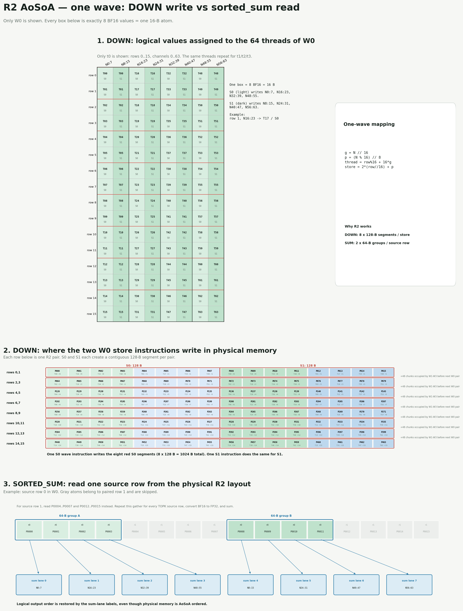
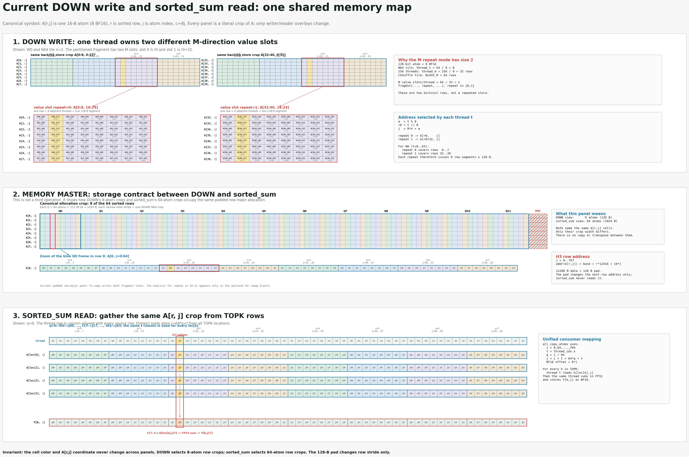

# fused MOE g1u0 gelu

## fused MOE 基本流程

 - hidden_states: [num_tokens, model_dims]
 - 逐点乘以 smooth_scale + per-token 量化到 INT8 [[1]](#共享smooth_scales)
 - moe_sorting(block_m) : 每个token的topk个需要infer的复本，根据专家进行分组排序，每组内token的个数padding到block_m整数倍 [[2]](#最大化block_m)
 - GEMM1 + fused_gelu: 输出数据tensor bf16：[num_tokens, topk, inter_dims] [[3]](#HIPKitten's 8wave pipeline) [[4]](#指令优化gelu)
 - 逐点乘以 per-expert smooth_scale + per-token 量化到 INT8
 - GEMM2: [num_tokens, topk, model_dims] [[6]](#中间结果动态量化) [[7]](#XCD Swizzle)
 - ReduceSum : [num_tokens, model_dims] [[5]](#避免ATOM访存带宽限制)


## 共享smooth_scales
根据 [SmoothQuant论文](https://arxiv.org/abs/2211.10438)，outlier主要出现在激活input的某些channel，权重相对则要均匀很多，作为整个MOE的原始输入，应该可以共享同一份smooth scale, 相较于每个专家独享一份smooth scale的方案，这可以把第一个量化kernel的数据访问量至少降低TOPK倍。

## 最大化block_m

GEMM问题中，一个workgroup (threadblock)处理的输出矩阵越大，越接近正方形，越能够降低访存计算比 `(M+N)*K/(MNK)`, 在LDS和寄存器资源允许的情况下，配合jit的手工寄存器分配，该值可以增加到256。（目前aiter代码中最大128）

## HIPKitten's 8wave pipeline

[HipKittens](https://arxiv.org/abs/2511.08083) 针对AMDGPU引入了8-wave 排流水的创新性pipeline：
 - 按照4wave为单位，分为两组，两组交替执行计算和加载，遮盖访存延迟
 - 可以大大简化流水线的排布，并且获得几乎不输于4wave的性能
 - 相对传统的`4wave`排流水，可以避免手工决定使用AccVGPR还是普通VGPR的问题，全部分配为普通VGPR

## 指令优化gelu

[Gelu](https://docs.pytorch.org/docs/stable/generated/torch.nn.GELU.html) 激活函数的计算使用到了[tanh](https://docs.pytorch.org/docs/stable/generated/torch.nn.Tanh.html)函数，HIP的C++ STL生成的汇编代码比较复杂并且可能出现thread-diverge（根据每个thread输入值的取值范围使用不同方式近似计算，以避免exp越界），可以更通过简单的方式保证exp的输入永远是负数来避免越界：
```python
    sign = np.sign(v)
    exp = np.exp(-2*sign*v)
    tanh = (sign - sign*exp)/(1 + exp)
```

## 避免ATOM访存带宽限制

目前Aiter中某些case下的moe gemm2的输出是使用 `global_atomic_pk_add_bf16` 指令直接累加到外存来避免写出巨量的中间结果和额外的ReduceSum kernel开销，但是实测表明这种 atomic 访存指令在 gfx942/gfx950 上的带宽只有普通写出访存指令的1/4，因此性能还不如`直接写出巨量数据，再使用ReduceSum读回做sum再存出最终结果`。

## 中间结果动态量化

gemm2写出巨量中间结果发生在gemm kernel的尾部，没有MFMA指令可以与其并行遮盖，因此拖累了性能，以1x32为单位的量化该中间结果到INT8再存出，可以显著降低写出消耗。

另外使用`sc1 nt`修饰符bypass cache，直接streaming到外存可以结果数据对L2-cache的污染，进一步提升gemm核心循环的性能


## XCD Swizzle

gfx950的256个CU分布在8个XCD上，每个XCD具有独立的L2-cache, 通过把访问相同专家权重的 gemm-block 计算任务分配到相同的 XCD上，当这些任务在gemm核心循环中，以一致的步调访问接近相同的权重和输入数据的某个K维度slice的时候，就可以从L2-cache受益，减少冗余的外存加载操作。

## H3 B=32768优化记录

固定测试配置：gfx942（MI308X），FP8 PTPC，`B=32768`，`H=6144`，本地
`I=384`（TP=8），`E=128`，`TOPK=4`，`BM=64`，`BN=256`。gateup和down都走
`prefill_1x4`。以下TFLOPS按有效token计算。sorting为2176个WG分配输出空间，但平衡路由下只有
2048个WG进入计算，尾部128个WG由设备端valid边界提前退出，因此MFMA工作量没有6.25%的padding膨胀。

> **后续实验应保留的正向结论**
>
> - **旧`e6fe8e9` N64代码的唯一稳定正收益是128B行padding：** 正反padding sweep从
>   `1.8257 + 0.5613 = 2.3870 ms`降到`1.7368 + 0.5661 = 2.3030 ms`，合计降低3.52%。
>   R2、scale经LDS、store均匀分布、完全顺序写出和`setprio`反相均无端到端正收益，实验代码
>   已移除，数据继续保留在本文后半部分。
> - **N256端到端最佳是4KB wave-private XOR CShuffle + 128B padding：** A LDS仍为
>   `Swizzle(3,4,3)`时，同机正反
>   trace为`1.6553 + 0.5753 = 2.2306 ms`，优于既有R2的
>   `1.5911 + 0.7047 = 2.2959 ms`，端到端降低2.84%。LDS为29,696B，资源为
>   `100 VGPR + 132 AGPR`，继续保持2 wave/SIMD。随后A LDS固化为`Swizzle(3,4,4)`；
>   空闲32轮同进程ABBA中down稳定降低2.55%。再将下一N块scale load放到8条weight load之前，
>   scale提交从`vmcnt(0)`放宽到`vmcnt(8)`，down再降低1.51%。最终同窗口为
>   **1.516768 ms / 407.8 TFLOPS**，达到gateup 421.2 TFLOPS的96.82%。

### 基线（2026-08-11）

| kernel | 有效FLOP | 稳态中位时间 | 有效TFLOPS | VGPR+AGPR | LDS/WG | wave/SIMD |
|---|---:|---:|---:|---:|---:|---:|
| gateup | 1.237 TFLOP | 2.734 ms | 452.5 | 56+128 | 16 KB | 2 |
| down | 0.618 TFLOP | 1.851 ms | 334.1 | 60+132 | 24 KB | 2 |

两者合计为1.855 TFLOP / 4.585 ms = 404.7 TFLOPS。完整`run()`还包含约
229 us输入量化、241 us中间激活量化、565 us sorted-sum和少量索引处理。

ATT稳态trace：

- gateup：79.3% stall；MFMA 55.3%，VMEM load+wait 26.7%，barrier 6.3%，
    LDS相关5.4%。
- down：77.9% stall；MFMA 38.3%，packed/其他VALU依赖23.8%，LDS相关15.9%，
    VMEM load+wait 13.2%，barrier 6.2%，VMEM store 2.6%。
- L2 hit：gateup 51.7%，down 60.2%。两者occupancy均被限制到2 wave/SIMD；
    down同时受24 KB LDS限制，最多2 WG/CU。

### MFMA stall解释

`v_mfma_f32_16x16x32_fp8_fp8`的issue间隔约4 cycles，同一accumulator的RAW延迟约
16 cycles，所以连续依赖MFMA在准备发射时理论上还需要等待约`16-4=12` cycles。
ATT的`stall_cycles`记录的是“该条MFMA准备发射但被阻塞”的周期，不是相邻两条MFMA的
总间隔。当前静态MFMA的stall/exec中位数为gateup 11.90、down 11.83 cycles，说明典型
accumulator链已经接近12-cycle RAW下限；但按动态执行加权的均值为16.73和13.91 cycles，
其中还包含操作数未就绪、pipeline争用和wave调度，不能解释成“MFMA总延迟接近16所以已最优”。

gfx942每条MFMA提供约12-cycle shadow，可以隐藏3条独立的普通4-cycle scalar VALU；依据
[`mfma-valu-coissue.md`](../../flydsl/attn_4wave/tools/mfma-valu-coissue.md)，
`v_pk_add_f32`/`v_pk_mul_f32`虽然吞吐也约4 cycles，但与MFMA的intra/inter full-coissue
容量都是0，不能利用这3条scalar VALU容量。

### down代码流程与首轮优化计划

down当前流程：

1. 按`sorted_ids`把FP8输入行搬到LDS A并同步；每个WG负责`64x64`输出块。
2. 从LDS加载完整A fragment；每次预取一个`N=64`权重块及PTPC scale到寄存器。
3. `gemm_compute`沿`K=384`执行FP8 MFMA，随后将scale和routing weight乘到FP32累加器。
4. FP32转BF16，写入双缓冲LDS C；同步后由上一缓冲读出并128-bit写全局内存。
5. kernel外通过`invert_sorted_ids + sorted_sum`把top-k中间结果归并为最终输出。

#### `gemm_compute`和4-wave划分

down的逻辑矩阵为`C[token, channel] = A[token, K] x W[channel, K]`，每个WG处理
`BLOCK_M x BLOCK_N = 64 token x 64 channel`。实现中为匹配MFMA寄存器布局，将MFMA的
M维映射为channel、N维映射为token：

```text
create_thr_mma(fp8, wave_mnk=(4, 1, 1))
thr_layout_mnk shape  = (4, 1, 1)
thr_layout_mnk stride = (1, 4, 0)
```

因此4个wave沿channel维划分，而不是沿token维划分：

| wave | thread | channel范围 | token范围 |
|---|---|---|---|
| 0 | 0..63 | 0..15 | 0..63 |
| 1 | 64..127 | 16..31 | 0..63 |
| 2 | 128..191 | 32..47 | 0..63 |
| 3 | 192..255 | 48..63 | 0..63 |

底层原子是`MFMA(16x16x32, FP8)`。一个wave覆盖`16 channel x 64 token`，即token方向有
4个16-wide accumulator tile。`BLOCK_K=32`，H3本地`K=384`，所以：

```text
nBK = K / BLOCK_K = 384 / 32 = 12
MFMA / wave / output-block = 12 K-step x 4 token-tile = 48
MFMA / WG / output-block   = 48 x 4 wave = 192
```

`gemm_compute(fragW, fragPCS, fragC)`的实际顺序：

1. 清零当前FP32 `fragC`。
2. 对12个K-step调用`fx.gemm`，每步每wave更新4组独立token accumulator。
3. K归约结束后，用PTPC weight scale逐元素乘`fragC`。
4. `postprocess_store2lds`再乘每token routing weight，FP32转BF16并写入LDS C。

外层`nBN=N/BLOCK_N=6144/64=96`。实现用两组`frag_weights/fragC/LDS-C`做N方向双缓冲：
当前块执行48条MFMA时预取后续channel块权重；上一块从LDS读出并写全局。每次外层循环推进
两个64-channel块。这里权重预取与MFMA存在重叠，但scale/routing-weight的packed ALU集中在
MFMA链之后，且`v_pk_mul_f32`不能利用MFMA的12-cycle scalar VALU shadow，正是首轮优化目标。

#### 权重和128-bit访存指令数

权重不经过LDS。`arg_p_weight`先包装成buffer descriptor，`load_tiled_mma_fragA`使用
`BufferCopy128b`直接执行`global/L2 -> VGPR`。对一个`64 token x 64 channel`输出块：

| 数据路径 | 每wave的wave-level指令 | 每WG的128-bit lane access | 备注 |
|---|---:|---:|---|
| weight global -> reg | 6 `buffer_load_dwordx4` | 1536 | 24 KB，4 wave各读自己的16 channel |
| A global -> reg | 6 `buffer_load_dwordx4` | 1536 | 每WG只在进入kernel时做一次 |
| A reg -> LDS | 6 `ds_write2_b64` | 1536 | 每WG只做一次 |
| A LDS -> reg | 24 `ds_read_b128` | 6144 | 每wave都需要完整`64x384` A，读量复制4倍 |
| C reg -> LDS | 2 `ds_write2st64_b64` | 512 | 每个输出块 |
| C LDS -> reg | 2 `ds_read_b128` | 512 | 每个输出块 |
| C reg -> global | 2 `buffer_store_dwordx4` | 512 | 每个输出块 |

这里“每wave指令”是一条wave指令控制64 lanes；“lane access”按每个active lane一次16-byte
访问计数，不等于合并后的物理L2/HBM transaction数。例如weight每wave读取
`16x384=6144 B`，所以是`6144/(64x16)=6`条wave指令；4 wave总计
`24x64=1536`个128-bit lane access。完整96个channel块中，每wave执行576条weight load和
4608条MFMA，整个WG读取权重2.25 MiB；权重没有对应的LDS/global写指令。

理论遮盖关系：

- 每条weight load包含两个K-step的wave operand，支持`2 K-step x 4 token-tile = 8`条MFMA。
    每个输出块是6条weight load对48条MFMA。
- 48条MFMA按4-cycle issue间隔提供约192 cycles的同wave计算窗口。当前scheduler按
    `6 MFMA + 1 memory group`排布，最早发出的weight load可获得接近整个窗口，最后几条load
    只有约24 cycles到下一次消费。
- 因此L2 hit通常可大部分遮盖，但300--500 cycle量级的HBM miss无法保证全部遮盖；2 wave/SIMD
    只能提供额外独立工作，不能消除同wave最后一批load到consumer的短距离。ATT中VMEM
    load+wait仍占down总stall的13.2%，说明weight/global读取是**大部分但未完全遮盖**。
- C的global store可与后续weight load/MFMA异步推进，ATT中VMEM-store只占2.6%，基本被遮盖。
- C的LDS write之后有barrier，下一阶段立即LDS read，存在硬同步依赖，不能由前一段MFMA
    向外遮盖；LDS相关stall占15.9%，是比global store更明确的未遮盖尾部。
- A的global->LDS->reg发生在96个输出块之前，没有MFMA并行，但只执行一次，成本被整个N循环
    摊薄；它不是当前首要优化目标。

首轮只改down，优先级如下，逐项小步验证：

1. **拆除packed FP32 ALU。** ATT中`v_pk_mul_f32`是最大的非MFMA热点之一，且微基准证明
     它不能和MFMA full-coissue。先把scale/routing-weight乘法改成明确的scalar FP32
     `v_mul_f32`/`v_fma_f32`，再检查ISA确认不被LLVM重新合并为`v_pk_*`。目标是把每条MFMA的
     12-cycle shadow用于最多3条scalar VALU。
2. **重排scalar ALU到MFMA窗口。** 仅拆包不够；需用调度barrier把独立scale/weight乘法
     分散到MFMA链之间，避免全部落在GEMM结束后的串行尾部。关注VGPR live range，不能让
     combined VGPR超过当前约192而降低occupancy。
3. **最后处理LDS epilogue。** down的`ds_write/lgkmcnt`平均暴露约47/46 cycles，当前
     `write LDS -> barrier -> read LDS -> global store`有硬依赖。先完成packed ALU实验，再考虑
     拉大LDS写读距离、将更多global store和下一块MFMA/权重预取交叠。

每次后续实验只在本节追加一行：`日期 | 改动 | 时间 | TFLOPS | VGPR+AGPR | LDS | ATT变化 | 结论`。

### 实验结果（2026-08-12）

以下时间均来自H3 B=32768的raw kernel trace，剔除首调用后取中位数；有效FLOP固定为
0.618475 TFLOP。当前gateup约451.8 TFLOPS，因此down若要追平，时间需从1.847 ms降到约
1.369 ms，即至少再降低25.9%。

| 改动 | down时间 | TFLOPS | VGPR+AGPR | 结果 |
|---|---:|---:|---:|---|
| N64原基线 | 1.8468 ms | 334.9 | 60+132 | 当前最快正确版本 |
| packed拆成scalar `llvm.fma.f32` | 1.8974 ms | 326.0 | 56+128 | ISA中`v_pk_mul_f32`清零，但scalar仍集中在MFMA之后，退化2.7%，已回退 |
| weight/scale三级预取 | 1.8784 ms | 329.3 | 108+132 | 消费距离从约48条MFMA增到96条，但VGPR和控制流成本更高，退化1.7%，已回退 |
| 跨块MFMA/后处理流水（仍packed） | 1.9821 ms | 312.0 | 96+128 | 槽位正确，但更长live range导致资源上升，退化6.8%，已回退 |
| N64每lane直接64-bit写出 | 3.2582 ms | 189.8 | 80+128 | 去掉C LDS，但每块store数量翻倍且串行，退化43.3%，已回退 |
| N128逻辑地址128-bit直写 | 2.4308 ms | 254.4 | 80+128 | 两个N64 pass在同一lane拼成连续8 BF16；无跨lane permute，`sorted_sum=0.5545 ms` |
| N128头部集中预取，无`setprio` | 2.0213 ms | 306.0 | 116+132 | 双份weight/scale寄存器；循环头集中发出12条weight和2条scale load |
| N128头部集中预取，slot反相`setprio` | 2.0142 ms | 307.1 | 116+132 | 当前N128最快；`sorted_sum=0.5726 ms`，完整H3 `diff=0.00105974` |

scalar实验补充结论：直接照搬PA的inline-asm `_fma_f32` 在down的SCF循环中不可靠。`=v`
输出允许寄存器覆盖尚未读取的输入；改为early-clobber后仍需显式处理VMEM依赖，尾块仍可能损坏。
改用LLVM scalar `llvm.fma.f32` intrinsic后，N=128/N=384有限值测试和完整H3测试均通过
（完整H3 `diff=0.00106`），且最终ISA生成普通`v_fma_f32`而不是packed指令，但因没有进入
MFMA shadow而出现上述性能退化。

#### N128直接128-bit写出结论

最初尝试保持标准连续N64权重布局，再从两个MFMA-M repeat拼接输出；该布局下同一lane的两组
4xBF16不连续，需要gfx942不支持的`permlane16_swap`或昂贵的`ds_bpermute`。最终方案不再对
结果做跨lane重排，而是重排weight的逻辑N遍历：

```text
pass 0: [0..3]  [8..11]  [16..19]  [24..27]
pass 1: [4..7] [12..15]  [20..23]  [28..31]
```

对wave `w`、lane-group `g`和N128 block `b`，两个pass分别产生：

```text
pass 0: 128*b + 32*w + 8*g + [0:4]
pass 1: 128*b + 32*w + 8*g + [4:8]
```

同一lane因此天然得到连续8个BF16，只需lane内拼接成一条`buffer_store_dwordx4`。每个物理
N128 block每wave执行4条128-bit store；不经过C LDS，不使用`bpermute`、`permlane`或其他
跨lane permute。写出地址直接采用真实逻辑顺序`wave*32 + lane_group*8`，所以`sorted_sum`
保持原128-bit连续读取和写出，不再需要channel解置换。

代价是weight的wave级N方向读取从连续16行改成“连续4行、跳过4行，下一pass补齐”。每个lane
自身仍执行连续16-byte的`buffer_load_dwordx4`，总weight字节数不变，但空间局部性下降。

#### N128头部集中预取与相位反转

原N128逻辑直写将next-pass0和next-pass1预取分散在两个GEMM之间，ATT中VMEM-load占40.0%、
VMEM-store占19.3%，down为2.4308 ms。新结构为每套current/next各保留两份weight和scale
fragment，主循环严格组织为：

```text
read/write stage:
    集中预取下一N128 block的两个pass（12条weight + 2条scale load）
compute stage:
    pass0 GEMM + scale/routing-weight后处理
    pass1 GEMM + scale/routing-weight后处理
read/write stage:
    4条128-bit global store
```

参考`tests/flydsl/pa_4wave/pa_prefill_4wave.py`读取`HW_REG_HW_ID[3:0]`，对同一SIMD的两个驻留
wave设置阶段相关优先级：read/write阶段slot0/slot1为`1/0`，compute阶段为`3/2`。最终ISA
确认12条weight load和2条scale load全部位于首条MFMA之前，随后是两组共96条MFMA及后处理，
最后才执行4条store。寄存器从逻辑直写版的80+128升至116+132，但仍保持2 wave/SIMD。

ATT对比（相同第5次稳态dispatch）：

| 指标 | N128逻辑直写 | 头部预取+`setprio` | 变化 |
|---|---:|---:|---:|
| total stall | 103.88M | 68.54M | -34.0% |
| stall rate | 85.6% | 76.3% | -9.3 pp |
| VMEM-load stall | 41.55M | 17.72M | -57.4% |
| VMEM-store stall | 20.03M | 12.66M | -36.8% |
| VMEM-wait stall | 3.34M | 2.27M | -32.0% |
| MFMA stall | 20.68M | 22.44M | +8.5% |

因此计算阶段确实部分掩盖了读写，down提升到2.0142 ms / 307.1 TFLOPS。关闭`setprio`但保留
完全相同的头部集中预取结构时为2.0213 ms / 306.0 TFLOPS，说明主要收益来自双份寄存器和
集中预取；slot反相本身额外约0.35%，接近运行波动，但ATT确认其最终阶段结构符合预期。

#### N256外循环 + 每wave 64x64x128核心

后续实验将WG输出块改为`M64xN256`，4个wave仍沿N分布，每个wave负责连续`M64xN64`；K方向
按128切成静态展开的内循环。H3的K=384因此每次N外循环包含3个`64x64x128`核心，共192条
FP8 MFMA。weight逻辑布局将TiledMMA的4个M-repeat映射为每wave连续64 channel，输出每个
token/lane使用两条128-bit store。

pipeline分为：

```text
stage0: 读weight/A、预取下一K（最后K预取下一N的K0）、写出
stage1: 当前64x64x128核心的MFMA计算
```

两个版本均通过N512/N1024有限值测试和完整H3测试（`diff=0.00105974`）：

| 版本 | down | TFLOPS | VGPR+AGPR | 结果 |
|---|---:|---:|---:|---|
| v1：当前K的weight/A读完立即计算 | 3.0773 ms | 201.0 | 56+128 | ATT暴露当前K依赖；该次stats受系统负载干扰，绝对时间波动较大 |
| v4：weight双槽ping-pong，A单槽，集中store | 2.3290 ms | 265.6 | 104+128 | 2 wave/SIMD；8条store集中在K循环之后 |
| v5：上一N块store按K-stage分成3/3/2 | 2.0559 ms | 300.8 | 120+128 | 当前N256/K128最佳；`sorted_sum=0.5645 ms` |

v1到v4的ATT变化证明K128 stage1能够掩盖stage0读取：

| Stall | v1 | v4 | 变化 |
|---|---:|---:|---:|
| total | 81.88M | 73.87M | -9.8% |
| VMEM-wait | 16.24M | 2.59M | -84.1% |
| LDS-wait | 15.01M | 1.67M | -88.9% |
| VMEM-load | 17.58M | 17.43M | -0.8% |
| VMEM-store | 12.97M | 16.81M | +29.6% |
| MFMA | 22.91M | 22.06M | -3.7% |

即计算确实掩盖了大部分weight/A等待，但没有减少实际load流量；每wave N64输出需要每token两条
128-bit store，store stall升至22.8%。尝试让A和weight都使用双槽时VGPR升至312，occupancy
降为1 wave/SIMD，因此淘汰。

v5将上一N块已完成的8条128-bit store作为BF16 loop-carried状态，在当前块的三个K128 stage0
中按3/3/2发出，最后再drain末块。每wave每个内层循环的128-bit指令预算为：

| K128 stage | weight `buffer_load_dwordx4` | A `ds_read_b128` | scale load | output `buffer_store_dwordx4` | MFMA |
|---|---:|---:|---:|---:|---:|
| K0 | 8 | 8 | 0 | 3 | 64 |
| K1 | 8 | 8 | 0 | 3 | 64 |
| K2 | 8（下一N的K0） | 8 | 4条`global_load_dwordx4` | 2 | 64 |

按WG计数时乘以4个wave：每K128为32条weight wave-instruction和32条A LDS wave-instruction；
每N256块为32条store wave-instruction。若按lane access计数，每wave每K128的weight/A各为
`8*64=512`次16-byte访问，每wave每N块store同样为512次16-byte访问。

相对集中store的v4，v5 down从2.3290降至2.0559 ms（-11.7%），TFLOPS从265.6升至300.8；
`down+sorted_sum=2.6204 ms`。VGPR从236升至250，仍保持2 wave/SIMD。ATT中store平均stall从
216.7降至191.1 cycles/exec（-11.8%），store stall总量从16.81M降至15.75M（-6.3%）；总stall
从73.87M降至72.81M（-1.4%）。因此分散store降低了单条store的暴露延迟，但ATT采样中的总周期
改善有限；绝对kernel时间的收益还包含更好的跨wave阶段配合。当前v5保留为未暂存实验，实验
开始前的全量工作区检查点在Git index中。

#### Scale 128-bit去重与LDS广播

原N256路径的scale已经生成4条`global_load_dwordx4`，但C-fragment地址只依赖`tid & 0xf0`，
同一16-lane group的16个lane读取完全相同的16个scale。每个N256块逻辑scale为1KB，原路径
4个wave各执行4条128-bit load，按lane流量为16KB，即16倍重复；K方向没有重复，每N块只加载
一次。

最终方案使用`fx.Array[fx.Float32, 256, 16]`额外分配1KB、显式16-byte对齐的独立LDS：每个wave
的前16个lane各用一条`buffer_load_dwordx4`加载4个连续scale到本wave的64-channel LDS片区，
然后4个wave分别用4条`ds_read_b128`按原C-fragment布局广播。各wave只读自己写入的片区，依靠
同wave`lgkmcnt`保序，不需要跨wave barrier。总LDS从24,576B增至25,600B，仍保持2 wave/SIMD。
BN128时上述容量和每wave参与lane数按tile缩半：scale LDS为512B、每wave前8个lane参与，
总LDS为25,088B。

指令/流量变化（每WG每N256块）：

| 路径 | Global scale load | Global lane流量 | LDS写 | LDS读 | Barrier |
|---|---:|---:|---:|---:|---:|
| 原direct scale | 16条wave-instruction | 16KB | 0 | 0 | 0 |
| 每wave私有LDS | 4条wave-instruction（每wave仅16 lanes active） | 1KB | 4条 | 16条 | 0 |

第一次仅wave0协作加载的版本虽然global只需1条wave-instruction，但需要全WG barrier；ATT中barrier
达到11.09M stall / 13.9%，因此放弃。每wave私有版本避免barrier，down为2.0288 ms。进一步将
下一N块scale的global load放在K2 stage0，把LDS提交推迟到K2的64条MFMA之后：最终ISA中稳态
scale load和`ds_write_b128`之间有64条MFMA，等待从`vmcnt(0)`放宽到`vmcnt(2)`。

| 版本 | down | TFLOPS | LDS | 结果 |
|---|---:|---:|---:|---|
| v5 direct scale | 2.0559 ms | 300.8 | 24,576B | 16倍global lane重复 |
| v7 每wave私有scale LDS，同步提交 | 2.0288 ms | 304.8 | 25,600B | 无barrier，但scale load后立即等待 |
| v8 异步scale load，K2后提交LDS | 2.0234 ms | 305.7 | 25,600B | 当前N256最佳；`sorted_sum=0.5646 ms` |

v7到v8的ATT中，scale helper stall从11.24M降至2.23M，VMEM-wait总量从11.87M降至3.06M，
总stall从76.44M降至72.61M。v8相对direct scale快1.58%，说明scale去重有效，但收益受新增LDS
广播和原有weight/store瓶颈限制。完整H3保持`diff=0.00105974`。

#### Tile N 128/192/256比较

本节记录已删除的tile sweep。实验阶段physical down曾支持`BLOCK_TILE_SIZE_N`为128/192/256；
最终只保留BN256。BN128使用4个wave沿N：每wave负责32 channel，
每lane最终得到8个连续BF16，因此每token只需一条128-bit store；三个K128 stage的4条store
自动分成2/1/1。BN128与BN256总MFMA、weight字节数和输出字节数相同，仅改变N外循环粒度。

| Tile N | ISA VGPR | Stats VGPR+AGPR | LDS | 每N块MFMA | 每wave store/N块 |
|---|---:|---:|---:|---:|---:|
| 128 | 158（next-free 169） | 32+144 | 25,088B | 96 | 4 |
| 256 | 242 | 120+128 | 25,600B | 192 | 8 |

空闲card3按128 -> 192 -> 256 -> 192顺序完成最终sweep：

| Tile N | down | TFLOPS | sorted_sum | Stats VGPR+AGPR | LDS |
|---|---:|---:|---:|---:|---:|
| 128 | 2.2174 ms | 278.9 | 0.5679 ms | 32+144 | 25,088B |
| 192-A | 2.6780 ms | 231.0 | 0.5558 ms | 76+132 | 25,600B |
| **256** | **2.0369 ms** | **303.6** | **0.5530 ms** | 120+128 | 25,600B |
| 192-B | 2.6535 ms | 233.1 | 0.5634 ms | 76+132 | 25,600B |

BN128相对BN256慢8.9%。BN192在4-wave分布下每wave48 channel、3个MFMA-M repeat；每lane最终
有3组连续4 BF16，使用每token三条64-bit `buffer_store_dwordx2`，三个K128 stage各分4条。
N1536端到端正确，资源为ISA VGPR202、单N块144条MFMA和12条64-bit store，但两轮均比BN256
慢约30%。因此最终删除BN128/192实现、环境开关和专用正确性覆盖，仅保留BN256。

#### Gateup/down pipeline、no-pk与scalar FMA

Gateup和physical down都以每wave `64x64x128` 为核心，每个核心均为64条
`v_mfma_f32_16x16x32_fp8_fp8`，但pipeline不同：

| | Gateup | Down BN256 |
|---|---|---|
| C流 | gate/up两条独立累加流 | 单条down累加流 |
| Activation | global gather -> register -> A LDS ping-pong | kernel头一次性global -> A LDS，K stage从LDS读 |
| Weight | gate/up各自global -> register双缓冲 | 单份weight global -> register双槽ping-pong |
| 调度 | 同一basic block内用`sched_group`交织VMEM/LDS/MFMA | `setprio`将stage0读写和stage1 MFMA分相，靠两驻留wave反相遮盖 |
| 输出 | CShuffle/LDS后写出，稳态store很少 | 上一N块8条128-bit store按2/2/4分散到三个K stage |

按最终ISA和ATT动态执行次数统一到“每wave每64条MFMA”后，128-bit指令预算为：

| | VMEM load | VMEM store | LDS read | LDS write |
|---|---:|---:|---:|---:|
| Gateup | 10.08 | 0.08 | 8.08 | 2.00 |
| Down BN256 | 8.54 | 2.78 | 9.39 | 0.35 |

Down稳态按当前源码stage精确计数为K0/K1/K2各8条weight load、8条A LDS read，store为2/2/4；
K2另有1条masked scale global load，N块尾有1条scale LDS write和4条scale LDS read。因而纯VMEM
平均为每wave每K128 `8 + 1/3`条load和`8/3`条store，共11条；4 wave合计44条，而不是将LDS
访问混入后得到的56条。LDS平均另有`8 + 4/3`条read和`1/3`条write，走独立管线，应单列。

在physical down launch上设置`target-features=-packed-fp32-ops`后，packed FP32指令清零；进一步将
routing scale与BF16 rounding bias合并为scalar `llvm.fma.f32`，最终ISA生成普通
`v_fmaak_f32`，明确没有`v_pk_fmac_f32`。BN256后处理从64条`v_pk_mul_f32`加32条
`v_pk_add_f32`变为64条scalar mul加64条scalar FMA；按每元素计算，原两轮packed共192个scalar
等价操作，现为128个，减少三分之一。空闲card3同口径结果：

| 版本 | Down | TFLOPS | Stats VGPR+AGPR | 结果 |
|---|---:|---:|---:|---|
| v8 packed | 2.0369 ms | 303.6 | 120+128 | 对照 |
| 仅禁pk | 2.0177 ms | 306.5 | 120+128 | +0.94% |
| 禁pk + scalar FMA融合 | **1.9966 ms** | **309.8** | **108+132** | 相对v8 +2.0%，保留 |
| 严格两相：stage1仅MFMA，stage0含读写与后处理 | **1.9928 ms** | **310.3** | **108+132** | 资源不变；相对FMA版基本持平，保留 |
| stage0保持slot `1/0`，stage1统一prio3 | **1.9719 ms** | **313.6** | **108+132** | 限制VMEM竞争、取消MFMA固定slot饥饿，保留 |
| 上一N块store按K stage改为`2/2/4` | **1.9504 ms** | **317.1** | **108+132** | 相对严格两相 +2.2%，当前最佳，保留 |

N256主循环现在是严格的两相状态机：prologue先进入stage0；每个K128迭代在stage0完成A读取、
下一份weight/scale预取和上一N块的分散store，随后切到stage1且只执行64条MFMA；MFMA结束后立即
切回stage0。因此最后K后的scale LDS提交、当前N块的weight/routing scale、BF16转换，以及末块
drain store都属于stage0。下一K迭代沿用当前stage0状态，不重复切换优先级。

FMA版ATT目录为`/tmp/moe_h3_n256_no_packed_fma_att/ui_output_agent_21912_dispatch_2596`。
总stall从72.61M降至70.91M；packed ALU的6.93M stall被0.70M scalar FP32 stall取代。三个K128
MFMA phase的64条MFMA stall分别为8.47M、8.31M、8.62M，首条仍有0.95M、0.99M、1.11M，说明
scalar后处理仍位于MFMA phase之外；当前主瓶颈回到VMEM load 20.80M、store 17.49M和MFMA
25.40M。尝试用`sched_group_barrier`指定`1 MFMA + 2 VALU`没有改变最终ISA顺序，已移除。

另试`MNK`遍历让weight源交替、activation源复用，计时仅从1.9966降至1.9901 ms（0.33%）；ATT中
MFMA平均stall几乎不变（13.64 -> 13.61 cycles/exec），总stall反而70.91M -> 72.87M，故按噪声
处理并恢复默认`NMK`。默认`NMK`已将K放在最外层，同一累加器复用距离约16条MFMA，单纯改变
M/N遍历无法进一步缩短MFMA依赖stall。

#### 严格两相ATT与遮盖机会

严格两相基线ATT为
`/tmp/moe_h3_n256_strict_two_stage_att/ui_output_agent_25881_dispatch_2596`，当前最佳`2/2/4`
ATT为`/tmp/moe_h3_n256_store_224_att/ui_output_agent_1692_dispatch_2596`。两者采样执行数一致；当前
最佳相对严格两相的stall变化为：

| Stall | 严格两相 | hybrid-prio3 + `2/2/4` | 变化 |
|---|---:|---:|---:|
| total | 70.00M | 68.25M | -2.5% |
| MFMA | 25.43M | 28.25M | +11.1% |
| VMEM load | 19.86M | 18.53M | -6.7% |
| VMEM store | 17.70M | 14.96M | -15.4% |
| VMEM wait | 3.62M（含统一wait分类） | 2.28M | 明显下降 |

Raw wave时间线显示，严格两相的双slot反相覆盖只有48.9%，两slot同时stage0占35.8%、同时stage1
占15.4%。这说明`setprio`不能构造严格的相位锁；更重要的是控制VMEM并发。原策略在stage0和
stage1都固定slot0比slot1高一级，slot1的首条weight load平均约328--370 cycles，slot0约162--173
cycles。最终策略在stage0保留slot `1/0`来抑制两个slot同时灌满VMEM队列，在stage1让两个slot都
使用prio3，避免固定压低slot1的MFMA。虽然反相覆盖降到约44%，但load/store stall下降更多，净性能
提升，因此不能把“反相比例最高”当作单一优化目标。

每个stage0的第一条weight load约245--259 cycles，后续7条通常仅27--47 cycles；它主要承接
MFMA->VMEM管线切换和队列背压，而不是8条load都暴露完整HBM延迟。K2原先集中9条load和2条store；
把8条输出store从`3/3/2`逐步后置后，`2/2/4`最佳。`1/2/5`退化到2.0001 ms，说明K2在4条store
附近已经达到承载边界。

已否证的遮盖实验：

- stage0或stage1单独反转固定slot：反相覆盖均降到约42%，MFMA平均stall从13.66升到约15.5
    cycles/exec，性能无收益，已回退。
- 两slot只按阶段统一prio0/prio2：控制指令更少，但ATT total stall增加2.6%，未保留。
- store-first再发weight/A load：相邻同卡A/B为2.0397 vs load-first 1.9853 ms，明显退化。
- 下一N scale load从K2提前到K1：隐藏距离从64增到128条MFMA，但live range改变寄存器分配，
    down中位数退化1.8%，已回退。
- 强制A LDS read先于weight load：最终ISA兑现但寄存器分配增加，外部GPU任务期间无法得到有效
    绝对性能，未保留。
- K2 `2R/1W` VMEM sched_group交织：最终ISA仍为全部load后全部store，且寄存器分配显著扰动，
    静态检查即淘汰。

#### BN256整wave连续写出

将BN256输出改为物理连续布局。对每条128-bit store，定义：

```text
physical_lane = (lane_id % 16) * 4 + lane_group
physical_chunk = ((block_n * 4 + wave_id) * 8 + store_index) * 64
                                 + physical_lane
byte_offset = physical_chunk * 16
```

因此lane `0/16/32/48`分别写相邻的第`0/1/2/3`个16B块，lane
`1/17/33/49`写第`4/5/6/7`个块；一个wave的64 lane恰好覆盖连续64个16B块，即连续1024B。
8条store依旧按K stage分为`2/2/4`，只改变物理地址。`sorted_sum`根据token location、逻辑column、
wave、lane group和store index执行逆映射。BN128/192保持原逻辑地址布局。

空闲card3同口径结果：

| 布局 | Down | TFLOPS | sorted_sum | VGPR+AGPR |
|---|---:|---:|---:|---:|
| 逻辑地址写出 | 1.9504 ms | 317.1 | 0.5669 ms | 108+132 |
| 整wave连续写出 | **1.5821 ms** | **390.9** | 1.2471 ms | 108+132 |

**核心结论：输出store是否能形成整wave顺序写出对down性能影响重大。** 在计算、资源和store
字节数不变时，仅将分散的逻辑地址写出改成每条wave连续1024B，down就降低18.9%；这说明原布局
的写合并、cache line/set映射或VMEM队列背压，而不是store指令数量本身，是主要性能因素。后续
padding实验将本次提交称为`base`，并以其1.5821 ms / 390.9 TFLOPS作为未改动最快基线。

连续写使down提升18.9%；`down + sorted_sum`从2.5173 ms变为2.8292 ms，但本实验目标只验证down
VMEM写出。最终ISA保持16条`buffer_store_dwordx4`，资源不变，地址计算中的乘加类指令减少16条。

连续写ATT为
`/tmp/moe_h3_n256_contiguous_store_att/ui_output_agent_61490_dispatch_2596`：

| Stall | 逻辑地址 | 连续地址 | 单次执行变化 |
|---|---:|---:|---:|
| total | 68.25M | 52.80M | 每MFMA采样归一后约-24% |
| VMEM store | 14.96M / 185.2 cycles | 4.74M / 57.5 cycles | **-68.9%** |
| VMEM load | 18.53M / 72.5 cycles | 6.99M / 26.8 cycles | **-63.0%** |
| MFMA | 28.25M / 15.2 cycles | 34.13M / 18.0 cycles | +18.5%，内存瓶颈解除后暴露 |

按阶段，K0/K1/K2的store stall分别从3.74M/3.52M/7.30M降到1.25M/1.26M/2.15M；末块drain
也从0.41M降到0.08M。连续store不仅减少store stall，也释放共享VMEM队列，显著降低后续weight
load stall。当前down已从VMEM主导转为MFMA主导。

#### BN256 sorted_sum优化

连续物理布局下，原始`sorted_sum`每个64-thread WG处理一个最终token。每线程处理12个128-bit
逻辑atom；TOPK=4时，每个atom发出4条随机`global_load_dwordx4`，转换到FP32后求和并写回。
基线为1.2471 ms；ATT目录为
`/tmp/moe_h3_sorted_sum_contiguous_baseline_att/ui_output_agent_4080_dispatch_2599`，总stall
174.72M / 93.0%，其中VMEM load 121.08M / 69.3%、VMEM wait 35.91M / 20.6%、VMEM store
14.29M / 8.2%。地址及其他算术只有1.6%，因此重点是load合并和MLP，而不是继续削减整数运算。

该实验版本曾保留三项改动：

1. 将BN256源A包装成单个buffer resource，最终ISA使用`buffer_load_dwordx4`。
2. 重排8-lane内的逻辑column分工：

     ```text
     lane_in_octet = lane_id % 8
     physical_atom = (lane_id // 8) * 8
                                 + (lane_in_octet % 4) * 2
                                 + lane_in_octet // 4
     column = (atom_index * 64 + physical_atom) * 8
     ```

     原lane顺序对应的物理atom顺序为`[0,2,4,6,1,3,5,7]`；重排后lane `0..3`和`4..7`
     分别读取连续64B。每个lane仍将结果写回自己实际归约的逻辑column，不需要额外置换。
3. 将12个静态atom改成6次运行时循环；每轮先发两个atom共8条TOPK load，再依次FP32归约和
     写回。这样保持8路MLP，同时将H3 ISA从约1600行缩到571行，避免静态展开带来的长live range。

真实H3（B=32768、TOPK=4、N=6144）card3结果：

| 版本 | sorted_sum | Down | Down资源 | 结果 |
|---|---:|---:|---:|---|
| 连续布局原始逆映射 | 1.2471 ms | 1.5821 ms | 108+132 | 基线 |
| lane重排 + buffer load + 运行时双atom预取 | **1.1779 ms** | **1.5645 ms** | 108+132 | 实验最佳 |

sorted_sum降低约5.5%；down没有代码改动，实测中位数仍优于1.5821 ms门槛。两者合计从
2.8292 ms降到约2.7424 ms，但仍高于原逻辑写出布局的2.5173 ms。

该实验版本的sorted_sum ATT为
`/tmp/moe_h3_sorted_sum_runtime_pair_att/ui_output_agent_26152_dispatch_2599`：56个arch VGPR、
64个SGPR、8 waves/SIMD。每轮动态body为8条`buffer_load_dwordx4`和2条
`buffer_store_dwordx4`；总stall 150.02M / 92.3%，VMEM load 121.22M / 80.8%、VMEM wait
12.85M / 8.6%、VMEM store 13.27M / 8.8%。双预取显著压低wait，但剩余瓶颈是物理布局下单逻辑行
最多只有4 lane组成连续64B读取，而不是occupancy或地址算术。

后续最终路径统一为wave-private CShuffle写row-major输出，consumer不再需要物理逆映射；因此
本节的buffer-resource逆映射、lane重排、双atom预取及专用测试现均已删除，仅保留实验数据。

已否证方案：

- 单纯将global load替换为buffer load：相邻微基准1.4388 vs 1.4384 ms，指令形式改变但无性能收益。
- 预取深度3：随机微基准略快，但VGPR升到70、occupancy降至7 waves/SIMD；真实H3退化到1.2442 ms。
- 跨pair loop-carried预取：下一pair的8条load确实被移动到当前pair两次store之间，但ISA生成额外
    prologue/epilogue和`vmcnt(0)`边界，随机微基准从1.2294退化到1.2425 ms。
- 128/256线程：分别约1.3490/1.4424 ms，增加每token wave数反而增加调度和VMEM竞争。
- 512/1024/2048列分WG：随机loc下1024列块可到1.1170 ms、VGPR降到44，但真实MoE sorting分布
    退化到1.2344 ms，说明拆WG破坏了实际局部性。
- `ds_bpermute`恢复自然lane后连续store：增加48条交叉通道指令和`lgkmcnt`等待，仅提升约0.2%，
    按噪声回退。
- load cache modifier：SC0与默认等价，SC1绕L2退化约1.7%，NT与默认等价；保留默认缓存。
- 反向连续读后BF16 atomic scatter：仓库已有gfx942测试表明`global_atomic_pk_add_bf16`带宽约为
    普通写出的1/4，预计只会把随机读瓶颈换成更慢的原子写，未引入。

#### 原逻辑layout + N方向padding实验

后续将commit `a6a1632`称为`base`：它使用BN256整wave连续物理写出，down基线为
1.5821 ms / 390.9 TFLOPS。实验通过`MOE_DOWN_OUTPUT_PADDING_BYTES=0/32/64/128`恢复
`sorted_sum`原先要求的row-major逻辑layout，并在每个sorted row的N方向尾部增加padding；环境变量
未设置时仍运行`base`。

原逻辑layout中，down中间结果的第一维是sorting后的row，第二维是逻辑channel。每行的N个BF16
连续存放，`sorted_sum`使用`loc_ids[token, topk]`选择4行，并在相同channel位置求和：

```text
                         N / channel方向（地址递增）
                c=0                                      c=N-1
sorted row 0   [ x x x x x x x x | ... | x x x x x x x x ][ padding ]
sorted row 1   [ x x x x x x x x | ... | x x x x x x x x ][ padding ]
sorted row 2   [ x x x x x x x x | ... | x x x x x x x x ][ padding ]
                   ^ 一个sorted_sum lane读取8个BF16 = 16B ^

row_stride_bytes = N * sizeof(BF16) + padding_bytes
address(row, col) = base + row * row_stride_bytes + col * sizeof(BF16)

output[token, col:col+8]
    = sum(A[loc_ids[token, k], col:col+8], k=0..TOPK-1)
```

BN256 down的一条wave store在这个layout中的地址分布如下。`lane 0..15`写16个不同row的同一段N，
`lane 16/32/48`回到相同16个row并分别前进16/32/48个channel；因此一条wave指令不是连续1024B，
而是跨16行散布的64个16B transaction：

```text
lane       sorted row                 channel range（每lane 8 BF16）
0..15      token_repeat*16 + lane     c +  0 .. c +  7
16..31     token_repeat*16 + lane-16  c + 16 .. c + 23
32..47     token_repeat*16 + lane-32  c + 32 .. c + 39
48..63     token_repeat*16 + lane-48  c + 48 .. c + 55

下一条channel_piece store补齐每行的c+8..15、c+24..31、c+40..47、c+56..63。
```

H3的`N=6144`，无padding时row stride恰好为`12288B = 3 * 4096B = 192 * 64B`，相邻row
在4KB页内和64B cache-line编号上完全同相。若down退化主要来自cache set冲突，增加一个或两个
64B cache line应打散相邻row映射；32B则用于区分“任意错相”与“完整cache-line错相”。

在空闲card3上按`base -> 0 -> 32 -> 64 -> 128`和反向顺序各运行一轮；每轮剔除前两次warmup，
再合并两轮共18个稳态样本取中位数。五档完整H3均保持`diff=0.00105974`：

| 版本 | padding | row stride | stride mod 4KB | Down | TFLOPS | sorted_sum | 合计 |
|---|---:|---:|---:|---:|---:|---:|---:|
| `base`整wave连续物理layout | - | - | - | **1.5603 ms** | **396.4** | 1.1811 ms | 2.7414 ms |
| 原逻辑layout | 0B | 12288B | 0B | 1.9644 ms | 314.8 | **0.5661 ms** | 2.5305 ms |
| 原逻辑layout | 32B | 12320B | 32B | 1.9202 ms | 322.1 | 0.6124 ms | 2.5326 ms |
| 原逻辑layout | 64B | 12352B | 64B | 1.8619 ms | 332.2 | 0.5993 ms | 2.4612 ms |
| 原逻辑layout | **128B** | **12416B** | **128B** | **1.8266 ms** | **338.6** | **0.5766 ms** | **2.4032 ms** |

结果有两个层次：

- 对down单kernel，`base`整wave连续1024B写出仍最快；128B padded逻辑layout比`base`慢17.1%。
- 在原逻辑layout内部，padding收益随32/64/128B单调增加。128B相对0B让down降低7.0%；同时
    避免物理layout的昂贵逆映射，使`down + sorted_sum`比`base`降低12.3%，是本轮端到端最佳。

0B与128B的第5次稳态down ATT分别为：

- `/tmp/moe_pad_att_0/ui_output_agent_61597_dispatch_2596`
- `/tmp/moe_pad_att_128/ui_output_agent_5719_dispatch_2596`

两者ISA静态指令数、动态mix、资源和occupancy完全一致：192条MFMA、44条buffer load、16条
buffer store，`108 VGPR + 132 AGPR`、112 SGPR、25,600B LDS、2 waves/SIMD。只有地址stride
不同，因此可以直接比较stall：

| ATT指标 | 0B | 128B | 变化 |
|---|---:|---:|---:|
| total cycles | 89.38M | 84.77M | -5.2% |
| total stall | 69.47M | 64.66M | -6.9% |
| VMEM store stall | 15.34M | 12.25M | **-20.1%** |
| VMEM load stall | 18.61M | 15.46M | **-16.9%** |
| VMEM wait stall | 2.32M | 2.35M | +1.3% |
| MFMA stall | 29.23M | 30.61M | +4.7% |

PMC进一步排除了“padding减少写事务”的解释。第5次稳态dispatch中：

| PMC | 0B | 128B | 变化 |
|---|---:|---:|---:|
| `TCC_WRITE_sum` | 50,331,648 | 50,331,648 | 0 |
| `TCP_TCC_WRITE_REQ_sum` | 50,331,648 | 50,331,648 | 0 |
| `TCC_EA0_WRREQ_DRAM_sum` | 25,179,646 | 25,170,164 | -0.04% |

steady-state的`TCC_EA0_WRREQ_STALL_sum`和`TCC_TOO_MANY_EA_WRREQS_STALL_sum`均为0，所以不是
DRAM credit耗尽或pending写请求达到硬上限。综合来看，128B padding没有减少软件请求、L2写请求
或HBM写事务，却让同样的store请求完成得更快，并连带降低后续weight load stall。**这支持原始
`3 * 4KB`行stride造成cache set/TCC地址映射同相、局部排队或bank/channel争用的假设。** 当前
rocprof SDK将非sum TCC counter仍聚合为单值，尚不能直接展示16个TCC实例的负载倾斜。

#### 兼顾down与sorted_sum：tile-major AoSoA



图片只画一个wave（W0，负责N0..63），并将过程拆成三个独立区域：

1. **逻辑值到线程。** 每个格子正好表示8个BF16，即一个128-bit/16B atom；格内`Txx/Sy`
    分别表示负责该atom的wave thread和动态store slot。主网格只展开`t0`的16行，`t1/t2/t3`
    使用相同64个thread，store slot依次变为`S2/S3`、`S4/S5`、`S6/S7`。
2. **Down写入物理内存。** 分开画出S0和S1两条wave store；每个R2双行组分别形成一个连续
    128B段，8个双行组合计为`8 x 128B = 1024B`。
3. **sorted_sum读取。** 以source row 0为例，蓝框分别标出两个连续64B读取组；灰色格属于配对
    row 1，读取row 0时跳过。箭头显示8个物理atom如何交给sum lane 0..7并恢复逻辑N顺序。

完全连续物理layout按`[N block, wave, store index, physical lane]`排列，down每条wave store覆盖
连续1024B，但同一逻辑row的数据被wave和store index拆散。row-major layout则反过来：每行完全
连续，但一条down wave store跨16行散布。两者不是只能二选一，可以按小组row构造AoSoA：

```text
tile-major顺序：
    [N256 block]
        [16-row token repeat]
            [R-row group]
                [wave 0..3，每wave负责N64]
                    [channel piece 0..1，每piece为8 channel]
                        [R rows]
                            [lane group 0..3]
```

令`R in {1,2,4,8,16}`，每个元素仍是8个BF16/16B atom。物理atom编号为：

```text
row_block   = row_in_16 // R
row_in_blk  = row_in_16 % R

physical_lane = ((row_block * 4 + wave_id) * (2 * R * 4)
                                 + channel_piece * (R * 4)
                                 + row_in_blk * 4
                                 + lane_group)

physical_chunk = block_n * (64 * 256 / 8)
                             + token_repeat * (16 * 256 / 8)
                             + physical_lane
```

这样一条down wave store仍然具有大粒度连续段，而同一逻辑row在一个N256 tile内的四个N64 wave
共512B也被聚在同一局部区域：

| R | down每条wave store | sorted_sum行局部性 |
|---:|---:|---:|
| 16 | 1段 x 1024B | 16行AoSoA；同row跨wave距离较大 |
| 8 | 2段 x 512B | 8行AoSoA |
| 4 | 4段 x 256B | 4行AoSoA |
| **2** | **8段 x 128B** | **2行AoSoA；同row N256共512B局部聚集** |
| 1 | 16段 x 64B | 单行N256连续512B，但down连续段最小 |

该历史实验曾通过`MOE_DOWN_OUTPUT_ROW_GROUP=1/2/4/8/16`选择。五档地址在一个`64x256`
tile上均穷举验证为完整双射，并通过down写出到sorted_sum恢复的GPU正确性测试。第一次五档
正反sweep结果：

| R | Down | sorted_sum | 合计 |
|---:|---:|---:|---:|
| 16 | 1.5690 ms | 1.2120 ms | 2.7811 ms |
| 8 | **1.5626 ms** | 1.1979 ms | 2.7605 ms |
| 4 | 1.5850 ms | 0.8912 ms | 2.4763 ms |
| **2** | 1.6037 ms | **0.7104 ms** | **2.3142 ms** |
| 1 | 1.9048 ms | 0.5628 ms | 2.4677 ms |

随后恢复“环境变量未设置=原base”约束，在完全空闲card3上对`base / R2 / 128B padded row-major`
按正反顺序公平复测，合并18个稳态样本：

| 版本 | Down | sorted_sum | 合计 | 相对base合计 |
|---|---:|---:|---:|---:|
| `base`整wave连续 | **1.5675 ms** | 1.1823 ms | 2.7498 ms | - |
| **tile-major R2** | **1.5953 ms** | **0.7116 ms** | **2.3069 ms** | **-16.1%** |
| 128B padded row-major | 1.8126 ms | **0.5757 ms** | 2.3883 ms | -13.1% |

R2相对base只牺牲1.8%的down，却让sorted_sum降低39.8%；端到端比base快16.1%，也比此前最佳
128B padded row-major快3.4%。后续wave-private CShuffle + row-major padding取得更好结果后，
tile-major实现、逆映射、环境开关和专用测试均已删除，本节只保留实验数据。

R2 ATT：

- down：`/tmp/moe_r2_att/ui_output_agent_38743_dispatch_2596`
- sorted_sum：`/tmp/moe_r2_att/ui_output_agent_38743_dispatch_2599`

资源与base保持同档：down为`108 VGPR + 132 AGPR`、25,600B LDS、2 waves/SIMD；sorted_sum为
52 VGPR + 4 accum VGPR、8 waves/SIMD。R2 down ATT中VMEM store stall为5.88M、VMEM load为
8.45M；虽然不如base的整wave1024B极限，但仍远优于row-major。sorted_sum仍由VMEM load主导，
但tile-major行局部性将真实H3时间压到约0.71 ms。

#### BN256 4KB wave-private XOR CShuffle

在恢复N256代码后，实验路径加入4KB wave-private XOR CShuffle。验证完成后它已成为physical
N256的唯一输出路径：启用`MOE_DOWN_PHYSICAL_N128=1`即固定使用BN256+CShuffle；row padding
由shape策略选择，也可显式覆盖：

```bash
MOE_DOWN_PHYSICAL_N128=1 \
MOE_DOWN_OUTPUT_PADDING_BYTES=128
```

如需复现实验，仍可用`MOE_DOWN_OUTPUT_PADDING_BYTES=0/32/64/128`显式覆盖默认值。

完整`M64 x N256` CShuffle需要32KB，若再加24KB A tile会破坏LDS预算。因此每个wave只分配
一个`M8 x N64`、1024B的私有scratch，4个wave合计4KB；8个M8 slice依次复用该scratch：

```text
A LDS                 64 x 384 x FP8       = 24,576B
weight-scale LDS      256 x FP32           =  1,024B
CShuffle scratch      4 x 8 x 64 x BF16    =  4,096B
                                                -------
总LDS/WG                                      29,696B
```

gfx942每CU有64KB LDS，因此仍可驻留2个WG。一个WG有4个wave且每个wave落到不同SIMD，资源
`100 VGPR + 132 AGPR`也不低于原R2的occupancy，最终继续保持2 wave/SIMD。

每个wave负责连续N64。对一个M8 slice，scratch逻辑布局为
`[wave_id][row_in_8][physical_atom][8 x BF16]`。producer中只有拥有当前8行的32个lane活跃，
每lane写两个16B atom：

```text
logical_atom  = lane_group * 2 + channel_piece
physical_atom = logical_atom XOR row_in_8
lds_atom      = wave_id * 64 + row_in_8 * 8 + physical_atom
```

gfx942有32个4B bank，一个16B atom横跨4个bank。线性映射在固定`channel_piece`时只有4个起始
bank、每个bank承受8个lane；XOR后覆盖8个起始bank、每个4个lane，达到32个活跃lane写128-bit
数据的理论下限。consumer使用同一XOR逆映射，64个lane各读一个16B atom；每个起始bank承受
8个lane，也达到64-lane读取的理论下限。随后每lane按以下地址执行row-major 128-bit global
store：

```text
row = slice_id * 8 + lane_id // 8
col = block_n * 256 + wave_id * 64 + (lane_id % 8) * 8
```

##### LDS bank conflict硬件计数器验证

使用rocprofv3在gfx942上采集`SQ_LDS_BANK_CONFLICT`、`SQ_LDS_IDX_ACTIVE`、`SQ_INSTS_LDS`、
`SQ_LDS_ADDR_CONFLICT`和`SQ_LDS_UNALIGNED_STALL`。每个方案执行11个完整H3 down dispatch，剔除
前两个warmup后取9个稳态dispatch中位数；R2和CShuffle按正反顺序各采集一次，两轮原始计数完全
一致，完整H3均保持`diff=0.00105974`：

| 方案 | `SQ_LDS_BANK_CONFLICT` | `SQ_LDS_IDX_ACTIVE` | `SQ_INSTS_LDS` | address conflict | unaligned stall |
|---|---:|---:|---:|---:|---:|
| base / pad128 direct / R2 | 38,141,952 | 84,475,904 | 5,791,744 | 0 | 0 |
| 自动128B XOR CShuffle | 38,141,952 | 122,224,640 | 10,510,336 | 0 | 0 |
| **CShuffle - R2** | **0** | **+37,748,736** | **+4,718,592** | **0** | **0** |

新增LDS指令数恰好为：

```text
2048个有效WG x 4 waves x 24个N256块 x (16条ds_write_b128 + 8条ds_read_b128)
    = 4,718,592条LDS指令
```

因此计数器差分覆盖了完整CShuffle路径，并非漏采部分dispatch；新增IDX-active与新增LDS指令之比
为8.0，而新增bank-conflict停顿周期严格为0。即：**XOR CShuffle本身的硬件实测bank conflict
增量为0。**

需要区分“新增CShuffle”和“整个down kernel”：整个kernel的`SQ_LDS_BANK_CONFLICT`原始计数
不是0。结合最终ISA和完整H3动态指令数，可以把非零部分精确闭合到A LDS路径。H3有2048个
有效WG，每个WG 4 waves；
每wave在A prologue执行6条`ds_write2_b64`，随后24个N256块各执行24条A `ds_read_b128`：

```text
A LDS动态指令
    = 2048 WG x 4 waves x (6 write + 24 N blocks x 24 read)
    = 4,767,744

A LDS触发的SQ_LDS_BANK_CONFLICT计数周期
    = 4,767,744 x 8 cycles/instruction
    = 38,141,952
```

按当前K384 specialization中每条A LDS指令对应8个计数周期，进一步做计数会计拆分：

| A LDS路径 | 动态指令数 | `SQ_LDS_BANK_CONFLICT`周期 | 占非零计数 |
|---|---:|---:|---:|
| prologue的6条`ds_write2_b64` | 49,152 | 393,216 | 1.03% |
| 24个N256块内的A `ds_read_b128` | 4,718,592 | 37,748,736 | **98.97%** |
| **合计** | **4,767,744** | **38,141,952** | **100%** |

该结果与PMC的非零计数逐项相等。scale LDS每个N块包含1条write和4条read：

```text
2048 WG x 4 waves x 25 scale blocks x 5 LDS instructions = 1,024,000
```

base/R2的总LDS指令也恰好为`4,767,744 + 1,024,000 = 5,791,744`，因此scale LDS的冲突
贡献为0。加上CShuffle的4,718,592条无冲突指令后，又精确得到10,510,336条总LDS指令。
所以整个kernel的非零原始计数全部由A LDS指令触发；在当前K384 specialization中，每条A LDS
指令对应8个`SQ_LDS_BANK_CONFLICT`计数周期，scale和CShuffle对应的增量均为0。rocprof官方
派生指标也符合这一计数来源解释：

| 方案 | `LdsBankConflict`（conflicts/access） | `LDSBankConflict`（GPU时间占比） | `LdsUtil` |
|---|---:|---:|---:|
| R2 | 0.823196605 | 17.331081% | 38.384473% |
| 自动128B XOR CShuffle | 0.453624318 | 15.665657% | 50.200086% |

CShuffle增加大量不提高原始冲突计数的LDS访问，因此整kernel的派生冲突率和冲突时间占比下降，
而不是降到0。若后续目标是降低整个kernel的该项计数或确认真实可优化冲突，需要继续分析A LDS
布局；当前scale和XOR CShuffle无需再为bank conflict修改。

静态地址枚举进一步区分了A写和A读：

- **A cooperative写。** `all_copy_atoms`让每个wave的64 lanes写64个不同16B atom；经过
    `Swizzle(3,4,3)`后，16B起始bank为`0,4,...,28`八组、每组8 lanes，展开4个dword后32个
    bank各承受8次访问，负载完全均匀。总数据1024B在gfx942的128B/cycle LDS上理论就需要8周期，
    因此表中的393,216周期是服务下限，不是可通过换bank映射消除的写冲突。
- **A MMA读。** 最终ISA的每条A `ds_read_b128`地址只使用`lane_id[5:4]`构造，wave内只有4个
    不同16B地址/broadcast组；相比CShuffle读的64个唯一地址均匀覆盖32 bank，A读的bank并行度
    明显更低。若非零计数中存在可优化的真实冲突，集中在占98.97%的A读路径。

这里的“来自A LDS”是**计数来源归因**，不能直接等价成38,141,952周期全部可通过swizzle消除。
为区分固定waterfall/broadcast服务与真实同bank冲突，新增独立程序
`prove_lds_bank_conflict.py`。三种模式都在循环内只生成一条`ds_read_b128`，资源同为8 VGPR、
16KB LDS和8 wave/SIMD，并在每次读取后立即`lgkmcnt(0)`：

| 独立模式 | 地址分布 | `s_memtime` cycles/read | 相对均匀模式 |
|---|---|---:|---:|
| `balanced_unique` | 64个连续16B地址 | 100.008789 | - |
| `broadcast_4` | 由`lane[5:4]`选择4个地址，模拟A读 | 100.008789 | 0.00% |
| `same_bank_stride128` | 64个不同地址、128B stride，故意落到相同4 banks | 152.008789 | +52.00% |

因此A-like四地址broadcast并不是严重bank conflict；故意制造的真冲突才表现出清晰的额外串行。
`SQ_LDS_BANK_CONFLICT`对当前宽向量A访问还包含固定服务/waterfall语义，不能单独作为优化判据。

在生产规模上进一步扫描A LDS swizzle。无swizzle逐bit正确但慢13.56%；`(3,3,3)`数值错误；
`(3,4,3)`到`(2,4,3)`性能中性；`(3,4,4)`逐bit正确且稳定更快。GPU完全空闲时做32轮
`old(3,4,3) -> new(3,4,4) -> new -> old`同进程ABBA：

| A LDS布局 | Down中位数 | Q1--Q3 |
|---|---:|---:|
| `Swizzle(3,4,3)` | 1.543086 ms | 1.541816--1.544806 ms |
| **`Swizzle(3,4,4)`** | **1.503666 ms** | **1.502206--1.506037 ms** |

配对`new/old=0.974474`，Q1--Q3为`0.973333--0.975757`，即稳定降低2.55%；最终输出逐bit一致。
两版均为192条MFMA、44条buffer load、8条store、40条LDS read、24条LDS write和29,696B LDS，
资源档位不变；新布局只改变A地址bit映射并少一条地址指令。当前physical BN256默认固化
`Swizzle(3,4,4)`，其他tile继续使用原布局。保留该改动的依据是空闲ABBA性能和正确性，不是原始
bank-conflict计数下降。

##### Down理论上限、ATT与PMC（最终版本）

独立程序`prove_fp8_mfma_roof.py`在同一空闲窗口重测
`v_mfma_f32_16x16x32_fp8_fp8`：1/2/4/8/16条独立accumulator链分别为
48.008789、28.004395、22.003174、19.001587、17.500793 cycles/MFMA，16链有效频率为
1.78827GHz。SQ PMC同时给出精确的16.000 busy cycles/MFMA，前者包含单wave循环/发射开销，
后者是MFMA管线占用。按80 CU、4 SIMD/CU：

| 参照 | 有效TFLOPS | 最终407.8T/参照 | 含义 |
|---|---:|---:|---|
| 架构dense MFMA | 585.98 | 69.59% | 16 cycles/MFMA，不含搬运和后处理 |
| 微基准dense MFMA | 535.73 | 76.11% | 17.500793 cycles/MFMA |
| 架构MFMA + 后处理0%遮盖 | 484.95 | 84.08% | 192 MFMA，加64 MUL、64 FMA和32 PERM；均按名义4-cycle issue |
| 微基准MFMA + 后处理0%遮盖 | 450.02 | 90.61% | 单wave操作计数敏感性点，不是roof或硬件上限 |
| 全部6.09375GiB均走HBM | 500.97 | 81.39% | 极保守假设；PMC证明实际HBM字节远少于该值 |

后处理计数来自最终physical N256 ISA：每wave的64个FP32结果各需一次routing-weight MUL和一次
带BF16 rounding bias的FMA，两个BF16打包为一条PERM，因此为64 MUL、64 FMA和32 PERM，名义
串行成本为640 cycles。450.02T把这640 cycles全部加在`192 * 17.500793`个MFMA cycles之后，
即明确假设同wave和其他驻留wave都提供0%遮盖。它只回答“若后处理完全暴露，操作计数对应多少
吞吐”，不能作为physical路径的真实roof。

实际有2个resident waves/SIMD，但“2 waves”不等于固定50%遮盖：两wave的stage相位、`setprio`、
VMEM/LDS等待和最后一个N块drain都会改变可重叠比例。按微基准MFMA口径，后处理遮盖
0/25/50/75/100%时的敏感性参照分别为450.02/468.77/489.15/511.38/535.73T。最终ATT也显示
最后一条MFMA之后仍有14.70M stall，其中8.17M为CShuffle LDS wait、2.66M为store，证明尾部并未
被完全遮盖；但ATT不能据此反推出一个跨所有wave固定的遮盖率。脚本现在用
`--postprocess-overlap`显式指定假设，默认0仅为保持原数值。

最终同窗口24轮`gateup -> down -> down -> gateup`为gateup 2.937016ms / 421.2T、down
1.516768ms / 407.8T，down/gateup为96.82%。完整随机H3保持`diff=0.00105974`；资源为
`100 VGPR + 132 AGPR`、29,696B LDS和2 wave/SIMD。

最终ATT为`/tmp/moe_down_only_att_final/ui_output_agent_30780_dispatch_18`：

| Stall类别 | Stall | 占比 |
|---|---:|---:|
| MFMA/FMA | 28.73M | 51.1% |
| LDS/SMEM wait | 10.65M | 19.0% |
| VMEM wait | 4.74M | 8.4% |
| VMEM load | 4.28M | 7.6% |
| LDS指令 | 3.26M | 5.8% |
| VMEM store | 2.99M | 5.3% |

最后一条MFMA之后仍有14.70M stall：8.17M为CShuffle LDS wait、2.66M为store、1.89M为LDS
指令、1.10M为后处理VALU。每个M8 slice都存在必要的`LDS write -> wait -> LDS read -> wait ->
global store`依赖；同wave后面已无MFMA可遮盖，只能依赖另一驻留wave。此前双槽CShuffle仅把
`lgkmcnt(0)`从23减到18，却将LDS从29,696B推到32,768B、next-free VGPR从198推到228，完整
N6144还不正确；将slice分散到K阶段则资源升到`116+132`并退化，均已撤销。

最终PMC：L2 hit为64.77%；HBM读0.639GB、写1.611GB，总带宽1.483TB/s，仅为5.3TB/s峰值的
27.99%。因此当前down不是HBM带宽受限。`SQ_LDS_BANK_CONFLICT=38,141,952`仍与旧A布局完全
相同，而A `Swizzle(3,4,4)`已稳定快2.55%，再次证明该raw counter不能单独代表可优化冲突。
8704个launch wave中只有8192个执行MFMA，恰好对应2048个有效WG、每wave 4608条MFMA；尾部
128个WG正确地在valid边界退出。

仍可优化与当前不可达原因：

- **已解决：** A LDS `Swizzle(3,4,4)`；scale load前置；XOR CShuffle新增bank-conflict为0；
    A-like broadcast不是严重真实冲突。
- **可能继续优化：** 首批weight load的operand-ready/VMEM队列和resident-wave相位，但HBM只有
    28%峰值，目标应是增加隐藏距离而不是追带宽；任何改法必须保持2 wave/SIMD。
- **当前布局下不可消除：** 16-cycle MFMA管线占用、最后一批weight依赖，以及CShuffle每slice
    的写读硬依赖。普通VALU虽有MFMA co-issue容量，但accumulator退休和严格scheduler均未让后处理
    进入最后64条MFMA，且显著增加VGPR。达到585.98T需要不存在的完美交织；达到或超过同窗口
    gateup仍差3.18%，需要同时降低MFMA operand-ready和CShuffle尾部，不能靠单个PMC计数实现。

##### Scale load前置

原K2阶段先发下一N块的8条weight load，最后才发scale load；提交scale到LDS时因此生成
`s_waitcnt vmcnt(0)`。最终实现先发scale load，以`sched_barrier(0)`固定编译器顺序，再发8条
weight load，机器码将提交放宽为`vmcnt(8)`。该barrier不生成机器指令，静态指令数、228个
VGPR-form寄存器、29,696B LDS和occupancy均不变。

空闲GPU4同进程24轮ABBA，baseline与候选逐bit一致：

| 版本 | Down中位数 | Q1--Q3 | 配对ratio |
|---|---:|---:|---:|
| 原scale-last | 1.544149 ms | 1.543088--1.545039 ms | - |
| **scale-first** | **1.520589 ms** | **1.519539--1.521828 ms** | **0.984869（-1.51%）** |

ATT中精确`vmcnt(0)` stall从1.994M降到0.379M（-81.0%），纯VMEM-wait从4.998M降到
3.789M（-24.2%），总stall从58.76M降到56.20M（-4.35%）。该顺序已固化，实验参数已删除。

scratch按wave完全分区，所以CShuffle不需要额外workgroup同步。最初保守实现每个M8 slice使用
一次`s_barrier`，完整H3为`1.7361 + 0.5668 = 2.3029 ms`。将其替换为
`s_waitcnt lgkmcnt(0) + sched_barrier(0)`后，小回归和完整H3都保持正确；`sched_barrier`只固定编译器
调度边界，不产生机器指令。最终ISA中CShuffle每wave、每N256块包含16条
`ds_write_b128`、8条`ds_read_b128`和8条`buffer_store_dwordx4`，输出阶段没有新增
`s_barrier`；kernel中仅保留原A tile初始化的两条barrier。

空闲card3上每个配置使用独立进程，关闭JIT cache，按正反顺序运行；每轮剔除前两次warmup，
合并18个稳态rocprof kernel trace样本：

| N256输出方案 | Down | 有效TFLOPS | sorted_sum | 合计 | LDS/WG | VGPR+AGPR |
|---|---:|---:|---:|---:|---:|---:|
| 128B padded direct | 1.801648 ms | 343.3 | **0.563943 ms** | 2.365591 ms | 25,600B | 108+132 |
| 既有R2 | **1.591147 ms** | **388.7** | 0.704703 ms | 2.295850 ms | 25,600B | 108+132 |
| CShuffle + `s_barrier` | 1.736088 ms | 356.2 | 0.566823 ms | 2.302910 ms | 29,696B | 100+132 |
| **wave-private XOR CShuffle** | **1.655287 ms** | **373.6** | **0.575343 ms** | **2.230630 ms** | **29,696B** | **100+132** |

最终CShuffle相对R2让down增加4.03%，但row-major consumer让sorted_sum降低18.36%，端到端降低
2.84%；相对历史R2结果`2.3069 ms`降低3.31%。完整H3保持`diff=0.00105974`。

启用CShuffle后改为自动选择128B padding，再次在空闲card3进行两轮复验。每轮均采用独立进程、
关闭JIT cache、正反顺序运行并剔除前两次warmup；合并36个稳态样本：

| 方案 | Down中位数 | Down Q1--Q3 | sorted_sum中位数 | sorted_sum Q1--Q3 | 合计 |
|---|---:|---:|---:|---:|---:|
| R2 | 1.603607 ms | 1.592247--1.617667 ms | 0.694983 ms | 0.687683--0.710073 ms | 2.298590 ms |
| **自动128B XOR CShuffle** | **1.651227 ms** | **1.645507--1.662657 ms** | **0.568483 ms** | **0.560733--0.575423 ms** | **2.219710 ms** |

自动padding CShuffle相对R2的down慢2.97%，但sorted_sum快18.20%，端到端快3.43%。8次完整H3
进程均保持`diff=0.00105974`；资源仍为29,696B LDS、`100 VGPR + 132 AGPR`和2 wave/SIMD。

##### 自动padding四路重新测试（2026-08-13，A LDS为`Swizzle(3,4,3)`）

为同时校验测试环境和历史数据，在8张卡均空闲时重新测试当前base、显式128B direct、R2和
自动128B CShuffle。固定使用card3，每个配置独立进程、关闭JIT cache，按
`base -> pad128 -> R2 -> CShuffle`及完全反序各运行一轮；每个进程剔除前两次warmup，合并
18个稳态样本。8个完整H3进程均保持`diff=0.00105974`：

| 当前方案 | Down中位数 | 有效TFLOPS | Down Q1--Q3 | sorted_sum中位数 | sorted_sum Q1--Q3 | 合计 |
|---|---:|---:|---:|---:|---:|---:|
| base整wave连续 | **1.567087 ms** | **394.7** | 1.546417--1.585467 ms | 1.176345 ms | 1.171915--1.180905 ms | 2.743431 ms |
| 128B padded direct | 1.821187 ms | 339.6 | 1.800218--1.841017 ms | **0.563583 ms** | 0.562862--0.564273 ms | 2.384769 ms |
| R2 | 1.605447 ms | 385.2 | 1.588417--1.612517 ms | 0.687283 ms | 0.686513--0.689773 ms | 2.292730 ms |
| **自动128B XOR CShuffle** | **1.660807 ms** | **372.4** | **1.655237--1.667617 ms** | **0.566002 ms** | **0.565393--0.567142 ms** | **2.226809 ms** |

同一测试窗口内，CShuffle相对base的down慢5.98%，但端到端快18.83%；相对pad128 direct的
down快8.81%、端到端快6.62%；相对R2的down慢3.45%，但sorted_sum快17.65%，端到端快2.88%。

本轮结果与对应历史公平测试的漂移如下。负数表示本轮更快：

| 对比项 | 本轮合计 | 历史合计 | Down变化 | sorted_sum变化 | 合计变化 |
|---|---:|---:|---:|---:|---:|
| base vs 历史base | 2.743432 ms | 2.749800 ms | -0.03% | -0.50% | -0.23% |
| pad128 direct vs 历史pad128 | 2.384770 ms | 2.388300 ms | +0.47% | -2.10% | -0.15% |
| R2 vs 历史R2 | 2.292730 ms | 2.306900 ms | +0.64% | -3.42% | -0.61% |
| CShuffle vs 首次CShuffle | 2.226809 ms | 2.230630 ms | +0.33% | -1.62% | -0.17% |
| CShuffle vs 上次自动padding 36样本 | 2.226809 ms | 2.219710 ms | +0.58% | -0.44% | +0.32% |
| CShuffle vs 旧`e6fe8e9` pad128最佳 | 2.226809 ms | 2.302900 ms | -4.38% | -0.02% | -3.30% |

base、pad128和R2相对历史合计漂移均不超过0.61%，CShuffle相对前两次结果也在0.32%以内，说明
本轮环境与历史可比，且CShuffle端到端优势可重复。该快照中最快down仍是整wave连续base，最快
`down + sorted_sum`则是自动128B XOR CShuffle。具体而言，当时CShuffle down的1.660807 ms仍比
历史最快down 1.5603 ms慢6.44%，其372.4 TFLOPS也比历史gateup 452.5 TFLOPS低17.70%；但当前
合计2.226809 ms比历史R2 2.3069 ms快3.47%，比旧`e6fe8e9` pad128最佳2.3029 ms快3.30%。

##### BN256 CShuffle完全顺序写出实验

实验将CShuffle读回后的global store改成完全顺序物理布局。对每个64-row WG，物理顺序为
`[N256 block][M8 row slice][wave N64][lane 0..63]`；每lane仍写一个16B atom：

```text
physical_atom = (((block_n * 8 + row_chunk) * 4 + wave_id) * 64 + lane_id)
byte_offset   = physical_atom * 16
```

因此每条wave store覆盖连续1024B。sorted_sum按以下公式恢复逻辑row/channel：

```text
row_chunk    = (token_loc % 64) // 8
row_in_8     = token_loc % 8
block_n      = column // 256
wave_id      = (column % 256) // 64
output_atom  = (column % 64) // 8
physical_lane = row_in_8 * 8 + output_atom

physical_atom = (((block_n * 8 + row_chunk) * 4 + wave_id) * 64
                 + physical_lane)
```

穷举一个H3 WG的49,152个16B atom验证为完整双射；每个wave地址严格为64个连续16B chunk。
双N块GPU回归和完整H3均正确，最终输出与当前CShuffle逐bit一致（`max_diff=0`，生产H3
`diff=0.00105974`）。最终down ISA仍为8条`buffer_store_dwordx4`、16条CShuffle
`ds_write_b128`和8条CShuffle `ds_read_b128`；LDS保持29,696B，但编译器地址live range使
架构VGPR升到226，rocprof运行资源仍处于同一2-wave/SIMD档位。

首次跨进程trace期间8张GPU均被外部任务占满，数据未采纳。随后等待card3真正空闲，使用单进程、
同一输入、同一stream的24轮ABBA交错测试，每种kernel各48个样本，顺序为
`CShuffle -> sequential -> sequential -> CShuffle`：

| 项目 | 当前CShuffle中位数 | 完全顺序中位数 | 配对sequential/CShuffle | 配对Q1--Q3 |
|---|---:|---:|---:|---:|
| Down | 1.543247 ms | **1.523307 ms** | 0.987363（-1.26%） | 0.986477--0.987882 |
| sorted_sum | **0.571203 ms** | 0.779044 ms | 1.361851（+36.19%） | 1.358570--1.366031 |
| **Down + sorted_sum组合事件** | **2.108050 ms** | **2.316932 ms** | **1.098785（+9.88%）** | **1.095390--1.101125** |

完全顺序写出稳定改善down 1.26%，但sorted_sum退化36.19%，端到端退化9.88%。原因是producer
获得连续1024B wave store，但同一逻辑row的N64数据被分散到不同
`row_chunk/wave`区域，consumer失去row-major连续读取。实验代码和
`MOE_DOWN_CSHUFFLE_SEQUENTIAL`开关已移除，仅保留结论。

还尝试将上一N块的8个M8 slice按`3/3/2`分散到当前块的3个K128阶段。该版本虽正确，但资源升到
`116 VGPR + 132 AGPR`，down退化到1.776187 ms，合计2.349549 ms；说明额外live range和阶段
干扰超过store重叠收益，代码已撤销，当前保留每个N块postprocess后的集中CShuffle。

#### `e6fe8e9`旧N64 CShuffle独立复测



图中每个细格表示8个BF16，即一个128-bit/16B atom，并按当前代码的实际线程映射绘制：

- **Down写出：** 256-thread WG中，`row0=tid//8`、`atom=tid%8`；每thread分别写
    `row0`和`row0+32`的一个atom。每8个相邻thread在一条逻辑row内形成连续128B段，
    但一条wave store同时跨8条row，整体是`8 x 128B`分散段。
- **物理row：** H3每条row有6144个BF16（12288B）。推荐的128B padding使row stride变为
    6208个BF16（12416B）；padding位于row尾部，不属于任何逻辑channel，sorted_sum不会读取。
    未设置padding时只移除图中的灰色尾部，thread/atom映射完全不变。
- **sorted_sum读入：** 64个thread在每个round中各读取一个16B atom，所以每个`loc[k]`
    source row形成连续1024B读取；TOPK=4的四个向量转换到FP32后逐元素求和，再转回BF16。
    N=6144共需12个round，每个round覆盖512个channel。

为区分layout收益与后续N256计算流水优化，工作树中的`moe_gemm_splitk.py`和`test_moe.py`
先直接复制为commit `e6fe8e9348595aefb96bcf76b1370d313676ad44`的文件内容（未执行revert、
未移动HEAD），再只移植以下两项：

- row-major输出增加0/32/64/128B可选行padding；
- 保留旧N64 CShuffle和LDS读回，仅将每thread最后两个8-BF16 store手工映射到R2
    tile-major AoSoA，sorted_sum使用对应逆映射。

旧实现与后续N256版本的关键区别是：**旧base本身就是row-major输出**。它的sorted_sum已经按
连续行读取，因此R2不再修复consumer端，只会将原本连续的行拆成AoSoA。固定H3配置不变，在
空闲card3按正反顺序运行，每个版本合并18个稳态kernel trace样本；三种布局均保持
`diff=0.00105974`：

| `e6fe8e9`旧代码布局 | Down | 有效TFLOPS | sorted_sum | 合计 |
|---|---:|---:|---:|---:|
| 原始row-major base | 1.8180 ms | 340.2 | **0.5605 ms** | 2.3785 ms |
| **128B padded row-major** | **1.7401 ms** | **355.4** | 0.5668 ms | **2.3068 ms** |
| R2 tile-major AoSoA | 1.7496 ms | 353.5 | 0.7451 ms | 2.4947 ms |

相对旧base，R2让down降低3.8%，说明128B连续写段仍改善producer；但sorted_sum增加32.9%，
最终合计反而增加4.9%。128B padding让down降低4.3%，合计降低3.0%，是旧代码上的最佳方案。
资源也反映了两种改法的差异：base/padding down均为`60 VGPR + 132 AGPR`，R2手工地址映射为
`72 VGPR + 128 AGPR`；base/padding sorted_sum为`44 VGPR + 4 accum VGPR`，R2为
`52 VGPR + 4 accum VGPR`。

padding正反sweep进一步确认128B最优：

| padding | row stride | Down | 有效TFLOPS | sorted_sum | 合计 |
|---:|---:|---:|---:|---:|---:|
| 0B | 12288B | 1.8257 ms | 338.8 | **0.5613 ms** | 2.3870 ms |
| 32B | 12320B | 1.7607 ms | 351.3 | 0.6056 ms | 2.3663 ms |
| 64B | 12352B | 1.7564 ms | 352.1 | 0.5923 ms | 2.3487 ms |
| **128B** | **12416B** | **1.7368 ms** | **356.1** | 0.5661 ms | **2.3030 ms** |

因此，**padding收益不依赖后续N256流水优化，R2收益则依赖producer基线已经采用整wave连续物理
layout**。在`e6fe8e9`这种原生row-major CShuffle基线上应选128B padding，不应选R2。

#### `e6fe8e9`旧N64 down完全顺序写出实验

为把producer写事务做到极致，实验将每个`M64 x N64` tile的512个16B atom按
`[N64 tile][repeat 0/1][thread 0..255]`顺序写入。对N64 tile `n`、CShuffle输出repeat `r`
和线程`tid`：

```text
physical_chunk = (2*n + r) * 256 + tid
byte_offset = physical_chunk * 16
```

因此每个repeat的256-thread store覆盖连续4096B，每个wave覆盖连续1024B；两次repeat合计
连续8192B。最终ISA仍为192条MFMA、34条128-bit VMEM load、8条128-bit global store和32条
128-bit LDS read，静态指令数不变；down资源从`60 VGPR + 132 AGPR`降到
`56 VGPR + 128 AGPR`。

sorted_sum同步使用逆映射。对排序后逻辑row `loc`和逻辑column `col`：

```text
block_row = loc % 64
repeat = block_row // 32
row0 = block_row % 32
atom = (col % 64) // 8

physical_chunk = (loc // 64) * (64*N/8)
               + ((col // 64) * 2 + repeat) * 256
               + row0 * 8 + atom
```

小回归和完整生产H3均保持`diff=0.00105974`。空闲card3按
`pad128 -> sequential -> sequential -> pad128`正反顺序运行，每个版本合并18个稳态kernel
trace样本：

| 布局 | Down | 有效TFLOPS | sorted_sum | 合计 | 相对pad128合计 |
|---|---:|---:|---:|---:|---:|
| 128B padded row-major | 1.731907 ms | 356.9 | **0.578623 ms** | **2.310530 ms** | - |
| 完全顺序写出 | **1.719666 ms** | **359.6** | 0.765843 ms | 2.485510 ms | **+7.57%** |

完全顺序写出仅让down降低0.70%，却让sorted_sum增加32.35%。原因是producer获得连续4KB/1KB
写段后，同一逻辑row的N64片段被拆散到不同repeat/thread区域，consumer失去pad128的整行连续
读取。相对历史数据：

- 历史最快down为整wave连续N256 base的`1.5603 ms`，完全顺序旧N64仍慢10.22%；
- 历史端到端R2最佳为`1.5953 + 0.7116 = 2.3069 ms`，完全顺序慢7.74%；
- 旧e6 padding sweep最佳为`1.7368 + 0.5661 = 2.3029 ms`，完全顺序慢7.93%。

同进程H3三方ABBA（pad128/R2/sequential共享输入、排序元数据、stream和外部负载窗口）也得到
相同排序：完全顺序down最快，但合计仍落后pad128约7.75%，落后R2约0.92%。因此完全顺序布局
只优化producer，不能形成端到端收益；实验代码和`MOE_DOWN_OUTPUT_SEQUENTIAL`开关已移除。

#### `e6fe8e9`旧N64 down主循环与128-bit指令预算

当前H3 specialization的tile为：

| 层级 | tile | 说明 |
|---|---:|---|
| workgroup输出 | `M64 x N64` | 256 threads，4 waves |
| 每wave输出 | `M16 x N64` | 4个wave沿M分割 |
| reduction | `K384 = 6 x K64` | 每个K64执行8条FP8 MFMA |
| 每wave计算 | `48 MFMA / N64 tile` | `6 x 8` |
| CShuffle | 两槽`M64 x N64 x BF16` | 当前tile写LDS，下一tile计算时读回并写global |
| LDS总量 | 24,576B | A为`M64 x K384 x FP8`；与16KB CShuffle union复用 |

以下伪代码描述稳态主循环。`store_repeat0/1`分别是每thread负责的`row=tid//8`和`row+32`
两个16B输出向量；严格16/32实验曾将它们移动到第2/4个K64计算之后：

```python
# prologue：一次性加载并复用整个A tile
A_global_to_LDS(M64 x K384)                 # 每wave 6 x load128 + 6 x LDS-write128
barrier()
A_frag = LDS_to_register(A)                 # 每wave 24 x LDS-read128

# 先计算N tile 0并写入CShuffle槽0
C0 = gemm_N64_K384(A_frag, W0)
postprocess(C0, scale0, routing_weight)
C0_to_LDS(slot=0)
barrier()

for n in range(0, N64_tiles - 2, 2):
    # ping半迭代：写出C[n]，同时计算C[n+1]
    out = LDS_to_register(slot=0)            # 2 x LDS-read128 / wave
    W_next = global_to_register(W[n+2])      # 6 x VMEM-load128 / wave
    scale_next = global_to_register(S[n+2])  # 1 x VMEM-load128 / wave

    acc = 0
    for k64 in range(6):
        acc = 8_MFMA(acc, W[n+1, k64], A_frag[k64])
        if distributed and k64 == 1:
            global_store128(out.repeat0)     # 最终ISA：MFMA 16之后
        if distributed and k64 == 3:
            global_store128(out.repeat1)     # 最终ISA：MFMA 32之后
    postprocess(acc, scale[n+1], routing_weight)
    C_to_LDS(acc, slot=1)                    # 2 x LDS-write128等价指令 / wave
    barrier()

    # pong半迭代对n+1/n+2执行相同流程，slot 0/1互换
```

按最终ISA统计，每个稳态`M64 x N64 x K384` tile的128-bit向量指令如下。这里的“每wave”是
一条vector ISA由一个wave执行一次；“每WG”乘以4。初始化阶段的A读取单列，不重复计入每个N tile：

| 指令 | 每wave / N64 tile | 每WG / N64 tile | 来源 |
|---|---:|---:|---|
| FP8 MFMA | 48 | 192 | 6个K64，每个8条 |
| VMEM load128 | 7 | 28 | 6条weight + 1条PTPC weight scale |
| LDS read128 | 2 | 8 | 读取上一N tile的两个CShuffle输出向量 |
| VMEM store128 | 2 | 8 | 写`row0`与`row0+32` |
| LDS write128等价 | 2 | 8 | 当前N tile写入CShuffle；ISA为两条`ds_write2st64_b64` |

一次性A prologue每wave另有`6 x VMEM-load128 + 6 x LDS-write128 + 24 x LDS-read128`；routing
weight、sorted id和per-token activation scale的32-bit访问不计入上表。

##### weight scale先入LDS实验

PTPC weight scale对同一个N64 tile在4个M-wave间完全相同。实验在A/C union的C分支中加入
`2 x 64 x f32 = 512B`双槽scale LDS，不增加24KB总LDS；仅wave0的前16 lanes从global读取64个
scale，然后所有4个wave从LDS构造各自的scale fragment。完整H3保持`diff=0.00105974`。

| 每N64 tile / WG | 原global直读 | scale经LDS |
|---|---:|---:|
| scale VMEM-load128 wave指令 | 4（每wave 1） | 1（仅wave0） |
| scale LDS-write128 wave指令 | 0 | 1 |
| scale LDS-read128 wave指令 | 0 | 4（每wave 1） |
| 总128-bit搬运指令 | 4 | 6 |

scale VMEM读取确实降低75%，但总搬运从4条增到6条，并增加LDS依赖链和寄存器：资源从
`60 VGPR + 132 AGPR`变为`68 VGPR + 132 AGPR`。首次空闲card3正反配对18个稳态样本中，
pad128 down从`1.7342 ms`退化到`2.3622 ms`（+36.21%）。随后在全机有外部负载时改用更严格的
单进程同stream ABBA：三种kernel共享相同H3输入、排序元数据和1.61GiB输出buffer，每种交错
发射24次；base为`1.6060 ms`（Q1--Q3 `1.6036--1.6090`），scale-LDS为`2.3487 ms`
（`2.3416--2.3697`），再次确认退化46.25%。因此scale-LDS代码和环境开关均已移除。

##### 写出均匀分布实验

基线最终ISA的两条store位于第6/12条MFMA之后。仅使用`sched_group`提示尝试16/32分布时，
两个半迭代的调度不一致且down退化7.81%。最终改为源级持有上一tile的两个16B向量，在第2/4个
K64计算后写出，并用`sched_barrier(0)`固定边界；两个半迭代的最终ISA均为MFMA 16/32。
MFMA、VMEM/LDS读写条数、barrier数和24KB LDS均保持不变，资源变为`72 VGPR + 128 AGPR`。

该候选通过完整H3正确性（`diff=0.00105974`）。一次较早、稳定但store位置为29/32的源级版本
从`1.7329`改善到`1.7229 ms`（-0.58%）；严格16/32版本的跨进程正反结果受外部任务切入污染。
最终使用上述单进程同stream ABBA复测：base为`1.6060 ms`，严格16/32为`1.6095 ms`
（Q1--Q3 `1.6059--1.6119`），即退化0.22%，属于性能中性且资源更高。该实验代码和环境开关
已移除，pad128继续使用原始MFMA 6/12附近写出。

#### `e6fe8e9`旧N64 CShuffle的`setprio`反相实验

旧N64循环的单个basic block同时混合上一块LDS读取/global store、下一块weight load、当前块
MFMA和LDS写入，不具备后续N256实现中纯净的“读写stage / MFMA stage”边界。基于硬件驻留
wave slot尝试了两种策略，均保持完整H3 `diff=0.00105974`：

1. **读写slot偏置，计算统一prio3。** 每个N64半迭代开始将slot0/slot1设为`1/0`，block末
    恢复为prio3。正反配对各合并18个稳态样本：原始row-major down为
    `1.8601 -> 1.8587 ms`（-0.08%，噪声）；pad128为`1.7368 -> 1.7906 ms`
    （+3.10%）。资源由`60 VGPR + 132 AGPR`变为`64 VGPR + 128 AGPR`。
2. **严格阶段反相。** 读写阶段slot0/slot1=`1/0`，计算阶段反转为`2/3`，并用
    `sched_barrier(0)`固定最终ISA边界。原始row-major down为`1.8461 -> 2.2967 ms`
    （+24.41%）；pad128为`1.7291 -> 2.1883 ms`（+26.56%）。资源升至
    `68 VGPR + 132 AGPR`。

严格反相把原本由`sched_group`在同一basic block内交织的VMEM/MFMA/LDS强制切开，既增加SALU
控制和VGPR，也破坏旧流水的指令重叠；固定slot0/slot1=`1/0`整个kernel则会长期饿死slot1，完整
运行同样明显退化。因此本轮未保留任何`setprio`代码或环境开关，旧e6仍以128B padding为最佳。

## B=32768多shape自动选择（2026-08-14）

H3优化不能无条件应用到所有MoE shape。当前host根据gateup的完整N tile、量化模式、down的实际
LDS占用和`down+sorted_sum`端到端收益自动选择layout与row padding；显式
`MOE_DOWN_PHYSICAL_N128=0/1`和`MOE_DOWN_OUTPUT_PADDING_BYTES=0/32/64/128`仍可覆盖自动值。

| 模型 | 本地`I` | `H` | `TOPK` | 量化 | gateup | down |
|---|---:|---:|---:|---|---|---|
| Hy3 | 192 | 4096 | 9 | per-tensor | prefill BN128 | physical N256 + CShuffle，0B padding（K64） |
| Qwen3.5-397B | 512 | 4096 | 10 | PTPC | prefill BN256 | legacy N64 |
| Qwen3.5-35B | 512 | 2048 | 8 | PTPC | prefill BN256 | legacy N64 |
| Xiaomi | 256 | 6144 | 8 | PTPC | prefill BN256 | physical N256 + CShuffle |
| H3 | 384 | 6144 | 4 | PTPC | prefill BN256 | physical N256 + CShuffle |

### Hy3不完整gateup tile

Hy3 gateup总宽度为`N=2*I=384`。旧host直接沿用`BN=256`并启动两个N block，但
`_make_gateup_weight_view()`的静态layout只完整描述`N/BN`个tile；第二个不完整tile因此越过当前
expert，实测前128个激活通道relative-L2为0.486，尾64个通道为1.0。所有expert使用相同权重时
错误会被掩盖，这也是单expert/同权重诊断曾经通过的原因。

核心kernel现在明确要求`N % BN == 0`；host在`384/256`时自动选择BN128。修复后gateup相对量化
参考的整体relative-L2降到0.00166，前128和尾64分别为0.00166与0.00166。完整生产harness的
`calc_diff=0.00021646`，低于0.02阈值。

### K512的LDS occupancy回退

physical N256的LDS按实际分配计算为：

```text
max(A: BM*K*FP8, C: 2*BM*64*BF16) + scale: 256*FP32 + CShuffle: 4*8*64*BF16
```

BM64时，PTPC K384为29,696B、PTPC K256为21,504B，均不超过32KB，因此每个64KB CU可驻留
两个WG；PTPC K512为37,888B，只能驻留一个WG。Qwen两个K512 shape的逐bit布局消融也确认
legacy更快：

| 模型 | legacy down | physical CShuffle down | legacy合计 | physical CShuffle合计 |
|---|---:|---:|---:|---:|
| Qwen3.5-397B | 390.68T | 315.36T | 4.2448 ms | 5.1822 ms |
| Qwen3.5-35B | 370.12T | 277.38T | 1.7377 ms | 2.2139 ms |

因此自动策略只在LDS不超过32KB且已有端到端收益时启用physical+CShuffle，而不是只检查K对齐。
Xiaomi K256和H3 K384使用128B padding；Hy3 K192使用0B padding。

核心kernel支持`K % 64 == 0`和per-tensor scale。Hy3 K192按3个K64 stage执行，per-tensor不分配
1KB PTPC scale LDS，总LDS为20,480B；最终ISA为next-free VGPR 150、accum offset 152，rocprof
运行资源为`24 VGPR + 128 AGPR`、0 spill。最初沿用H3的128B
padding时，physical down虽更快，但producer之后的sorted-sum回退45.7%；padding消融确认0B可
消除该回退并获得`down+sorted_sum`净收益。详细数据见后文“Down数据复核”。

### Hy3 K192实际与理论性能差距

为区分shape固定成本和K方向计算成本，固定`B=32768`、`N=4096`、`TOPK=9`、`E=193`、
`BM64/BN256`、per-tensor、physical CShuffle和0B padding，只把K从192改成384。两者复用同一
sorting结果；每个计时样本前运行相同Hy3 gateup形成生产功耗上下文，10套输入/权重buffer轮换，
GPU4固定1800MHz，24轮ABBA、每个K共48个样本。全1输入下K384输出与`2 * K192`逐bit一致。

另用当前原生`entry_common('fly_splitk_2s')`跑10-buffer完整调用并记录11个kernel dispatch，剔除
首个warmup后，Hy3 K192 down稳定中位为`1.811528 ms / 256.06T`，与下表同shape ABBA的
`1.834509 ms / 252.85T`接近。后续理论差距按原生生产值回答；K192/K384缩放关系按下表的同协议
ABBA回答。

| K | 每N256 wave MFMA | 中位时延 | Q1--Q3 | 有效TFLOPS | 16链dense效率 | 后处理0%遮盖参照 | 实际/该参照 |
|---:|---:|---:|---:|---:|---:|---:|---:|
| 192 | 96 | 1.834509 ms | 1.808108--1.838909 ms | **252.85T** | 47.44% | 385.94T | 65.52% |
| 384 | 192 | 3.039535 ms | 3.037565--3.045285 ms | **305.22T** | 57.27% | 447.68T | 68.18% |

K翻倍但配对时延只增加1.6688倍（Q1--Q3为1.6528--1.6811），因此K384吞吐比K192高20.71%。
按16链MFMA微基准，两个shape的padding后dense roof均为532.95T；对应纯MFMA理论时延为
0.870351/1.740702 ms。再把每N256 wave固定的64 MUL、64 FMA、32 PERM按0%遮盖加入，理论时延
变为1.201898/2.072249 ms。原生K192实测相对dense多0.941177 ms，相对0%遮盖参照仍多
0.609629 ms；K384 ABBA则分别多1.298833/0.967285 ms。固定后处理只解释了部分差距，其余来自
MFMA operand-ready、LDS/CShuffle和stage边界等待。

仅用K192/K384两点拟合`t(K)=a*K+b`，得到`a=0.006276 ms/K`、`b=0.629483 ms`。该截距约占
K192时延34.31%、K384时延20.71%；名义后处理640 cycles对应0.331547 ms，约占截距52.67%，
余下约0.298 ms是CShuffle、同步、地址和流水切换等K无关成本。两点拟合只用于量级分解，不作为
独立roof。

#### K192/K384 ATT对比

在相同1800MHz下分别采第6次稳态down dispatch；ATT时延为1.802689/3.038972 ms，与ABBA结果
一致。K192资源为`24 VGPR + 128 AGPR`、20,480B LDS，可驻留3 waves/SIMD；K384为
`64 VGPR + 128 AGPR`、28,672B LDS，可驻留2 waves/SIMD。K192 occupancy更高但效率更低，
因此缺口不是驻留wave不足。

| ATT stall类别 | K192占总stall | K384占总stall | K192 stall/MFMA | K384 stall/MFMA |
|---|---:|---:|---:|---:|
| MFMA | 25.52% | 37.76% | 15.35 | 12.62 |
| VALU | 34.09% | 33.63% | 20.51 | 11.25 |
| LDS wait + LDS指令 | 25.40% | 20.68% | 15.28 | 6.91 |
| VMEM load/store/wait | 12.66% | 6.00% | 7.61 | 2.01 |
| barrier + SALU | 2.34% | 1.92% | 1.41 | 0.64 |

MFMA动态执行数正好翻倍，但总ATT stall只从85.75M增到95.31M。统一到每个有效wave、每个N256
block后，总stall仅从5775增到6419 cycles（+11.1%），而MFMA从96翻倍到192；其中非MFMA stall
反而由约4301降到3996 cycles/block。固定输出路径因此在K192中占比更大。

静态ISA也直接闭合该结论：K192/K384分别有96/192条MFMA、19/38条`buffer_load_dwordx4`和
20/32条`ds_read_b128`；但两者都固定包含68条`v_mul_f32`（其中64条为输出scale）、64条
`v_fmaak_f32`、32条`v_perm_b32`、16条CShuffle `ds_write_b128`、8条global store、2条barrier和
12条`setprio`。最后一条静态MFMA之后的stall为41.07M/37.34M，占各自总stall的47.89%/39.18%。

两者都分3个K core，但K192每个stage1只有32条MFMA，K384有64条。三个core首条MFMA的
stall/exec分别为K192的59.3/78.8/66.7 cycles和K384的92.3/93.8/83.9 cycles；K384首条绝对
等待更高，却能摊到两倍MFMA上。组内MFMA中位stall/exec则由K192约13.1--14.0降到K384约11.7，
说明K192的短计算窗口更难遮盖operand-ready和阶段切换。

#### PMC排除项

- `SQ_VALU_MFMA_BUSY_CYCLES / SQ_INSTS_MFMA`在K192/K384中均精确为16.0，说明MFMA硬件管线
    吞吐正常；ATT中额外MFMA stall来自依赖或操作数未就绪，而不是MFMA执行单元变慢。
- L2 hit rate为61.9%/67.6%。实际HBM读约0.418/0.775GB，写均为2.429GB，总带宽约
    1.582/1.054TB/s，只占5.3TB/s峰值29.8%/19.9%；两者都不是HBM带宽受限。固定2.429GB输出写
    在K192总流量中的占比更高，但ATT中VMEM store只占2.98% stall。
- 每条LDS指令的`SQ_LDS_BANK_CONFLICT`为2.69/4.03，K384原始冲突率更高却性能更好；该counter
    不能解释K192回退。K192更高的LDS stall/MFMA主要来自固定CShuffle写读依赖被更少MFMA摊薄。
- 动态PMC按launch wave统计：K从192翻倍到384时，MFMA正好翻倍，但VALU仅增加36.6%、VMEM
    增加60.1%、LDS增加33.7%，`SQ_WAVE_CYCLES`只增加15.9%，再次证明大量指令是K无关固定成本。

#### 结论与下一步

关键原因是：**K192使用3个K64 core，每个stage只有32条MFMA，却与K384的3个K128 core一样
支付整套输出后处理、CShuffle、store和三次stage边界；固定成本和首条MFMA气泡无法被充分摊薄。**
它不是MFMA吞吐、HBM带宽或occupancy问题。

两个探针进一步排除了简单修复：将K192 LDS占用强制到2 WG/CU使down稳定回退13.4%，说明第三
驻留wave有帮助；关闭`setprio`的ABBA有明显顺序双簇，正反几何对称估计仅约-1.3%，远小于理论
缺口，未保留。更有针对性的后续方向是：

1. 将K192从`3 x K64`改为异构`K128 + K64`两stage，少付一次stage切换，并给首批load更长的
     MFMA遮盖窗口。
2. 针对Hy3 per-tensor，将weight scale提前并入已存在的activation-scale/routing-weight组合，
     尝试从MFMA尾部移除64条逐输出`v_mul_f32`；当前静态68条MUL中64条来自这一路径。
3. 若继续流水化CShuffle，必须用额外计算覆盖约0.30ms剩余固定成本；单纯牺牲第三wave换寄存器
     已被2-WG实验否证。

#### K继续扩展：K192--K1024

继续沿用上述1800MHz、共同gateup、10-buffer和正反对称轮换协议，将K扩展到
`192/384/512/576/640/704/768/896/960`。每个K有48个样本，其他shape、sorting结果、physical
N256 CShuffle和0B padding均不变；全1输入下，各K输出与`K / 192 * K192输出`逐bit一致。
physical路径在`K % 128 == 0`时使用`BLOCK_K=128`，否则使用`BLOCK_K=64`。

| K | BLOCK_K / core数 | 中位时延 | Q1--Q3 | 有效TFLOPS | 16链dense效率 | LDS | VGPR + AGPR | waves/SIMD |
|---:|---:|---:|---:|---:|---:|---:|---:|---:|
| 192 | 64 / 3 | 1.830329 ms | 1.809709--1.838729 ms | 253.43T | 47.55% | 20,480B | 24 + 128 | 3 |
| 384 | 128 / 3 | 3.040735 ms | 3.035645--3.046395 ms | 305.09T | 57.25% | 28,672B | 64 + 128 | 2 |
| 512 | 128 / 4 | 4.680903 ms | 4.678503--4.682573 ms | 264.25T | 49.58% | 36,864B | 72 + 192 | 1 |
| 576 | 64 / 9 | 5.520388 ms | 5.515678--5.528277 ms | 252.08T | 47.30% | 40,960B | 44 + 220 | 1 |
| 640 | 128 / 5 | 5.586728 ms | 5.584437--5.590188 ms | 276.76T | 51.93% | 45,056B | 76 + 188 | 1 |
| 704 | 64 / 11 | 6.377032 ms | 6.370042--6.383762 ms | 266.71T | 50.04% | 49,152B | 48 + 216 | 1 |
| 768 | 128 / 6 | 6.406372 ms | 6.403031--6.410672 ms | 289.62T | 54.34% | 53,248B | 80 + 184 | 1 |
| 896 | 128 / 7 | 6.988295 ms | 6.984604--6.992343 ms | **309.76T** | **58.12%** | 61,440B | 88 + 176 | 1 |
| 960 | 64 / 15 | 9.234866 ms | 9.227005--9.242405 ms | 251.14T | 47.12% | 65,536B | 60 + 204 | 1 |

扫描出现两个独立拐点：

- K384到K512时combined VGPR由192增至264、LDS由28KB增至36KB，occupancy从2降至1 wave/SIMD；
    即使两者都用K128 core，K512吞吐仍下降13.37%。这是明确的occupancy台阶。
- 在occupancy固定为1 wave/SIMD后，K128族从K512的264.25T单调升到K896的309.76T，K896比
    K384高1.53%。K64族则没有同样的扩展性：K576/K704/K960为252.08/266.71/251.14T；K从576
    增到960时FLOPs增加66.7%，配对时延增加67.28%，吞吐反而下降0.37%。K896切到K960时吞吐
    稳定下降18.93%（同轮ratio IQR为-18.98%到-18.88%）。

为排除“K值不同”这个混杂变量，另在同一个K640上精确比较生产默认`5 x K128`与强制
`10 x K64`。两者输出逐bit一致，LDS均为45,056B、scratch均为0、combined VGPR均为264，均只能
驻留1 wave/SIMD；K128使用`76 VGPR + 188 AGPR`，K64使用`20 VGPR + 244 AGPR`。24轮ABBA结果：

| K640 variant | 中位时延 | Q1--Q3 | 有效TFLOPS |
|---|---:|---:|---:|
| K128 core | 5.595647 ms | 5.592827--5.597897 ms | **276.32T** |
| K64 core | 6.037789 ms | 6.030669--6.044439 ms | 256.09T |

正反顺序的`K64/K128`中位ratio分别为1.07977/1.07874，几何对称值1.07925；因此在完全相同的K、
LDS和occupancy下，K128使时延降低7.34%、吞吐提高7.93%。这直接证明较长的64-MFMA core比
32-MFMA K64 core更能遮盖load/LDS和stage边界，而不是K值或occupancy的间接相关性。

ATT和PMC也闭合该结论。K576/K768同为1 wave/SIMD，ATT的LDS stall/MFMA由4.06降到2.56，
VMEM stall/MFMA由2.64降到1.83；跨2/3-wave与1-wave时，ATT会把无可发射指令的时间从stall转到
idle，因此不直接横比原始stall占比。更稳健的PMC结果如下：

后三个`SQ_INSTS_*`列先除launch waves，再除每wave的静态MFMA数，只作为同一counter跨K的归一化
活动量，不等同于静态ISA条数。

| K | BLOCK_K | MFMA busy cycles/inst | wave cycles/MFMA | VALU计数/MFMA | VMEM计数/MFMA | LDS计数/MFMA |
|---:|---:|---:|---:|---:|---:|---:|
| 576 | 64 | 16.0 | 113.60 | 25.69 | 2.45 | 3.25 |
| 768 | 128 | 16.0 | 98.66 | 23.25 | 2.35 | 2.92 |
| 896 | 128 | 16.0 | **92.20** | 22.29 | 2.30 | 2.79 |
| 960 | 64 | 16.0 | 112.97 | 21.95 | 2.27 | 2.73 |

四个K的MFMA执行单元均保持精确16 cycles/inst。K960的归一化VALU/VMEM/LDS活动量均不高于
K896，但wave cycles/MFMA却高22.5%，所以回退来自K64 stage的调度/operand-ready空槽，不是MFMA
硬件吞吐或更多非MFMA活动量。

当前实现也在K960达到资源硬边界。physical down的静态LDS为
`max(64 * K, 16KB) + 4KB CShuffle`：K960恰为65,536B；K1024需要69,632B，实际编译报错
`local memory (69632) exceeds limit (65536)`。这4KB不能直接与完整A tile重叠，因为A会被所有N
block重复读取，而每个N block都执行CShuffle。若要继续超过K960，需要减少/移除独立CShuffle
空间，或不再把完整K的A常驻LDS；仅扩大K无法通过gfx942资源检查。

### 理论roof口径

按gfx942 80CU、4 SIMD/CU、实测有效频率1.78827GHz，架构16-cycle dense roof为585.98T，
16链`17.500793 cycles/MFMA`微基准roof为535.73T。先乘均衡路由的BM64 padding效率，得到所有
路径都可比较的有效dense roof：

| 模型 | padding效率 | 架构dense roof | 16链dense roof | 后处理0%遮盖参照 |
|---|---:|---:|---:|---:|
| Hy3 | 99.4819% | 582.94T | 532.95T | 385.94T |
| Qwen3.5-397B | 100% | 585.98T | 535.73T | 不适用（legacy） |
| Qwen3.5-35B | 100% | 585.98T | 535.73T | 不适用（legacy） |
| Xiaomi | 96.9697% | 568.22T | 519.49T | 404.06T |
| H3 | 100% | 585.98T | 535.73T | 450.02T |

“后处理0%遮盖参照”沿用前文64 MUL、64 FMA、32 PERM全部暴露的操作计数，只适用于physical
N256 codegen，不能套到legacy N64。它不是roof，也没有计入2个resident waves的实际遮盖；表中
只保留它作为不同K长度下的统一敏感性点。参数化脚本`analyze_down_theoretical_roof.py`通过
`--path physical_n256|legacy`区分路径，并用`--postprocess-overlap`扫描遮盖假设。

最终五个shape的生产正确性均通过：Hy3/Qwen3.5-397B/Qwen3.5-35B/Xiaomi/H3的`calc_diff`
分别为0.00021646、0.00020764、0.00020577、0.00019977、0.00020164。下表保留此前同口径的
隔离单kernel峰值窗口，用于看roof距离；它不是后文10-buffer生产上下文的端到端时延，不能与
`sorted_sum`绝对时延直接相加。Hy3 0B修复仅按生产上下文复测，不与这组历史峰值混列。

| 模型 | gateup | down | down/gateup | 16链dense效率 | down/0%遮盖参照 |
|---|---:|---:|---:|---:|---:|
| Qwen3.5-397B | 474.16T | 399.44T | 84.24% | 74.56% | 不适用（legacy） |
| Qwen3.5-35B | 442.62T | 393.71T | 88.95% | 73.49% | 不适用（legacy） |
| Xiaomi | 468.73T | 326.99T | 69.76% | 62.94% | 80.93% |
| H3 | 421.16T | 407.76T | 96.82% | 76.11% | 90.61% |

最后一列只是相对0%遮盖操作参照的比值，不应称为效率或roof距离。Qwen两型的主要问题是K512
physical occupancy，继续使用legacy；Hy3使用physical 0B，数据见后文配对表。GPU被外部任务
占满或测试中途切入时的样本均未进入上表。

### 与`e6fe8e9`修改前完整调用对比

基线来自detached worktree中的commit
`e6fe8e9348595aefb96bcf76b1370d313676ad44`。为避免editable安装把“旧版”重新指向当前源码，
每次运行都对`test_moe.__file__`和`moe_gemm_splitk.__file__`做绝对路径断言：e6必须来自
`/tmp/pyhip-e6-baseline`，当前版必须来自主工作树。旧版使用原生`BM64/BN128`和legacy N64，
当前版使用`BM64/TILE_N=256`及最终自动选路。两版在同一gfx942 GPU、1800MHz性能确定性模式、
`B=32768`下运行各自原生`entry_common('fly_splitk_2s')`；10套buffer轮换，剔除首轮后取其余
9轮完整`run()`时延均值。测试后均执行`--resetperfdeterminism`并恢复auto。

完整调用包括sorting、激活量化、gateup、down、sorted-sum及相关索引kernel；有效TFLOPS仍只按
gateup和down的有效GEMM FLOP计算，因此低于前表的单kernel TFLOPS。它用于确认最终路径，不用于
单独归因down；down的因果数据见后文同进程布局消融。

| 模型 | `e6fe8e9`路径 | 当前路径 | e6完整调用 | 当前完整调用 | 时延变化 | e6有效TFLOPS | 当前有效TFLOPS | TFLOPS变化 |
|---|---|---|---:|---:|---:|---:|---:|---:|
| Hy3 | gate BN128 + legacy N64 | gate BN128 + physical N256/K64，0B padding | 5.6457 ms | 5.4853 ms | **-2.84%** | 246.49T | 253.71T | **+2.93%** |
| Qwen3.5-397B | gate BN128 + legacy N64 | gate BN256 + legacy N64 | 12.8120 ms | 11.9771 ms | **-6.52%** | 321.91T | 344.26T | **+6.94%** |
| Qwen3.5-35B | gate BN128 + legacy N64 | gate BN256 + legacy N64 | 5.1311 ms | 4.9894 ms | **-2.76%** | 321.43T | 330.56T | **+2.84%** |
| Xiaomi | gate BN128 + legacy N64 | gate BN256 + physical N256/K128 | 9.8038 ms | 8.5322 ms | **-12.97%** | 252.35T | 289.96T | **+14.90%** |
| H3 | gate BN128 + legacy N64 | gate BN256 + physical N256/K128 | 6.1790 ms | 5.7129 ms | **-7.54%** | 300.29T | 324.78T | **+8.16%** |

#### Gateup数据复核

e6与当前版本的gateup主体并没有代码变化：对`_make_1x4_tiled_mma`、`gemm_1x4`、
`_apply_1x4_fp8_dequant`、`_gateup_pair_bf16`、`_make_gateup_weight_view`和
`moe_2stage_gateup_prefill_1x4`做AST归一化比较，六个函数全部相同。进一步在严格模块路径断言下
固定Qwen3.5-35B为BN128分别编译e6和当前代码；去掉源码路径注释和汇编元数据后，617条指令的
SHA均为`7e628b6f...a7a48e64`，资源也同为16,384B LDS、118 VGPR、96 SGPR。

此前跨进程stage表中14%--25%的“gateup版本提升”混入了两项非代码因素：旧commit自带测试入口
默认`TILE_N=128`，当前入口默认`TILE_N=256`；长时间大shape采样还会在gfx942上触发明显DPM
双峰。为拆开两者，在同一进程、同一输入、同一stream中交错运行`e6 BN128 -> 当前BN128 ->
当前BN256`，三路输出逐bit一致：

| 模型 | 当前BN128 / e6 BN128 | 当前BN256 / 当前BN128 | 当前BN256 / e6 BN128 | 结论 |
|---|---:|---:|---:|---|
| Qwen3.5-397B | 0.9986（-0.14%） | 0.9738（-2.62%） | 0.9633（-3.67%） | 版本中性，BN256小幅收益 |
| Qwen3.5-35B | 0.9993（-0.07%） | 1.0185（+1.85%） | 1.0012（+0.12%） | 版本中性，tile差异接近噪声 |
| Xiaomi | 0.9926（-0.74%） | 0.8703（-12.97%） | 0.8592（-14.08%） | 大部分收益来自BN256 |
| H3 | 0.9785（-2.15%） | 0.9881（-1.19%） | 0.9677（-3.23%） | 版本差异仍在运行波动范围 |

Hy3的gate总宽度为384，BN256不是完整tile，因此e6和当前都应使用BN128；当前正确性断言只是禁止
错误配置，不构成性能优化。综上，不能把前述跨进程gateup差值归因于gateup代码优化；可归因的
变化只有入口tile选择，且收益高度依赖shape。

#### Down数据复核

先确认“版本变化”本身。五个shape均在严格e6/current模块路径断言下编译相同legacy N64配置；
去掉源码路径注释和汇编元数据后，down与legacy sorted-sum的指令数、逐条指令流SHA和资源占用
分别完全一致。原始`.s`文件SHA不同只来自两个内嵌`s_nop`调试注释中的源码绝对路径。因此：

- Qwen两型使用legacy路径，其down/sorted-sum在代码层面性能中性；跨进程的绝对时延差不能
    归因于down代码变化。
- H3/Xiaomi的收益来自当前自动选择physical N256+CShuffle，而不是legacy实现被改快。

physical会同时改变down producer和sorted-sum consumer，必须合计。最终消融在同一当前进程、
1800MHz性能确定性模式下执行；每个样本前运行共同gateup形成生产功耗上下文，10套输入/权重buffer
轮换，24轮ABBA正反顺序。独立运行两次后合并48个同轮ratio样本；两种布局的最终reduced输出逐bit
一致。表中绝对时延是两轮全部样本中位数，变化率是同轮`physical/legacy` ratio中位数，因此两列
绝对中位数之比可能与配对变化率略有差别。该表保留的是早期variant配对窗口的绝对样本，用于
解释相对选路；当前原生Hy3 down绝对值以本节前述`1.811528 ms / 256.06T`为准。

| 模型 | legacy down | physical down | down变化（IQR） | legacy sum | physical sum | sum变化（IQR） | legacy down+sum | physical down+sum | 合计变化（IQR） | 自动选择 |
|---|---:|---:|---:|---:|---:|---:|---:|---:|---:|---|
| Hy3，0B padding | 2.201731 ms / 210.68T | 2.036950 ms / 227.72T | **-7.61%**（-9.05%~-6.69%） | 0.870943 ms | 0.867363 ms | -0.22%（-0.43%~+0.10%） | 3.081979 ms | 2.919034 ms | **-5.41%**（-5.79%~-4.88%） | **physical** |
| Xiaomi | 3.989694 ms / 206.69T | 3.660633 ms / 225.27T | **-9.00%**（-16.63%~-8.45%） | 1.289245 ms | 1.071803 ms | **-16.96%**（-17.08%~-14.36%） | 5.278059 ms | 4.725256 ms | **-11.04%**（-13.41%~-10.72%） | **physical** |
| H3 | 2.794370 ms / 221.33T | 2.571089 ms / 240.55T | **-8.16%**（-12.94%~-7.98%） | 0.605582 ms | 0.603342 ms | -0.84%（-1.16%~-0.16%） | 3.401532 ms | 3.175012 ms | **-6.68%**（-6.75%~-6.58%） | **physical** |

Hy3最初复用了H3的128B padding，得到down -9.80%、sorted-sum +45.70%、合计+5.96%的回退。
固定其他代码只扫row padding后，0/32/64/128B的`down+sum`变化分别为-5.41%/+13.74%/+12.68%/
+5.86%，所以自动策略对Hy3选择0B，对H3/Xiaomi保持128B。

0B结果独立复测两次，`down+sum`分别为-5.36%和-5.44%；上表合并两轮48个同轮ratio样本。

这是读侧跨row gather的地址映射问题，不是“不连续写”：0B和128B的down都通过同一wave-private
CShuffle写row-major 128-bit atom，sorted-sum也都在每个选中source row内连续读取128-bit atom，
并连续写最终输出。TOPK=9本来就要跨9个不同sorted row gather；padding只把这些row的基址stride
从8192B改为8320B。legacy和physical 0B的sorted-sum最终ISA逐字相同（1590行、62 VGPR、
32 SGPR）；128B版指令更少、SGPR更低，因此不是地址算术开销。

两个独立consumer实验进一步定位了stride与gather分布的交互：预填source、不执行down、使用顺序
`loc_ids`时，128B/0B ratio为0.9879；换成真实Hy3 sorting产生的`loc_ids`后，ratio变为1.1475
（+14.75%）。执行对应down后，第一次和第二次读取的ratio分别为1.1345和1.1572；10-buffer生产
上下文中差距可放大到约45.7%。因此128B不是普遍慢，而是8320B row stride与真实TOPK=9跨row
gather组合不佳。

PMC进一步排除了“128B增加cache miss或DRAM流量”的解释。三个稳态dispatch中，0B与128B的
`TCC_HIT_sum/TCC_MISS_sum`均约为2.117M/21.009M，L2 hit rate同为9.154%；
`TCC_EA0_RDREQ_DRAM_sum`也同为约18.924M，差异小于0.01%。所以两种stride产生几乎相同的L2
miss和DRAM请求数，性能差来自这些请求的服务并行度/延迟，而非请求数量。当前sum counter仍不能
进一步区分具体的TCC channel、HBM bank或地址hash机制，因此不作更具体硬件归因。

修复后Hy3自动走physical N256/K64 + 0B padding，生产正确性保持`calc_diff=0.00021646`；固定
1800MHz的10-buffer完整调用为5.4853 ms / 253.71T，相对严格隔离的e6 5.6457 ms / 246.49T降低
2.84%。Qwen两型的完整调用变化来自gateup tile选择及其他辅助kernel，不是down代码收益；
Xiaomi/H3则同时包含gateup BN256和physical down收益。旧版与当前版均通过各自harness的正确性
阈值，但两个版本的参考实现对FP8激活量化的建模不同，因此`calc_diff`绝对值不作横向比较。
